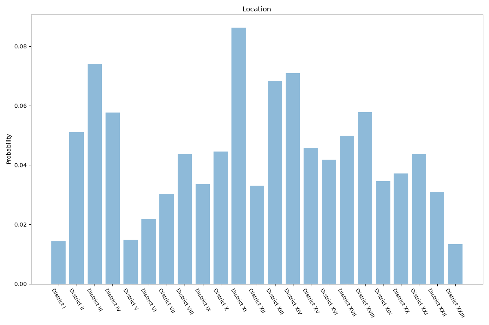

# Budapest
**2 features:** location and residence.

## Location

## Residence

## Sources

- [Microcensus 2016, Hungarian Central Statistical Office (KSH) (2016)](https://www.ksh.hu/en) — location
- [World Urbanization Prospects 2018, United Nations (2018)](https://population.un.org/wup/) — residence