# India

**11 features:** age, sex, location, religion, language, marital status, education, occupation, housing tenure, place of birth, and sexuality.

## Age

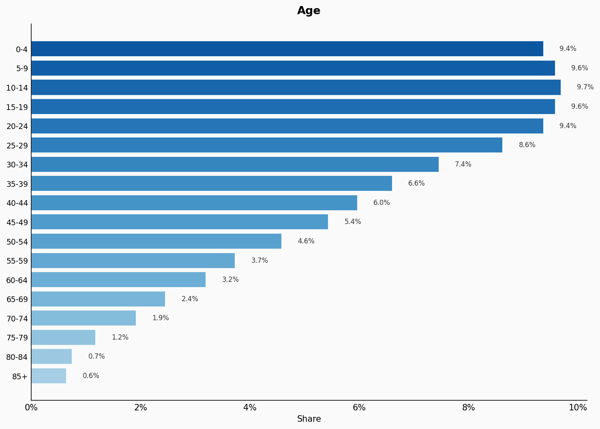

| Option | Share |
|---|---:|
| 0-4 | 9.4% |
| 5-9 | 9.6% |
| 10-14 | 9.7% |
| 15-19 | 9.6% |
| 20-24 | 9.4% |
| 25-29 | 8.6% |
| 30-34 | 7.4% |
| 35-39 | 6.6% |
| 40-44 | 6.0% |
| 45-49 | 5.4% |
| 50-54 | 4.6% |
| 55-59 | 3.7% |
| 60-64 | 3.2% |
| 65-69 | 2.4% |
| 70-74 | 1.9% |
| 75-79 | 1.2% |
| 80-84 | 0.7% |
| 85+ | 0.6% |

## Sex

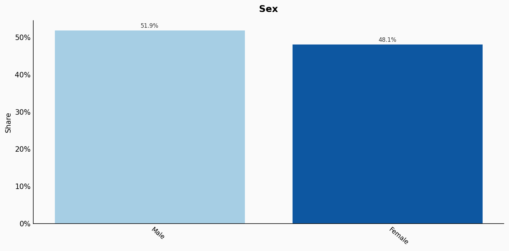

| Option | Share |
|---|---:|
| Male | 51.9% |
| Female | 48.1% |

## Location

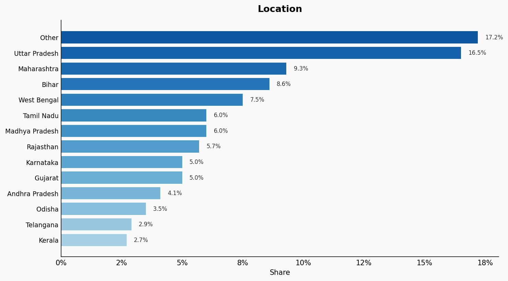

| Option | Share |
|---|---:|
| Other | 17.2% |
| Uttar Pradesh | 16.5% |
| Maharashtra | 9.3% |
| Bihar | 8.6% |
| West Bengal | 7.5% |
| Tamil Nadu | 6.0% |
| Madhya Pradesh | 6.0% |
| Rajasthan | 5.7% |
| Karnataka | 5.0% |
| Gujarat | 5.0% |
| Andhra Pradesh | 4.1% |
| Odisha | 3.5% |
| Telangana | 2.9% |
| Kerala | 2.7% |

## Religion

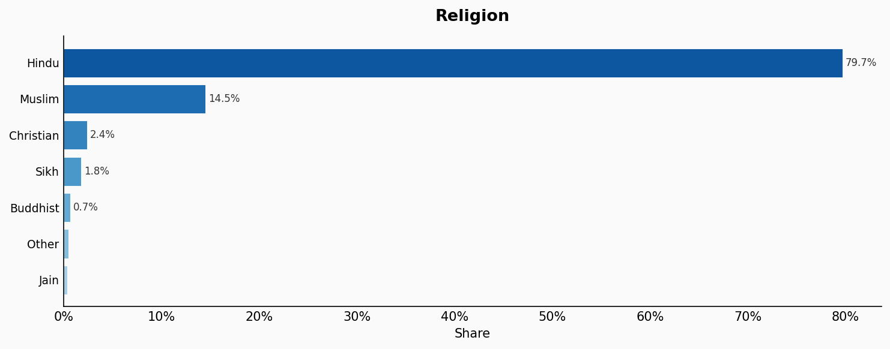

| Option | Share |
|---|---:|
| Hindu | 79.7% |
| Muslim | 14.5% |
| Christian | 2.4% |
| Sikh | 1.8% |
| Buddhist | 0.7% |
| Other | 0.5% |
| Jain | 0.4% |

## Language

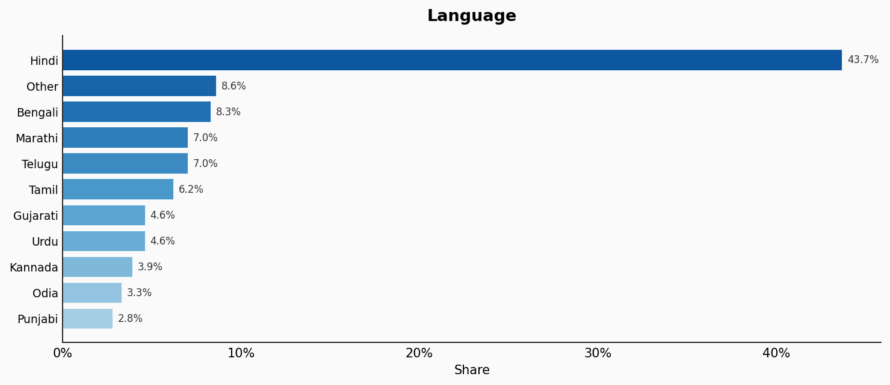

| Option | Share |
|---|---:|
| Hindi | 43.7% |
| Other | 8.6% |
| Bengali | 8.3% |
| Marathi | 7.0% |
| Telugu | 7.0% |
| Tamil | 6.2% |
| Gujarati | 4.6% |
| Urdu | 4.6% |
| Kannada | 3.9% |
| Odia | 3.3% |
| Punjabi | 2.8% |

## Marital Status

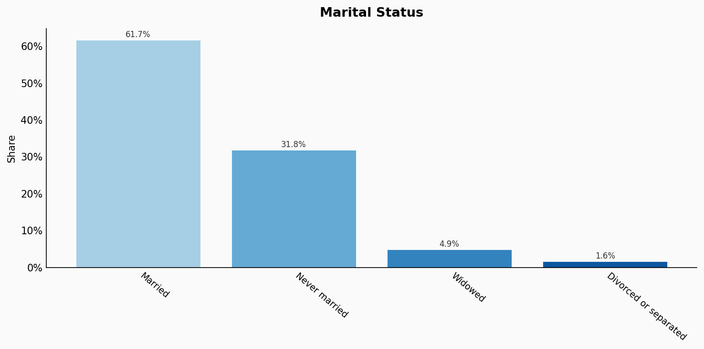

| Option | Share |
|---|---:|
| Married | 61.7% |
| Never married | 31.8% |
| Widowed | 4.9% |
| Divorced or separated | 1.6% |

## Education

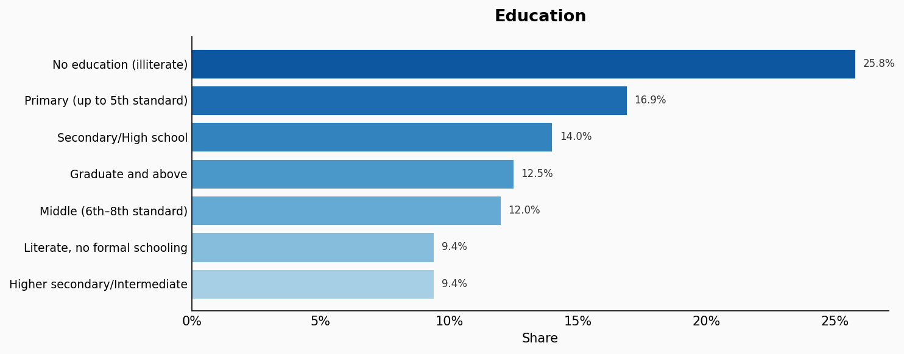

| Option | Share |
|---|---:|
| No education (illiterate) | 25.8% |
| Primary (up to 5th standard) | 16.9% |
| Secondary/High school | 14.0% |
| Graduate and above | 12.5% |
| Middle (6th–8th standard) | 12.0% |
| Literate, no formal schooling | 9.4% |
| Higher secondary/Intermediate | 9.4% |

## Occupation

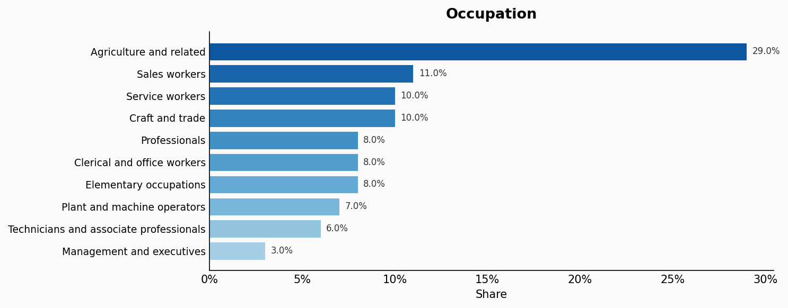

| Option | Share |
|---|---:|
| Agriculture and related | 29.0% |
| Sales workers | 11.0% |
| Service workers | 10.0% |
| Craft and trade | 10.0% |
| Professionals | 8.0% |
| Clerical and office workers | 8.0% |
| Elementary occupations | 8.0% |
| Plant and machine operators | 7.0% |
| Technicians and associate professionals | 6.0% |
| Management and executives | 3.0% |

## Housing Tenure

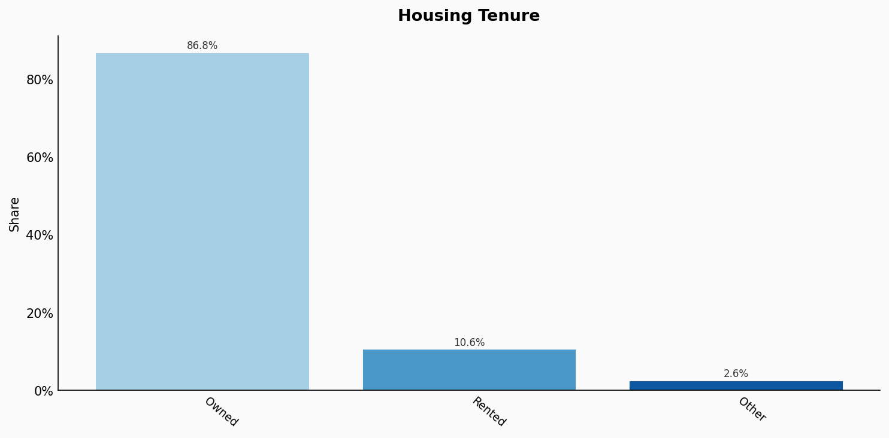

| Option | Share |
|---|---:|
| Owned | 86.8% |
| Rented | 10.6% |
| Other | 2.6% |

## Place Of Birth

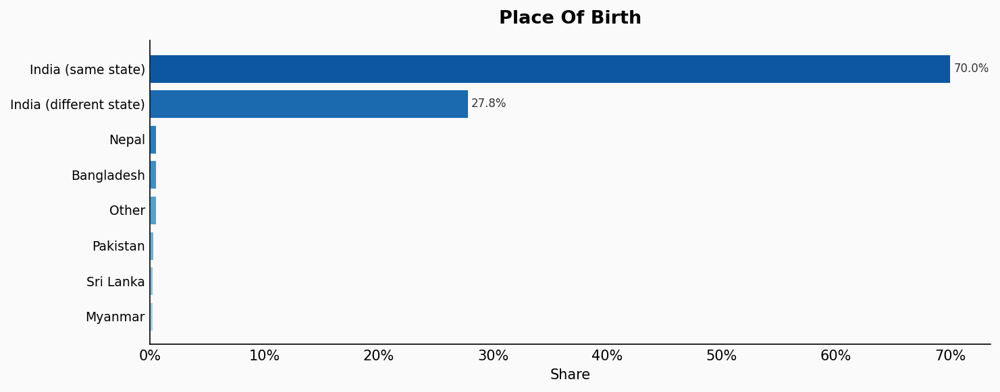

| Option | Share |
|---|---:|
| India (same state) | 70.0% |
| India (different state) | 27.8% |
| Nepal | 0.5% |
| Bangladesh | 0.5% |
| Other | 0.5% |
| Pakistan | 0.3% |
| Sri Lanka | 0.2% |
| Myanmar | 0.2% |

## Sexuality

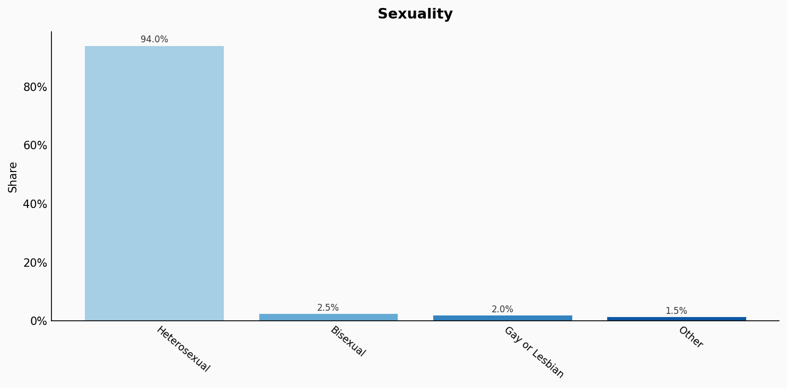

| Option | Share |
|---|---:|
| Heterosexual | 94.0% |
| Bisexual | 2.5% |
| Gay or Lesbian | 2.0% |
| Other | 1.5% |

## Sources

- [Census of India 2011, Office of the Registrar General and Census Commissioner (2011)](https://censusindia.gov.in/census.website/)
  *Covers: `age`, `sex`, `marital status`, `location`, `religion`, `language`, `housing tenure`*
- [Periodic Labour Force Survey 2021-22, MOSPI (2022)](https://mospi.gov.in/sites/default/files/publication_reports/PLFS_2021-22_0.pdf)
  *Covers: `education`, `occupation`*
- [Census of India 2011 – Migration tables (2011)](https://censusindia.gov.in/census.website/data/census-tables)
  *Covers: `place of birth`*
- [India Health Monitor, Population Council (2021)](https://www.popcouncil.org/research/india-health-monitor)
  *Covers: `sexuality`*