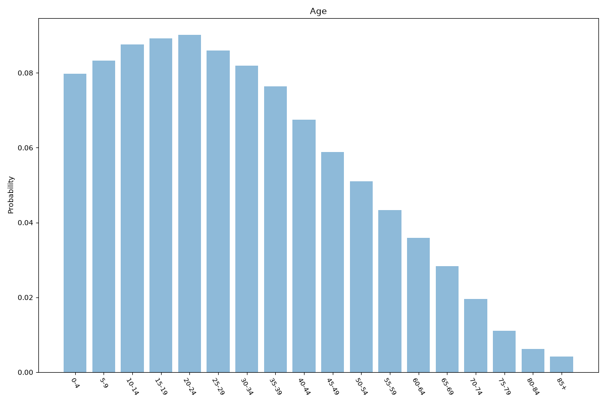
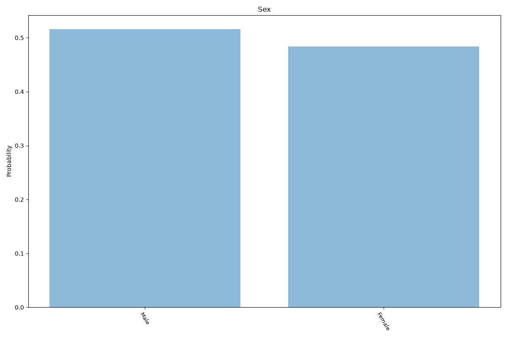
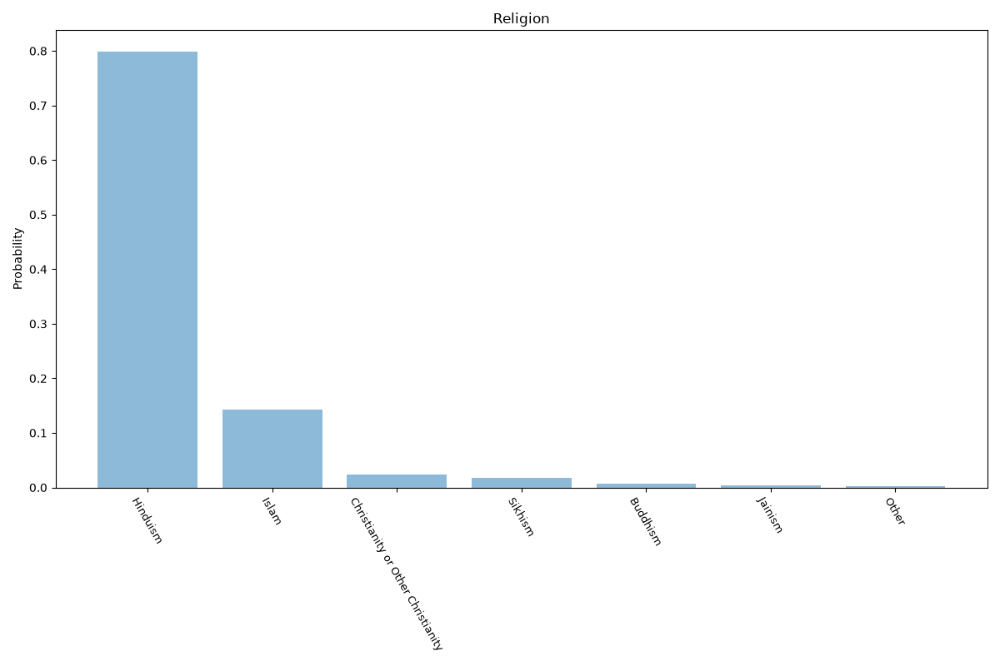
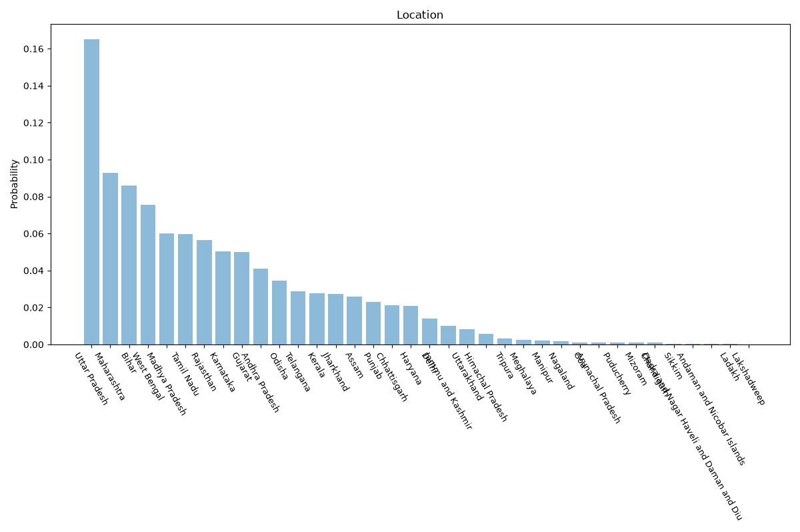

# India
**4 features:** age, sex, religion and location.

## Age

## Sex

## Religion

## Location

## Sources

- [World Population Prospects 2024, United Nations (2024)](https://population.un.org/wpp/) — age, sex
- [Census of India 2011 (religion) (2011)](https://censusindia.gov.in/) — religion
- [Census of India 2011, Office of the Registrar General & Census Commissioner (2011)](https://censusindia.gov.in/) — location