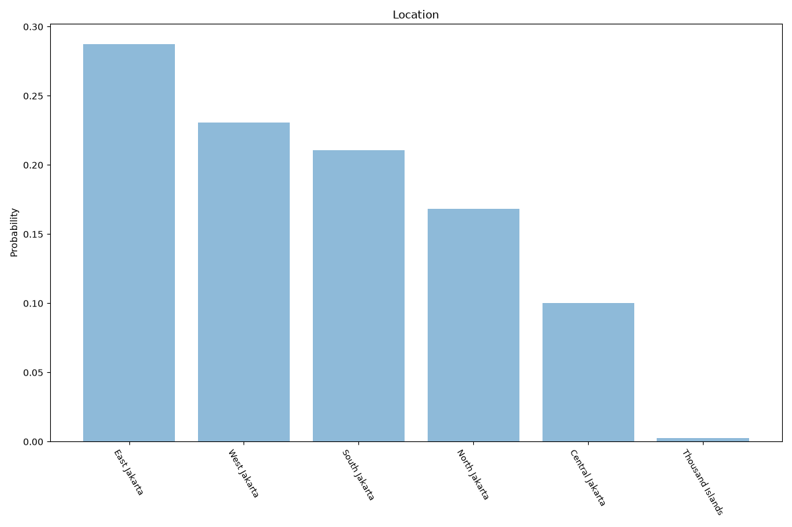

# Jakarta
**2 features:** location and residence.

## Location

## Residence

## Sources

- [Sensus Penduduk 2020, Badan Pusat Statistik (BPS) (2020)](https://www.bps.go.id/) — location
- [World Urbanization Prospects 2018, United Nations (2018)](https://population.un.org/wup/) — residence