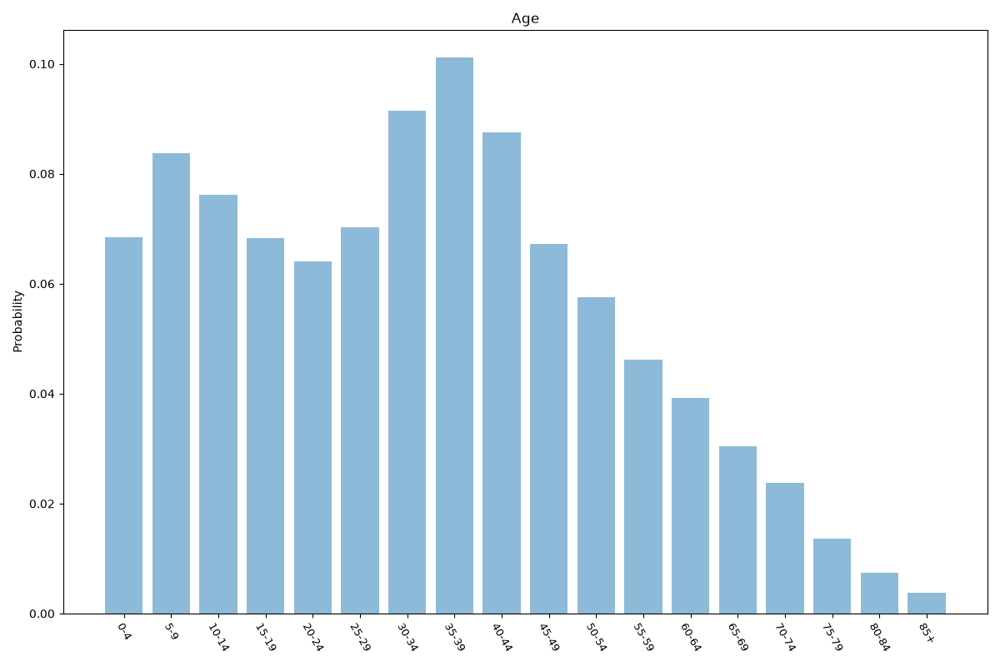
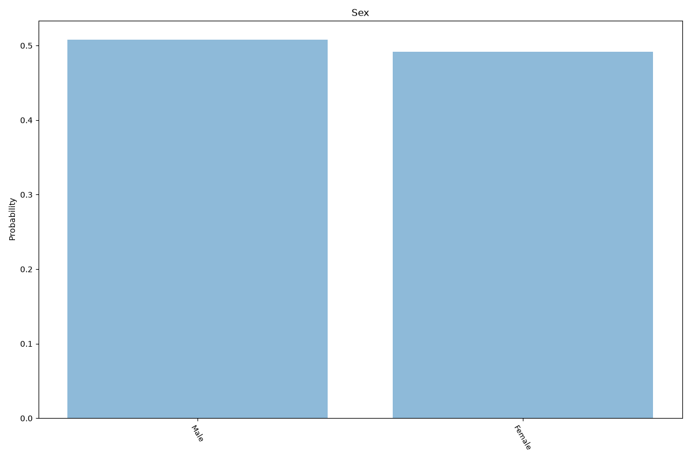
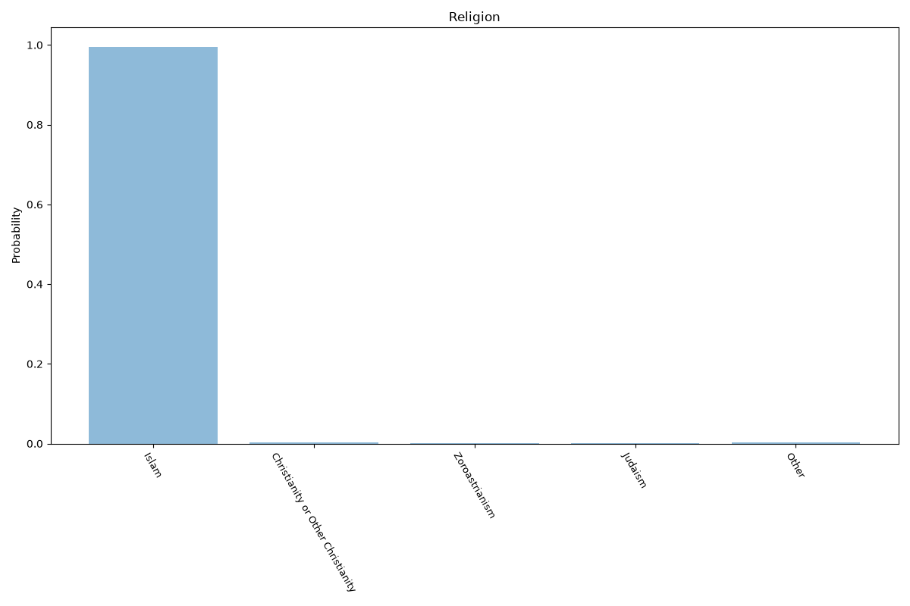
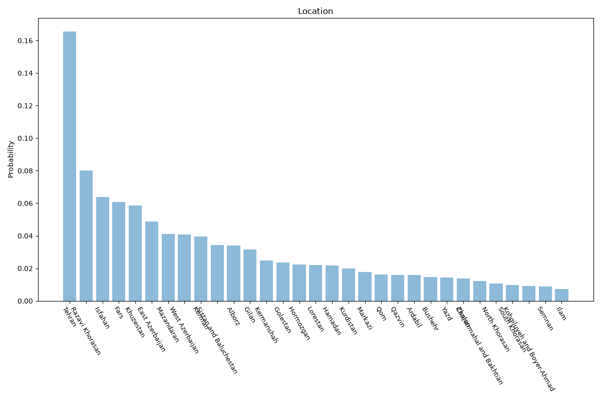

# Iran
**4 features:** age, sex, religion and location.

## Age

## Sex

## Religion

## Location

## Sources

- [World Population Prospects 2024, United Nations (2024)](https://population.un.org/wpp/) — age, sex
- [2011 National Census (religion), Statistical Center of Iran (2011)](https://www.amar.org.ir/english) — religion
- [Provincial population estimates, Statistical Center of Iran (2023)](https://www.amar.org.ir/english) — location