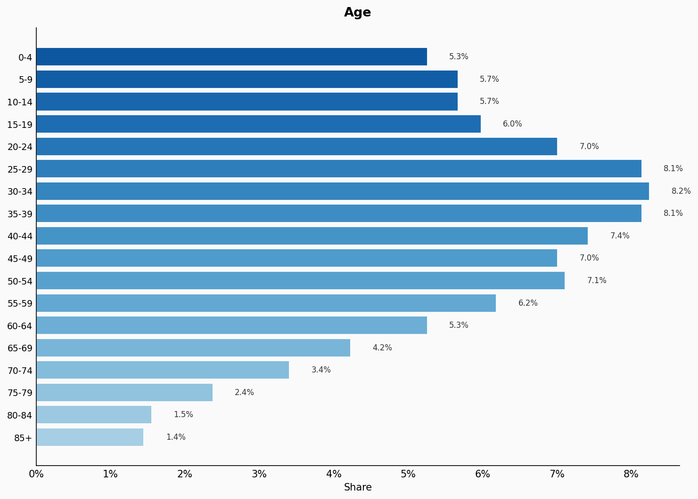
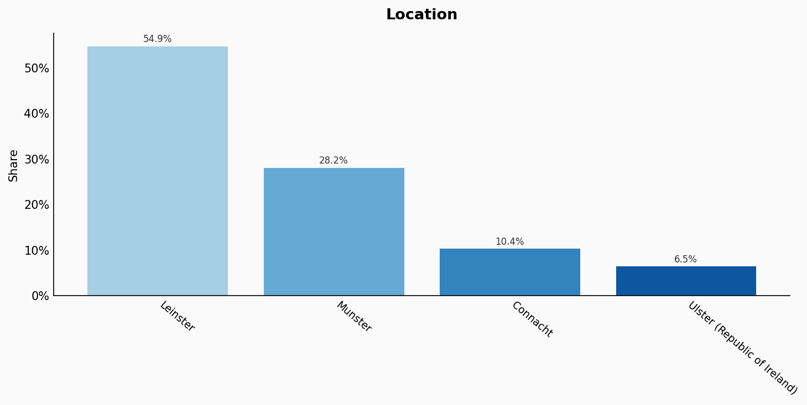
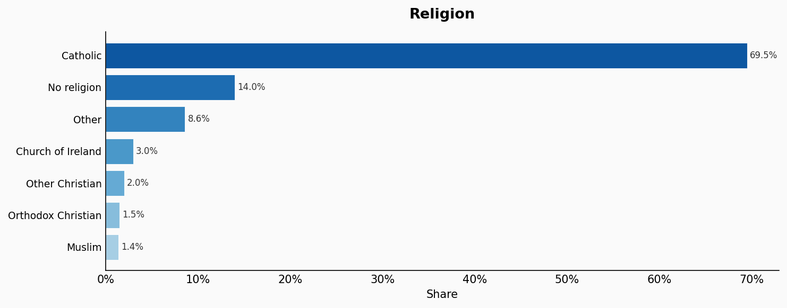
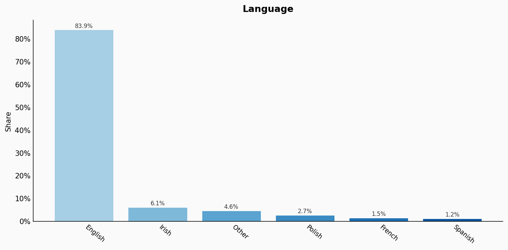
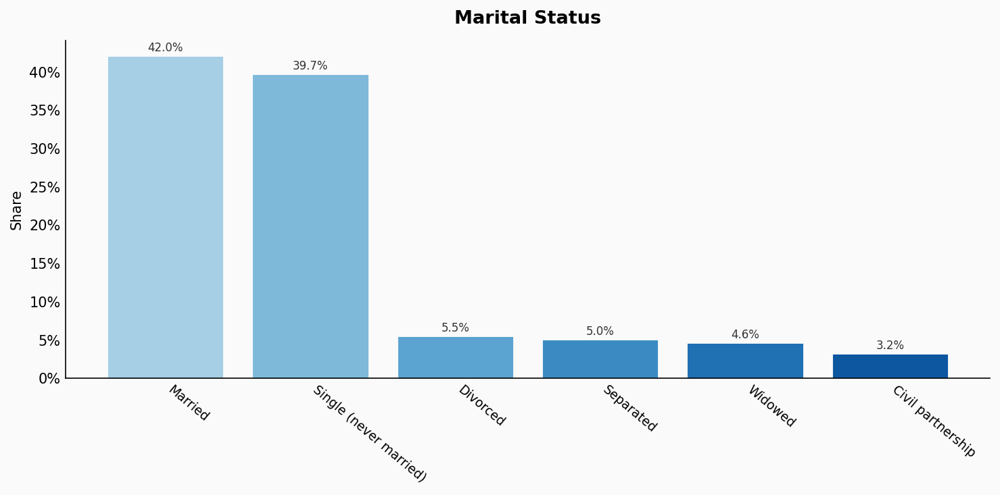
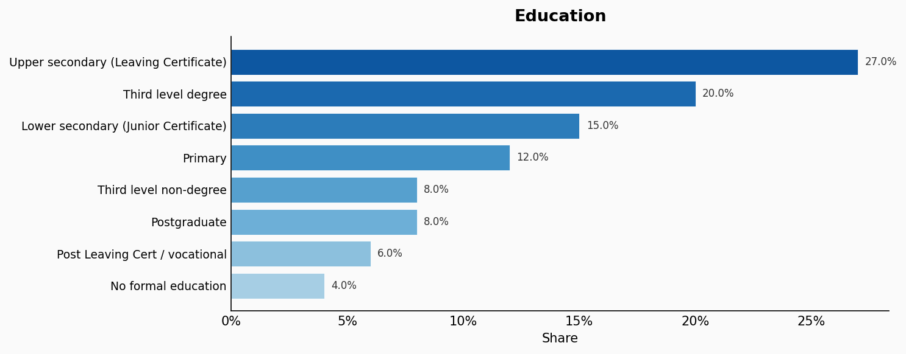
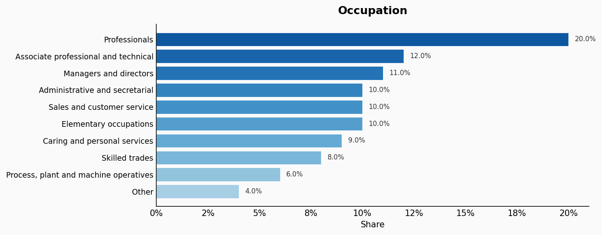
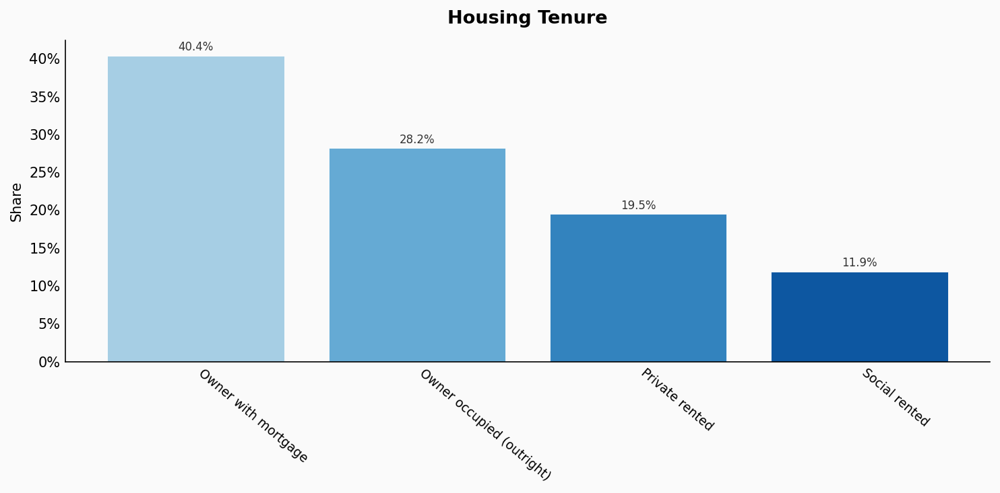
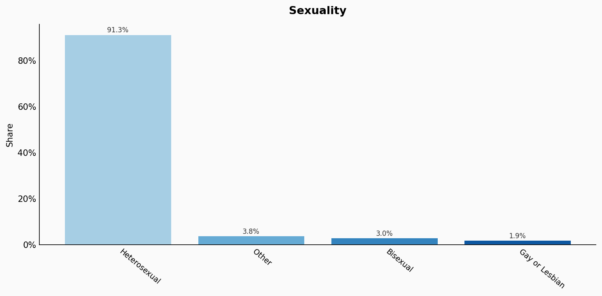

# Ireland

**11 features:** age, sex, location, religion, language, marital status, education, occupation, housing tenure, place of birth, and sexuality.

## Age

| Option | Share |
|---|---:|
| 0-4 | 5.3% |
| 5-9 | 5.7% |
| 10-14 | 5.7% |
| 15-19 | 6.0% |
| 20-24 | 7.0% |
| 25-29 | 8.1% |
| 30-34 | 8.2% |
| 35-39 | 8.1% |
| 40-44 | 7.4% |
| 45-49 | 7.0% |
| 50-54 | 7.1% |
| 55-59 | 6.2% |
| 60-64 | 5.3% |
| 65-69 | 4.2% |
| 70-74 | 3.4% |
| 75-79 | 2.4% |
| 80-84 | 1.5% |
| 85+ | 1.4% |

## Sex

| Option | Share |
|---|---:|
| Female | 50.4% |
| Male | 49.6% |

## Location

| Option | Share |
|---|---:|
| Leinster | 54.9% |
| Munster | 28.2% |
| Connacht | 10.4% |
| Ulster (Republic of Ireland) | 6.5% |

## Religion

| Option | Share |
|---|---:|
| Catholic | 69.5% |
| No religion | 14.0% |
| Other | 8.6% |
| Church of Ireland | 3.0% |
| Other Christian | 2.0% |
| Orthodox Christian | 1.5% |
| Muslim | 1.4% |

## Language

| Option | Share |
|---|---:|
| English | 83.9% |
| Irish | 6.1% |
| Other | 4.6% |
| Polish | 2.7% |
| French | 1.5% |
| Spanish | 1.2% |

## Marital Status

| Option | Share |
|---|---:|
| Married | 42.0% |
| Single (never married) | 39.7% |
| Divorced | 5.5% |
| Separated | 5.0% |
| Widowed | 4.6% |
| Civil partnership | 3.2% |

## Education

| Option | Share |
|---|---:|
| Upper secondary (Leaving Certificate) | 27.0% |
| Third level degree | 20.0% |
| Lower secondary (Junior Certificate) | 15.0% |
| Primary | 12.0% |
| Third level non-degree | 8.0% |
| Postgraduate | 8.0% |
| Post Leaving Cert / vocational | 6.0% |
| No formal education | 4.0% |

## Occupation

| Option | Share |
|---|---:|
| Professionals | 20.0% |
| Associate professional and technical | 12.0% |
| Managers and directors | 11.0% |
| Administrative and secretarial | 10.0% |
| Sales and customer service | 10.0% |
| Elementary occupations | 10.0% |
| Caring and personal services | 9.0% |
| Skilled trades | 8.0% |
| Process, plant and machine operatives | 6.0% |
| Other | 4.0% |

## Housing Tenure

| Option | Share |
|---|---:|
| Owner with mortgage | 40.4% |
| Owner occupied (outright) | 28.2% |
| Private rented | 19.5% |
| Social rented | 11.9% |

## Place Of Birth

| Option | Share |
|---|---:|
| Ireland | 81.7% |
| Other | 5.5% |
| United Kingdom | 4.6% |
| Poland | 2.8% |
| Lithuania | 1.2% |
| Romania | 1.1% |
| India | 1.0% |
| Brazil | 0.8% |
| Germany | 0.7% |
| France | 0.6% |

## Sexuality

| Option | Share |
|---|---:|
| Heterosexual | 91.3% |
| Other | 3.8% |
| Bisexual | 3.0% |
| Gay or Lesbian | 1.9% |

## Sources

- [Census 2022, Central Statistics Office Ireland (2022)](https://www.cso.ie/en/census/census2022/)
  *Covers: `age`, `sex`, `marital status`, `location`, `place of birth`, `sexuality`*
- [Labour Force Survey 2022, CSO Ireland (2022)](https://www.cso.ie/en/releasesandpublications/ep/p-lfs/)
  *Covers: `education`, `occupation`, `housing tenure`*
- [Census 2022 – Religion, CSO Ireland (2022)](https://www.cso.ie/en/releasesandpublications/ep/p-cp8iter/cp8iter/)
  *Covers: `religion`*
- [Census 2022 – Irish language, CSO Ireland (2022)](https://www.cso.ie/en/releasesandpublications/ep/p-cp10esil/)
  *Covers: `language`*