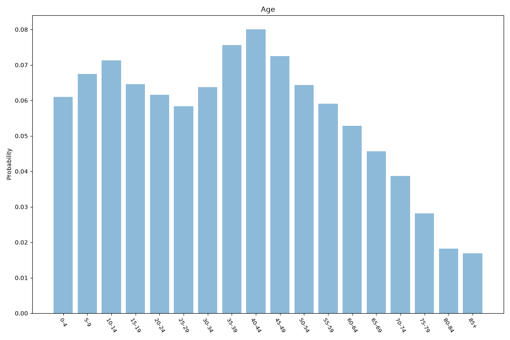
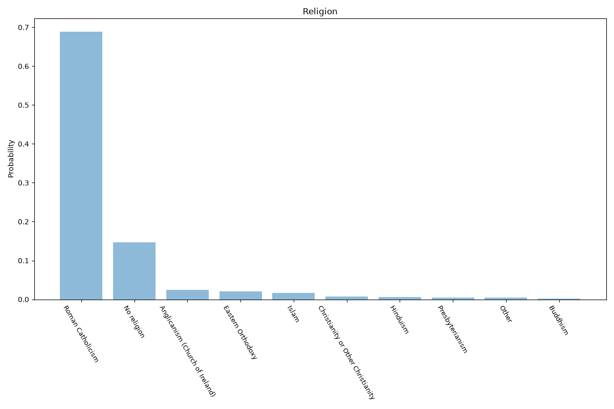
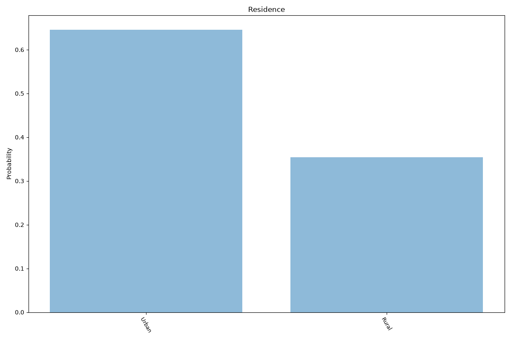
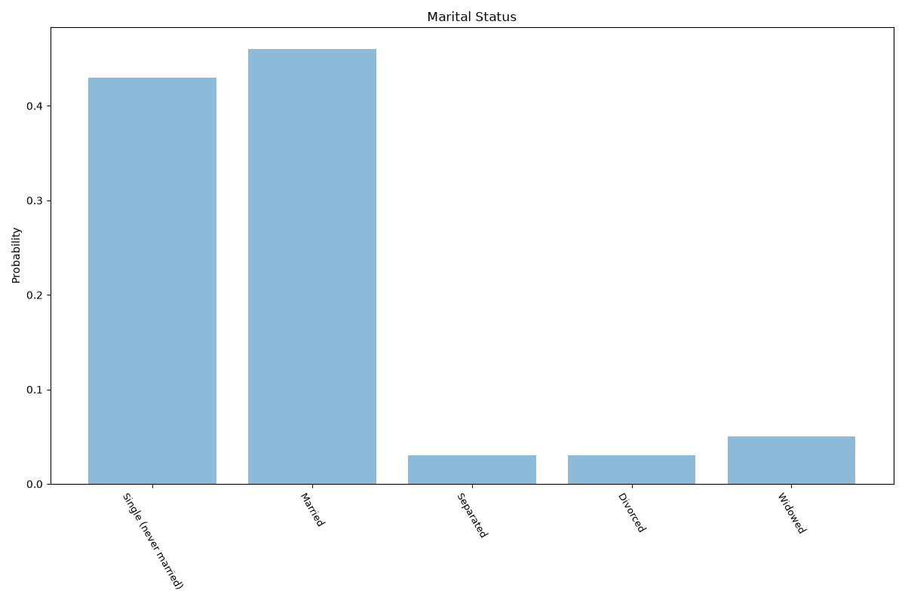
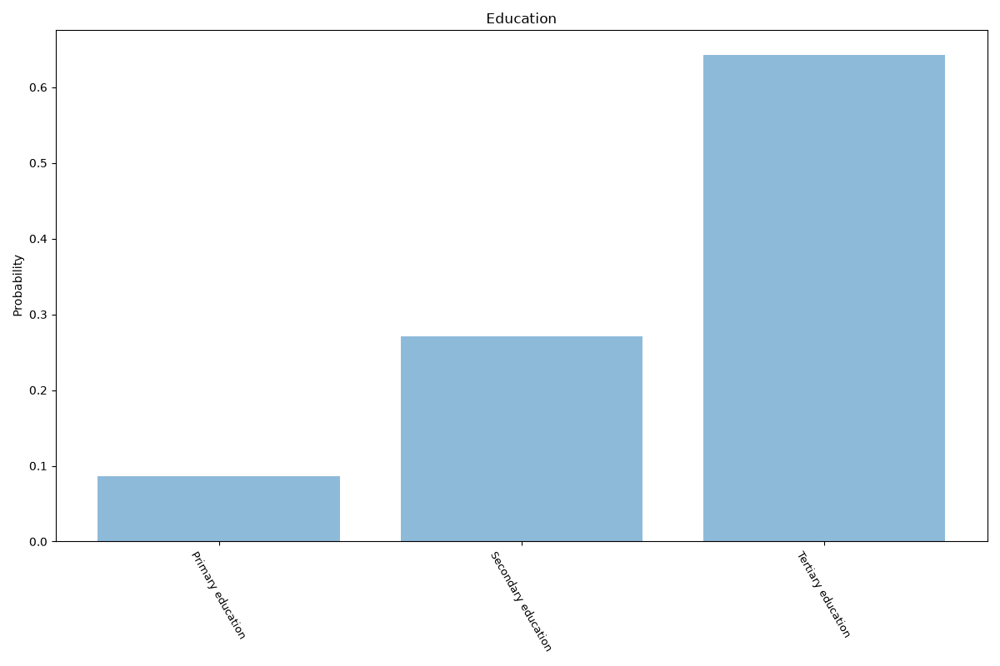
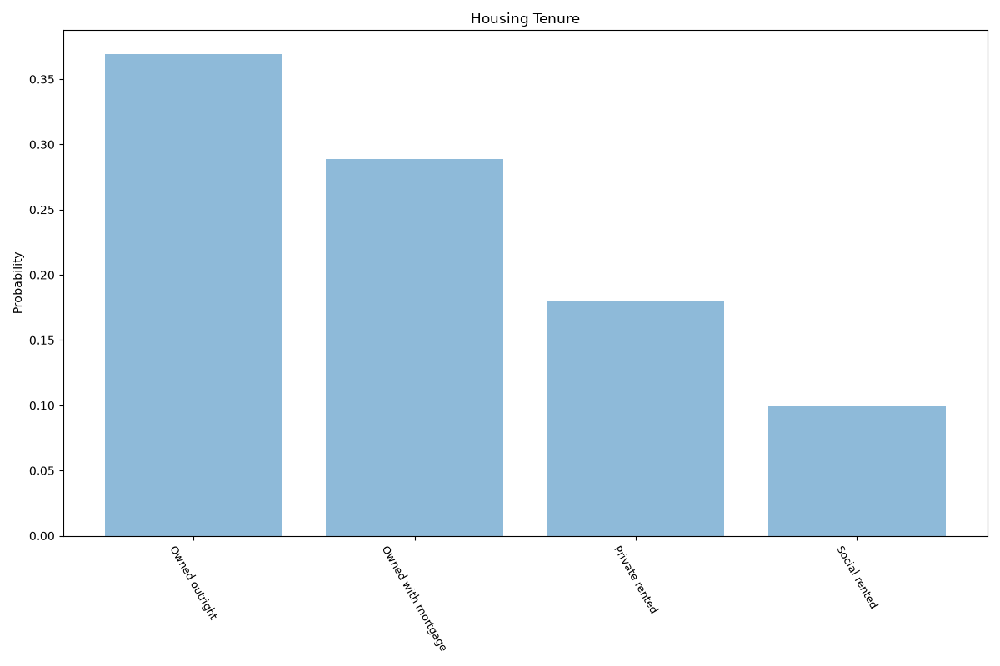
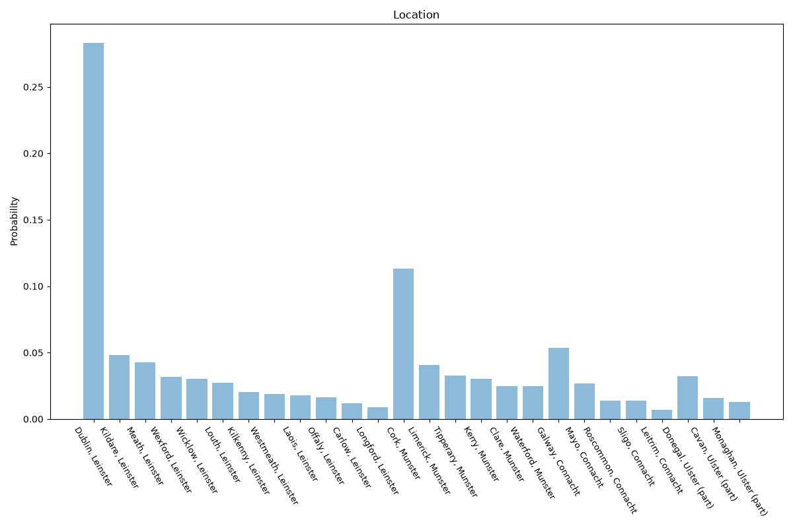

# Ireland
**8 features:** age, sex, religion, residence, marital status, education, housing tenure and location.

## Age

## Sex

## Religion

## Residence

## Marital Status

## Education

## Housing Tenure

## Location

## Sources

- [Census of Population 2022 - Summary Results, Central Statistics Office (CSO) (2022)](https://www.cso.ie/en/releasesandpublications/ep/p-cpsr/censusofpopulation2022-summaryresults/) — age, sex, location
- [Census of Population 2022 Profile 5 - Diversity, Migration, Ethnicity, Irish Travellers & Religion, CSO (2023)](https://www.cso.ie/en/releasesandpublications/ep/p-cpp5/censusofpopulation2022profile5-diversitymigrationethnicityirishtravellersreligion/) — religion
- [Census of Population 2022 Profile 3 - Households, Families and Childcare, CSO (2023)](https://www.cso.ie/en/releasesandpublications/ep/p-cpp3/censusofpopulation2022profile3-householdsfamiliesandchildcare/) — marital status
- [Census of Population 2022 Profile 2 - Housing in Ireland, CSO (2023)](https://www.cso.ie/en/releasesandpublications/ep/p-cpp2/censusofpopulation2022profile2-housinginireland/) — housing tenure
- [Urban population (% of total population), World Bank (2025)](https://data.worldbank.org/indicator/SP.URB.TOTL.IN.ZS) — residence
- [Wittgenstein Centre Human Capital Data Explorer (Version 3.0, SSP2 scenario), IIASA (2020)](https://dataexplorer.wittgensteincentre.org/wcde-v3/) — education