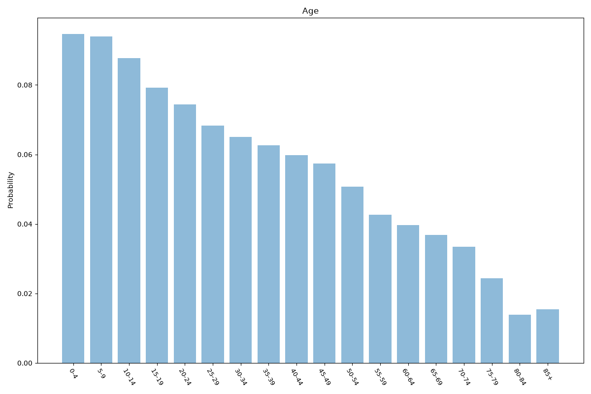
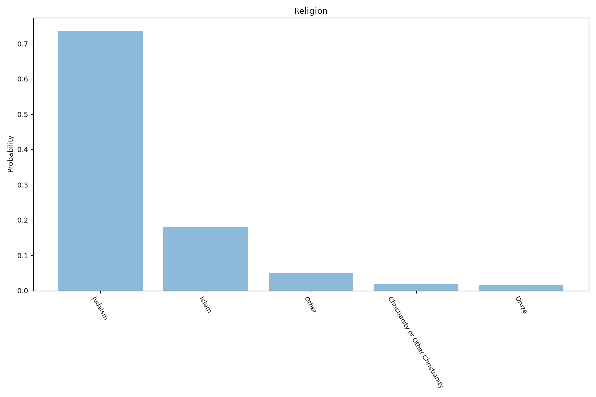
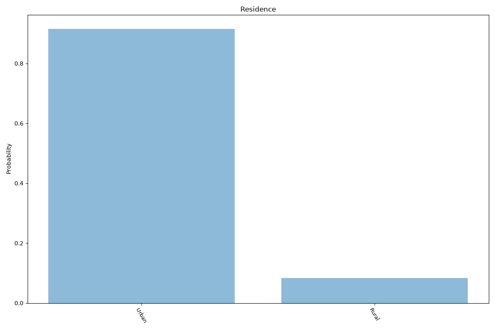
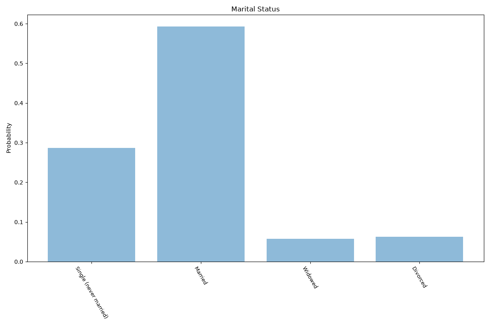
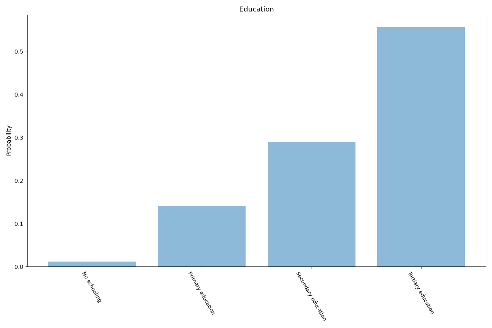
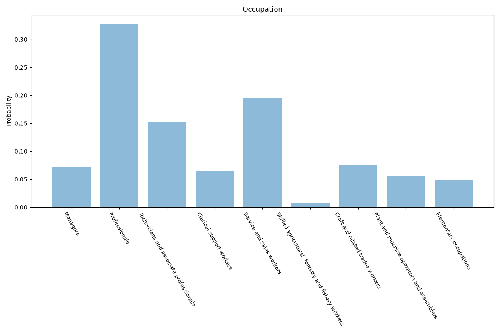

# Israel
**9 features:** age, location, sex, religion, residence, marital status, education, occupation and employment status.

## Age

## Location

Population-weighted distribution by district and area at 31 December 2024.

## Sex

## Religion

## Residence

## Marital Status

## Education

## Occupation

## Employment Status

Population aged 15 and over.

## Sources

- [World Population Prospects 2024, United Nations (2024)](https://population.un.org/wpp/) — age, sex
- [Statistical Abstract of Israel, Central Bureau of Statistics (2022)](https://www.cbs.gov.il/en/) — religion
- [Statistical Abstract of Israel, Central Bureau of Statistics (2024)](https://www.cbs.gov.il/he/publications/DocLib/2025/2.ShnatonPopulation/st02_12x.pdf) — location
- [Urban population (% of total population), World Bank (2025)](https://data.worldbank.org/indicator/SP.URB.TOTL.IN.ZS) — residence
- [World Marriage Data 2019, United Nations (2018)](https://www.un.org/development/desa/pd/data/world-marriage-data) — marital status
- [Wittgenstein Centre Human Capital Data Explorer (Version 3.0, SSP2 scenario), IIASA (2020)](https://dataexplorer.wittgensteincentre.org/wcde-v3/) — education
- [Employment by sex and occupation (ISCO-08), ILOSTAT, International Labour Organization (2024)](https://ilostat.ilo.org/data/) — occupation
- [Labour force participation rate and unemployment rate (modelled ILO estimate), World Bank (2025)](https://data.worldbank.org/indicator/SL.TLF.CACT.ZS) — employment status
