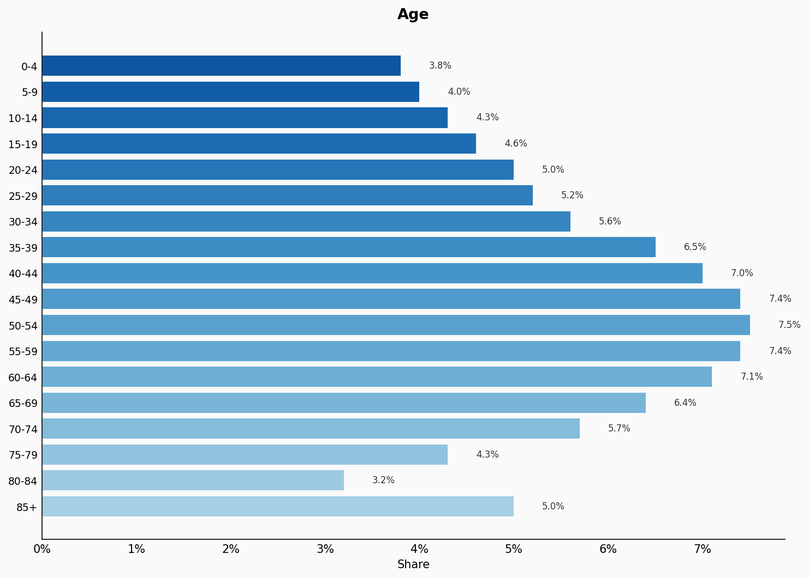
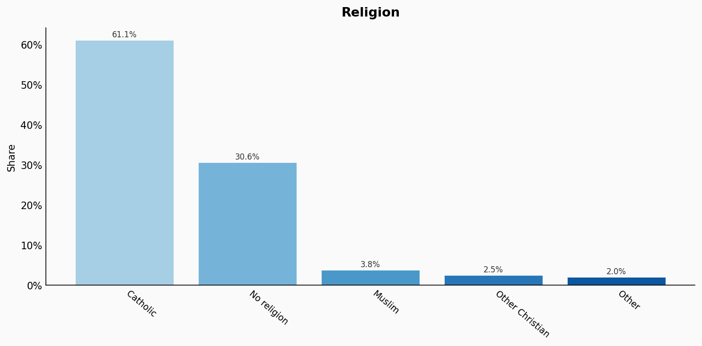
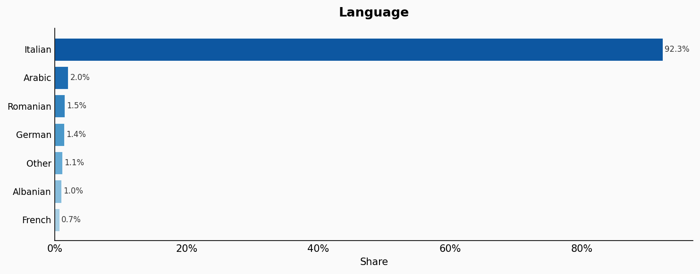
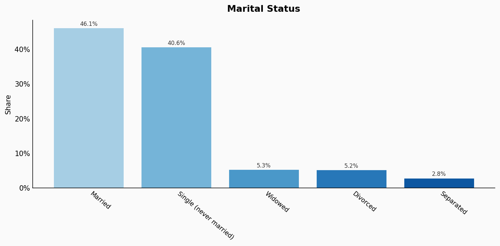
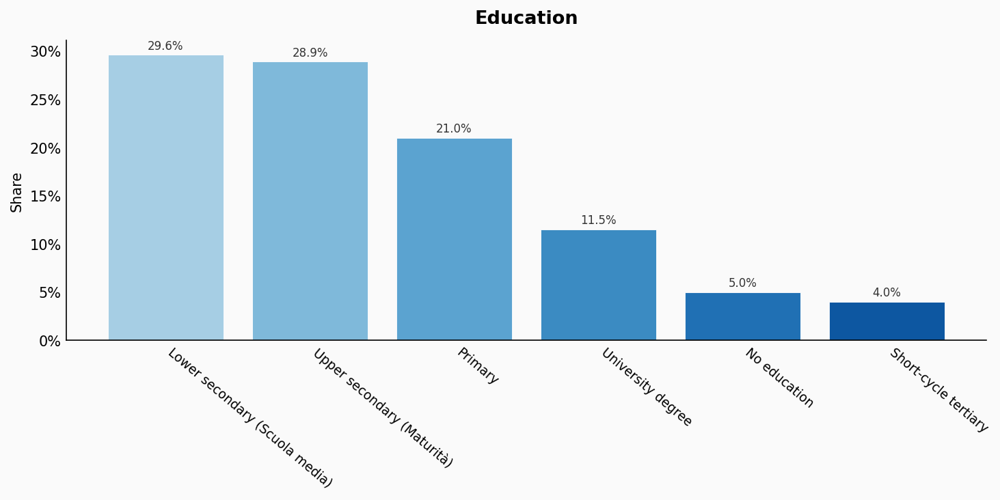
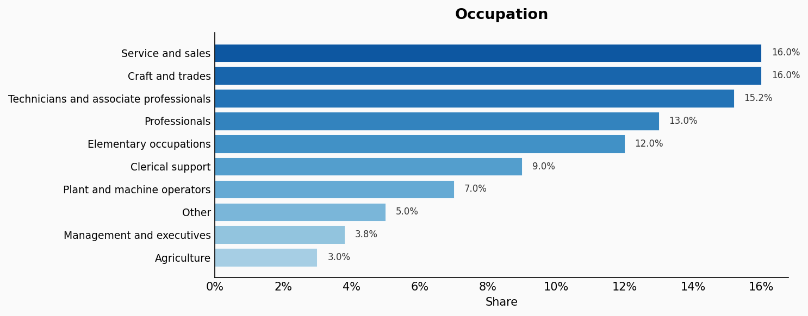
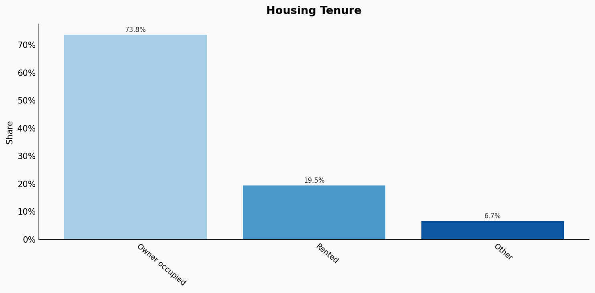
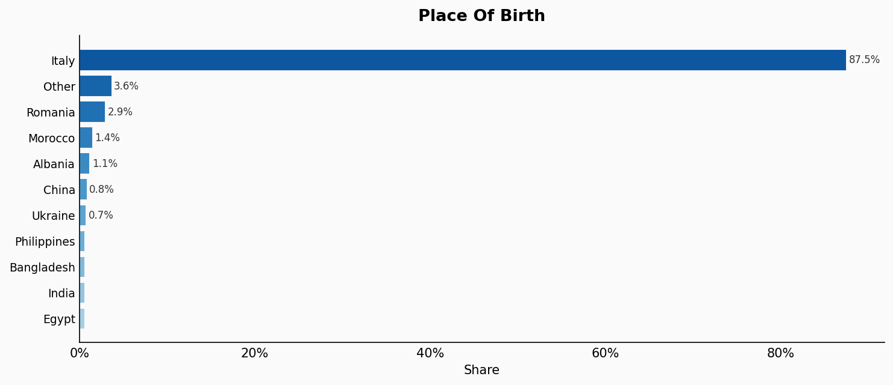
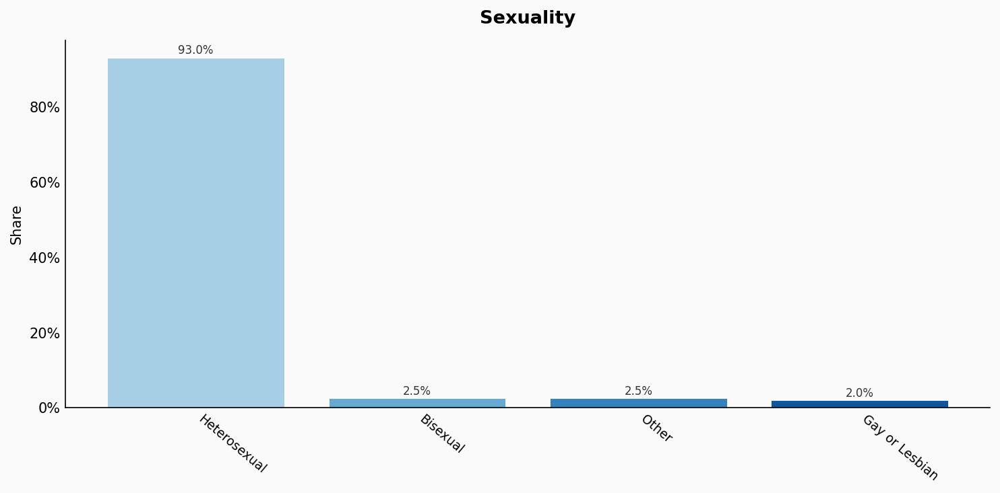

# Italy

**11 features:** age, sex, location, religion, language, marital status, education, occupation, housing tenure, place of birth, and sexuality.

## Age

| Option | Share |
|---|---:|
| 0-4 | 3.8% |
| 5-9 | 4.0% |
| 10-14 | 4.3% |
| 15-19 | 4.6% |
| 20-24 | 5.0% |
| 25-29 | 5.2% |
| 30-34 | 5.6% |
| 35-39 | 6.5% |
| 40-44 | 7.0% |
| 45-49 | 7.4% |
| 50-54 | 7.5% |
| 55-59 | 7.4% |
| 60-64 | 7.1% |
| 65-69 | 6.4% |
| 70-74 | 5.7% |
| 75-79 | 4.3% |
| 80-84 | 3.2% |
| 85+ | 5.0% |

## Sex

| Option | Share |
|---|---:|
| Female | 51.4% |
| Male | 48.6% |

## Location

| Option | Share |
|---|---:|
| Lombardy | 16.9% |
| Lazio | 9.9% |
| Campania | 9.6% |
| Sicily | 8.5% |
| Veneto | 8.2% |
| Piedmont | 7.3% |
| Emilia-Romagna | 7.3% |
| Puglia | 6.4% |
| Tuscany | 6.2% |
| Calabria | 3.0% |
| Liguria | 2.7% |
| Sardinia | 2.6% |
| Marche | 2.5% |
| Abruzzo | 2.0% |
| Friuli-Venezia Giulia | 1.9% |
| Trentino-Alto Adige | 1.8% |
| Umbria | 1.4% |
| Basilicata | 0.9% |
| Molise | 0.5% |
| Aosta Valley | 0.2% |

## Religion

| Option | Share |
|---|---:|
| Catholic | 61.1% |
| No religion | 30.6% |
| Muslim | 3.8% |
| Other Christian | 2.5% |
| Other | 2.0% |

## Language

| Option | Share |
|---|---:|
| Italian | 92.3% |
| Arabic | 2.0% |
| Romanian | 1.5% |
| German | 1.4% |
| Other | 1.1% |
| Albanian | 1.0% |
| French | 0.7% |

## Marital Status

| Option | Share |
|---|---:|
| Married | 46.1% |
| Single (never married) | 40.6% |
| Widowed | 5.3% |
| Divorced | 5.2% |
| Separated | 2.8% |

## Education

| Option | Share |
|---|---:|
| Lower secondary (Scuola media) | 29.6% |
| Upper secondary (Maturità) | 28.9% |
| Primary | 21.0% |
| University degree | 11.5% |
| No education | 5.0% |
| Short-cycle tertiary | 4.0% |

## Occupation

| Option | Share |
|---|---:|
| Service and sales | 16.0% |
| Craft and trades | 16.0% |
| Technicians and associate professionals | 15.2% |
| Professionals | 13.0% |
| Elementary occupations | 12.0% |
| Clerical support | 9.0% |
| Plant and machine operators | 7.0% |
| Other | 5.0% |
| Management and executives | 3.8% |
| Agriculture | 3.0% |

## Housing Tenure

| Option | Share |
|---|---:|
| Owner occupied | 73.8% |
| Rented | 19.5% |
| Other | 6.7% |

## Place Of Birth

| Option | Share |
|---|---:|
| Italy | 87.5% |
| Other | 3.6% |
| Romania | 2.9% |
| Morocco | 1.4% |
| Albania | 1.1% |
| China | 0.8% |
| Ukraine | 0.7% |
| Philippines | 0.5% |
| Bangladesh | 0.5% |
| India | 0.5% |
| Egypt | 0.5% |

## Sexuality

| Option | Share |
|---|---:|
| Heterosexual | 93.0% |
| Bisexual | 2.5% |
| Other | 2.5% |
| Gay or Lesbian | 2.0% |

## Sources

- [Censimento permanente della popolazione 2022, ISTAT (2022)](https://www.istat.it/it/archivio/censimento+della+popolazione)
  *Covers: `age`, `sex`, `marital status`, `location`*
- [Rilevazione sulle forze di lavoro 2022, ISTAT (2022)](https://www.istat.it/it/lavoro-e-retribuzioni/occupati-e-disoccupati)
  *Covers: `education`, `occupation`, `housing tenure`*
- [Indagine multiscopo sulle famiglie, ISTAT (2020)](https://www.istat.it/it/files/2020/06/Vita-quotidiana-2019.pdf)
  *Covers: `religion`*
- [Statistiche sulla presenza straniera, ISTAT (2022)](https://www.istat.it/it/archivio/popolazione+straniera)
  *Covers: `language`, `place of birth`*
- [Condizioni di vita delle persone LGBT+, ISTAT (2020)](https://www.istat.it/it/files//2020/06/Anni-di-scuola.pdf)
  *Covers: `sexuality`*