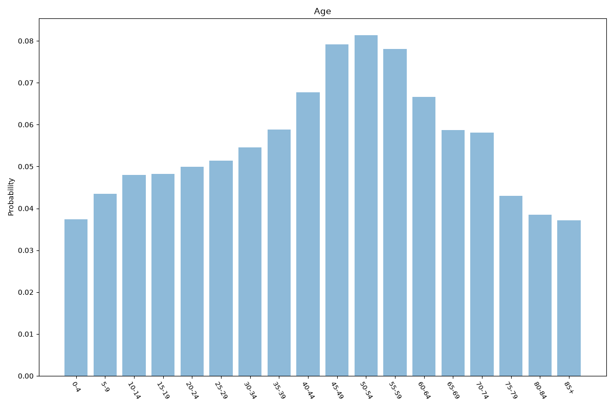
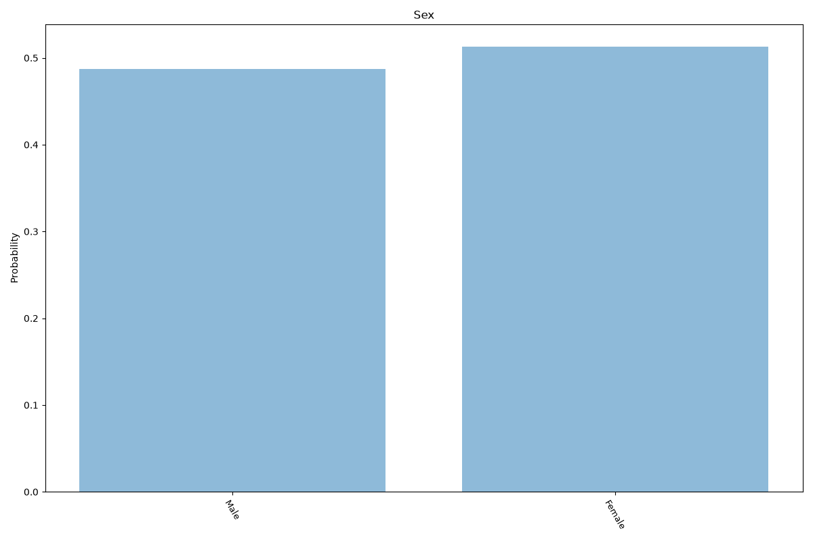
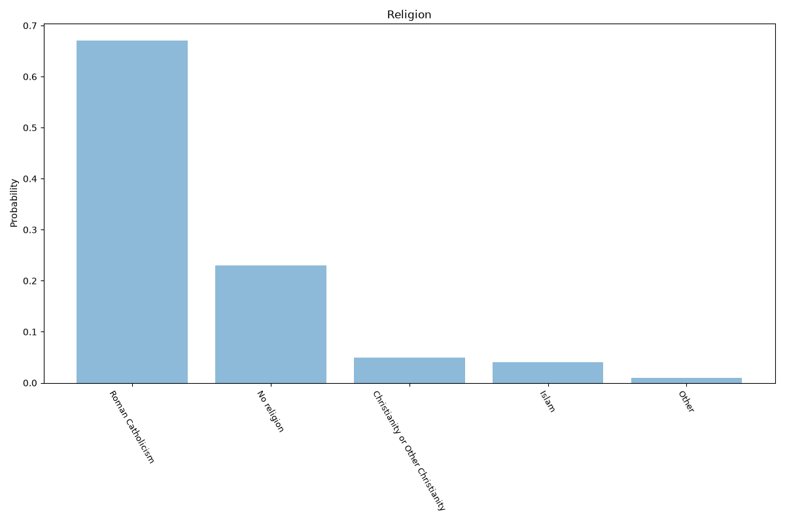
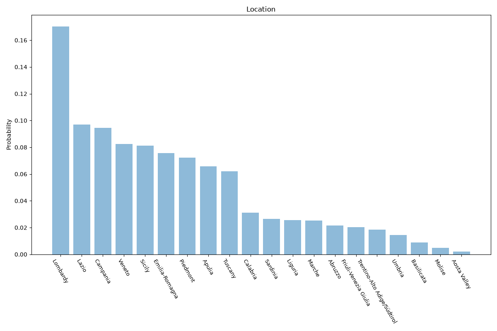

# Italy
**4 features:** age, sex, religion and location.

## Age

## Sex

## Religion

## Location

## Sources

- [Popolazione residente per età e sesso, Istituto Nazionale di Statistica (ISTAT) (2023)](https://www.istat.it/en/) — age, sex
- [Bilancio demografico e popolazione residente per regione, ISTAT (2025)](https://www.istat.it/en/) — location
- [Le religioni in Italia, Center for Studies on New Religions (CESNUR) (2020)](https://cesnur.org/) — religion