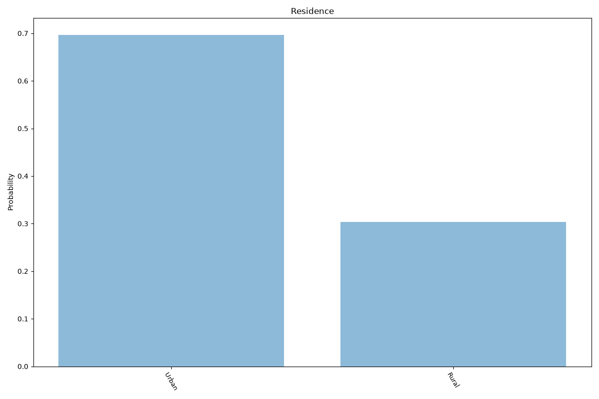
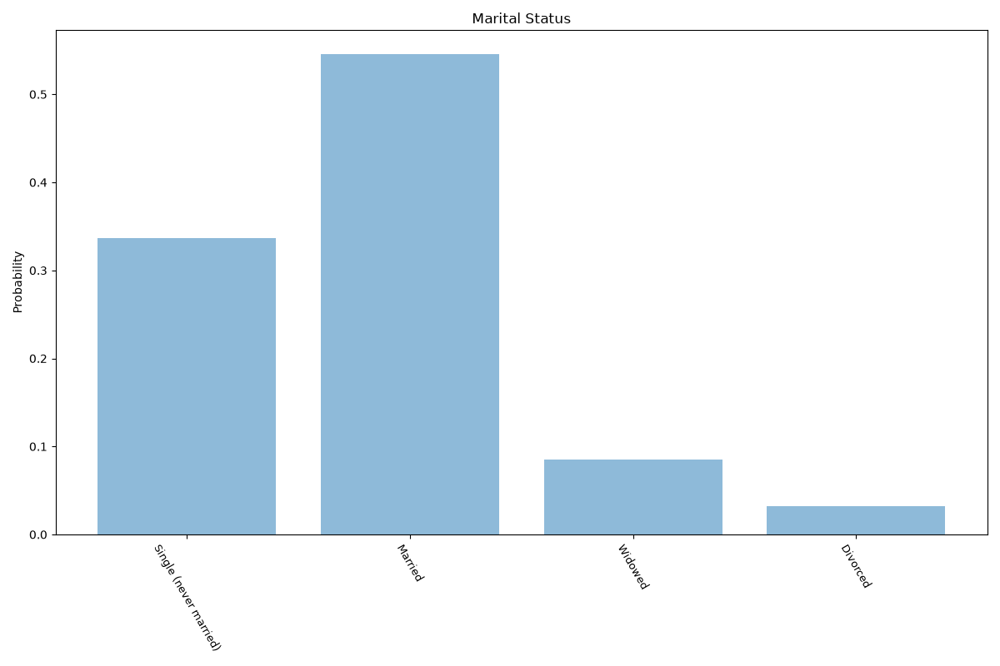

# Italy
**6 features:** age, sex, religion, residence, marital status and location.

## Age

## Sex

## Religion

## Residence

## Marital Status

## Location

## Sources

- [Popolazione residente per età e sesso, Istituto Nazionale di Statistica (ISTAT) (2023)](https://www.istat.it/en/) — age, sex
- [Bilancio demografico e popolazione residente per regione, ISTAT (2025)](https://www.istat.it/en/) — location
- [Le religioni in Italia, Center for Studies on New Religions (CESNUR) (2020)](https://cesnur.org/) — religion
- [Urban population (% of total population), World Bank (2025)](https://data.worldbank.org/indicator/SP.URB.TOTL.IN.ZS) — residence
- [World Marriage Data 2019, United Nations (2018)](https://www.un.org/development/desa/pd/data/world-marriage-data) — marital status