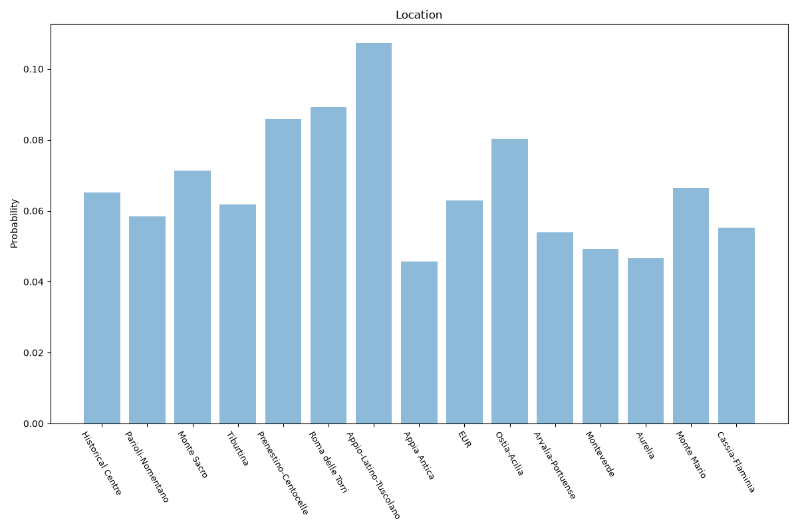

# Rome
**2 features:** location and residence.

## Location

## Residence

## Sources

- [Popolazione residente per municipio, Roma Capitale (2015)](https://www.istat.it/en/) — location
- [World Urbanization Prospects 2018, United Nations (2018)](https://population.un.org/wup/) — residence