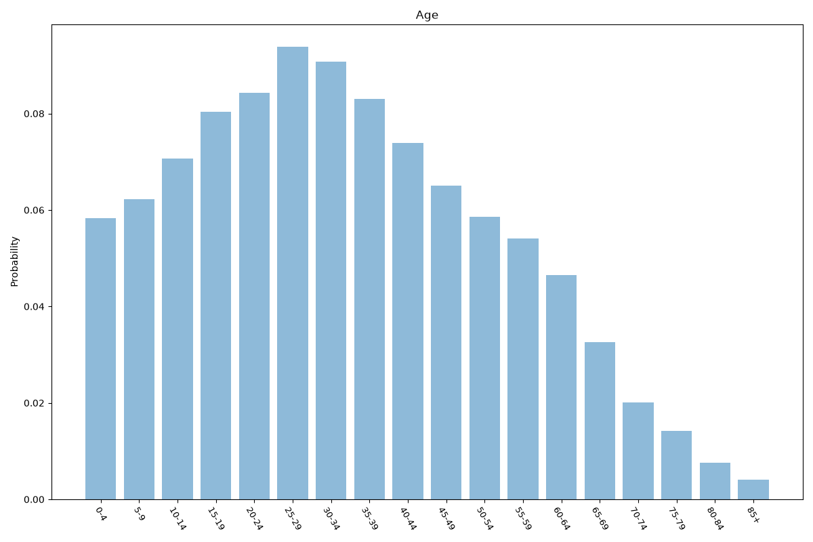
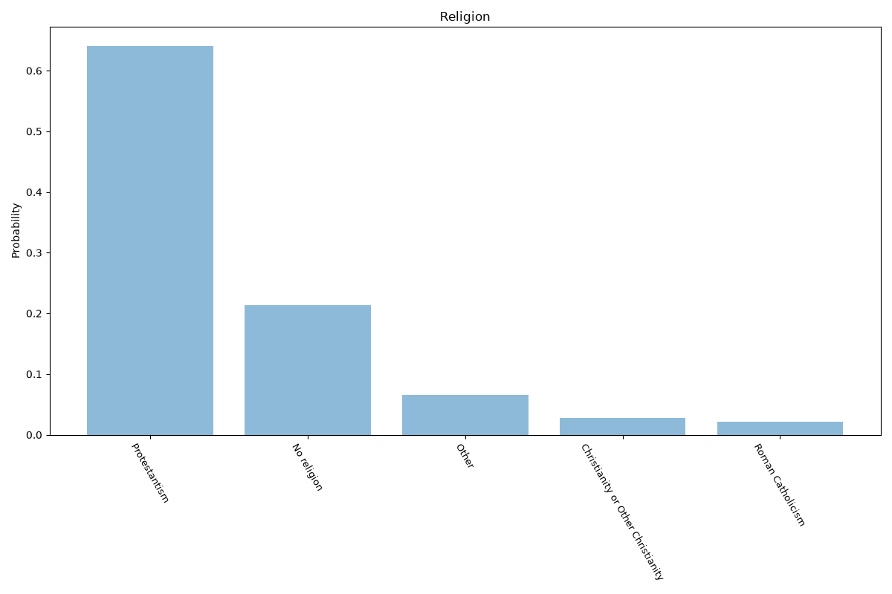
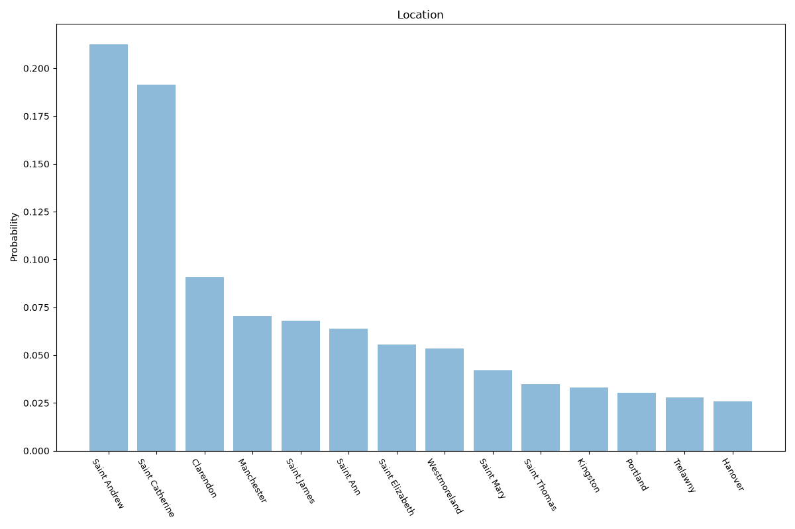

# Jamaica
**4 features:** age, sex, religion and location.

## Age

## Sex

## Religion

## Location

## Sources

- [World Population Prospects 2024, United Nations (2024)](https://population.un.org/wpp/) — age, sex
- [2011 Census (religion), Statistical Institute of Jamaica (STATIN) (2011)](https://statinja.gov.jm/) — religion
- [2011 Census, Statistical Institute of Jamaica (STATIN) (2011)](https://statinja.gov.jm/) — location