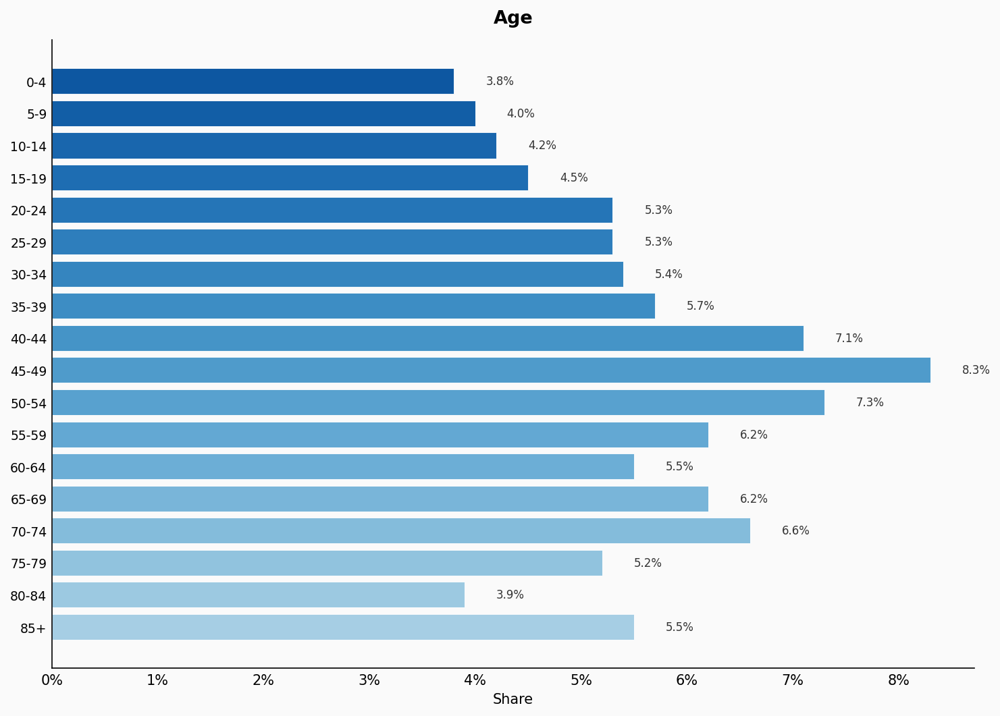
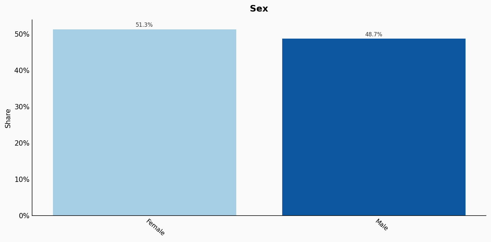
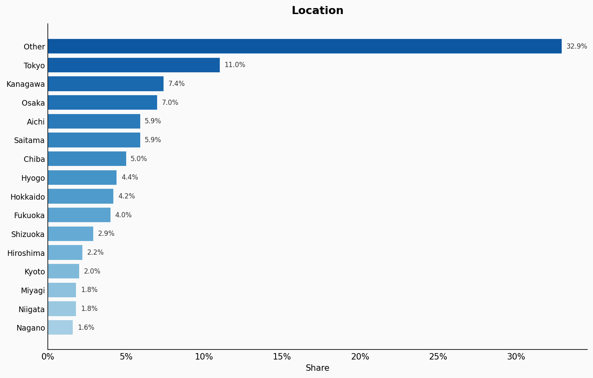
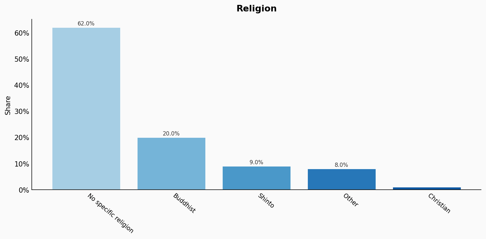
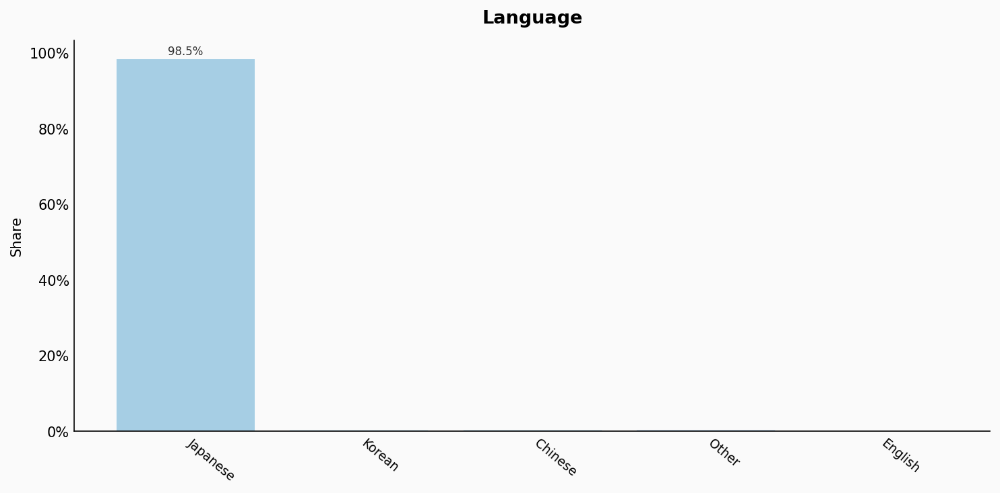
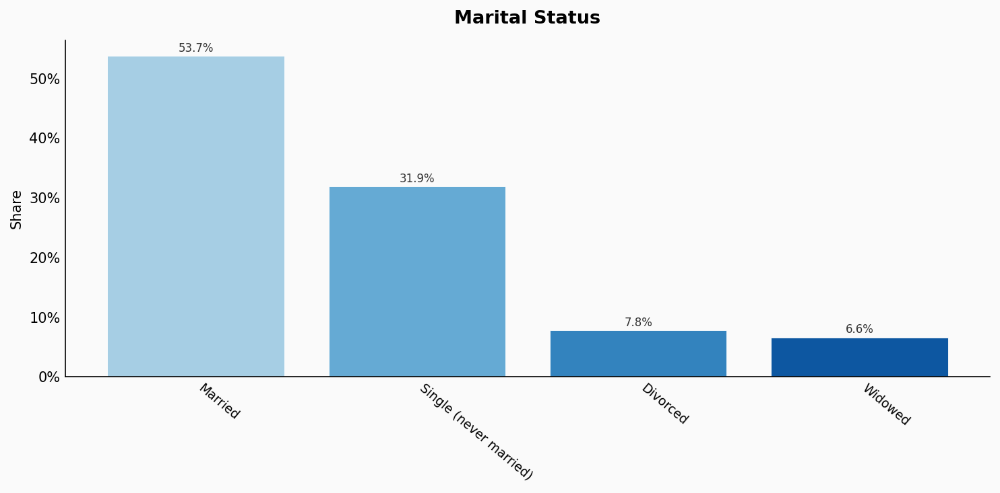
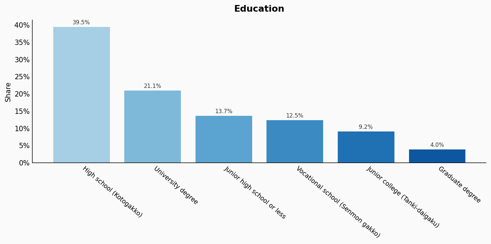
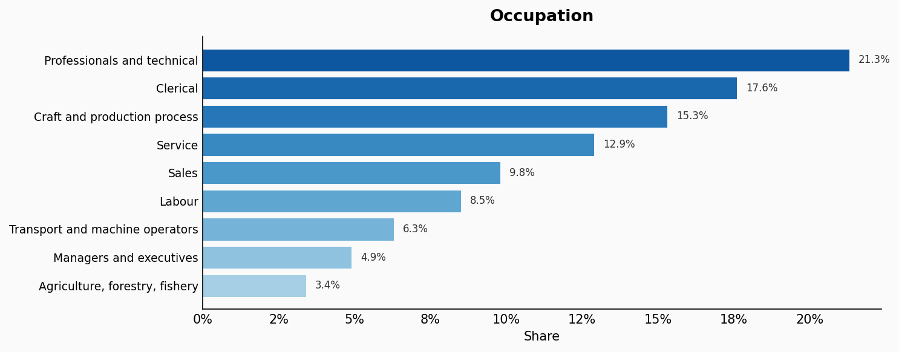
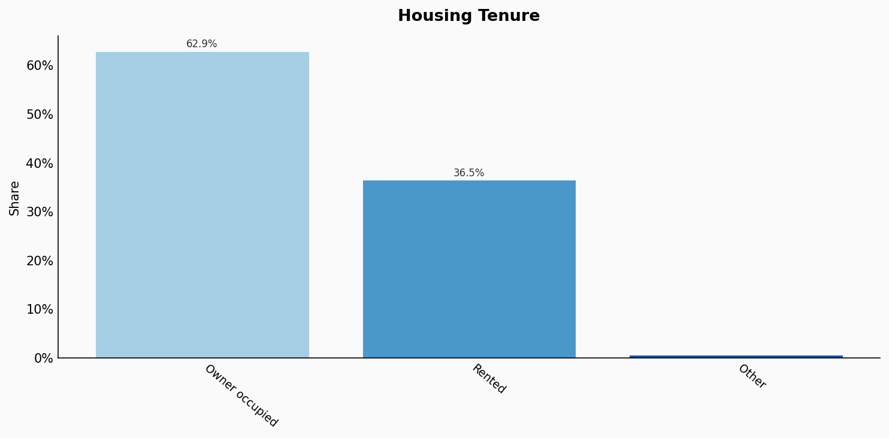
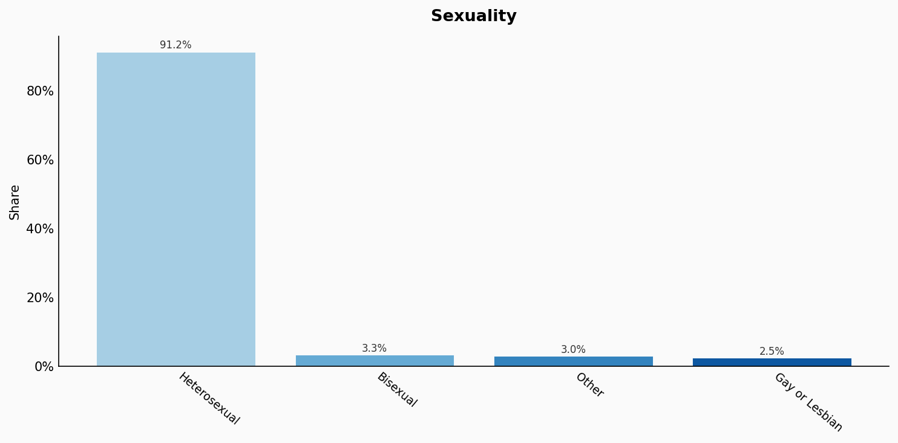

# Japan

**11 features:** age, sex, location, religion, language, marital status, education, occupation, housing tenure, place of birth, and sexuality.

## Age

| Option | Share |
|---|---:|
| 0-4 | 3.8% |
| 5-9 | 4.0% |
| 10-14 | 4.2% |
| 15-19 | 4.5% |
| 20-24 | 5.3% |
| 25-29 | 5.3% |
| 30-34 | 5.4% |
| 35-39 | 5.7% |
| 40-44 | 7.1% |
| 45-49 | 8.3% |
| 50-54 | 7.3% |
| 55-59 | 6.2% |
| 60-64 | 5.5% |
| 65-69 | 6.2% |
| 70-74 | 6.6% |
| 75-79 | 5.2% |
| 80-84 | 3.9% |
| 85+ | 5.5% |

## Sex

| Option | Share |
|---|---:|
| Female | 51.3% |
| Male | 48.7% |

## Location

| Option | Share |
|---|---:|
| Other | 32.9% |
| Tokyo | 11.0% |
| Kanagawa | 7.4% |
| Osaka | 7.0% |
| Aichi | 5.9% |
| Saitama | 5.9% |
| Chiba | 5.0% |
| Hyogo | 4.4% |
| Hokkaido | 4.2% |
| Fukuoka | 4.0% |
| Shizuoka | 2.9% |
| Hiroshima | 2.2% |
| Kyoto | 2.0% |
| Miyagi | 1.8% |
| Niigata | 1.8% |
| Nagano | 1.6% |

## Religion

| Option | Share |
|---|---:|
| No specific religion | 62.0% |
| Buddhist | 20.0% |
| Shinto | 9.0% |
| Other | 8.0% |
| Christian | 1.0% |

## Language

| Option | Share |
|---|---:|
| Japanese | 98.5% |
| Korean | 0.5% |
| Chinese | 0.4% |
| Other | 0.4% |
| English | 0.2% |

## Marital Status

| Option | Share |
|---|---:|
| Married | 53.7% |
| Single (never married) | 31.9% |
| Divorced | 7.8% |
| Widowed | 6.6% |

## Education

| Option | Share |
|---|---:|
| High school (Kotogakko) | 39.5% |
| University degree | 21.1% |
| Junior high school or less | 13.7% |
| Vocational school (Senmon gakko) | 12.5% |
| Junior college (Tanki-daigaku) | 9.2% |
| Graduate degree | 4.0% |

## Occupation

| Option | Share |
|---|---:|
| Professionals and technical | 21.3% |
| Clerical | 17.6% |
| Craft and production process | 15.3% |
| Service | 12.9% |
| Sales | 9.8% |
| Labour | 8.5% |
| Transport and machine operators | 6.3% |
| Managers and executives | 4.9% |
| Agriculture, forestry, fishery | 3.4% |

## Housing Tenure

| Option | Share |
|---|---:|
| Owner occupied | 62.9% |
| Rented | 36.5% |
| Other | 0.6% |

## Place Of Birth

| Option | Share |
|---|---:|
| Japan | 97.7% |
| China | 0.7% |
| Korea | 0.7% |
| Other | 0.5% |
| Vietnam | 0.2% |
| Philippines | 0.2% |

## Sexuality

| Option | Share |
|---|---:|
| Heterosexual | 91.2% |
| Bisexual | 3.3% |
| Other | 3.0% |
| Gay or Lesbian | 2.5% |

## Sources

- [Population Census 2020, Statistics Bureau of Japan (2020)](https://www.stat.go.jp/english/data/kokusei/2020/index.html)
  *Covers: `age`, `sex`, `marital status`, `location`, `occupation`, `housing tenure`*
- [Survey on Living Standards, Ministry of Health, Labour and Welfare (2022)](https://www.mhlw.go.jp/toukei/list/20-21.html)
  *Covers: `education`*
- [Survey on Religious Consciousness, NHK Broadcasting Culture Research Institute (2018)](https://www.nhk.or.jp/bunken/research/yoron/pdf/20190401_7.pdf)
  *Covers: `religion`*
- [Statistics on Foreign Residents, Ministry of Justice Japan (2022)](https://www.moj.go.jp/isa/publications/press/13_00028.html)
  *Covers: `place of birth`*
- [LGBT Survey, Dentsu Diversity Lab (2020)](https://www.dentsu.co.jp/news/release/2021/0408-010364.html)
  *Covers: `sexuality`*