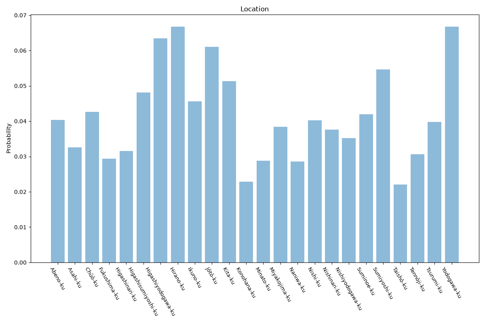

# Osaka
**2 features:** location and residence.

## Location

## Residence

## Sources

- [Population Census 2020, Statistics Bureau of Japan (2020)](https://www.stat.go.jp/english/) — location
- [World Urbanization Prospects 2018, United Nations (2018)](https://population.un.org/wup/) — residence