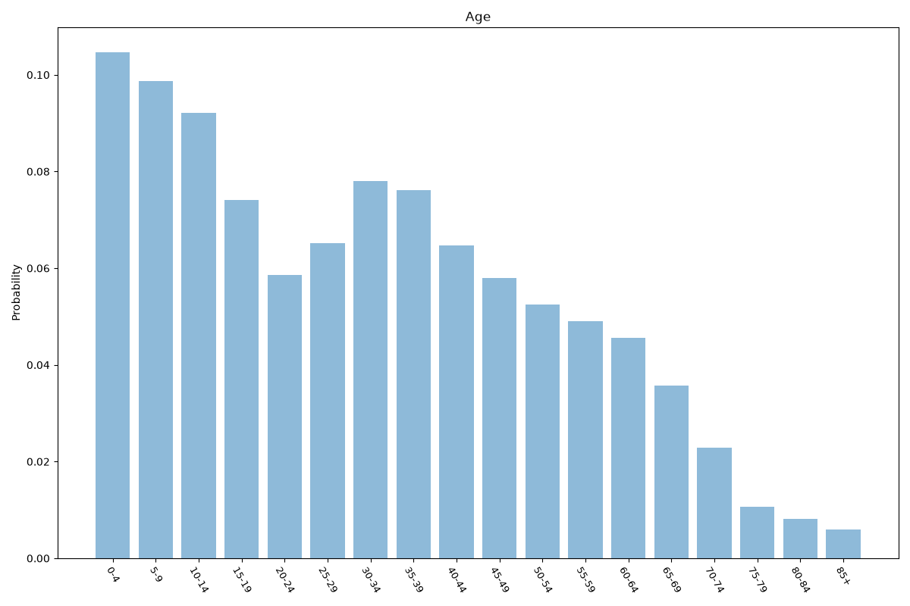
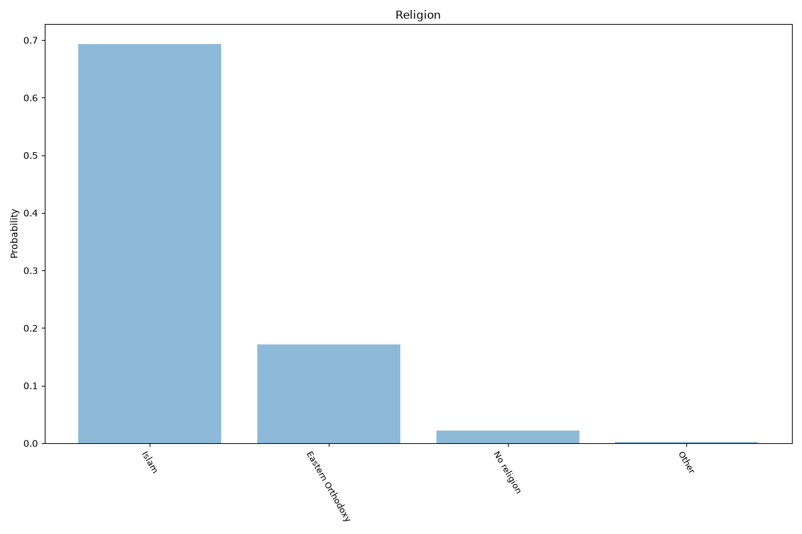
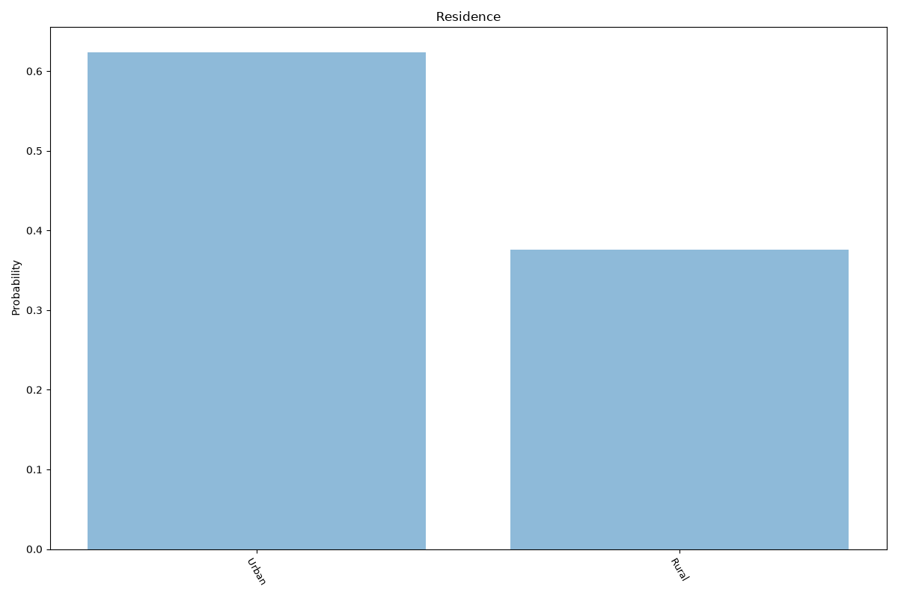
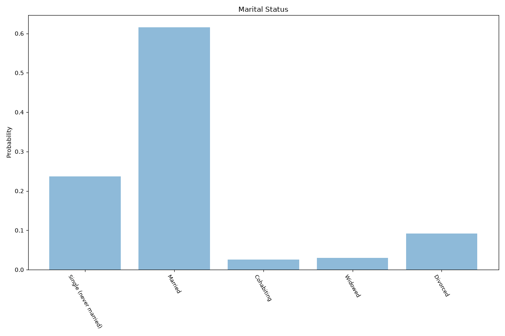
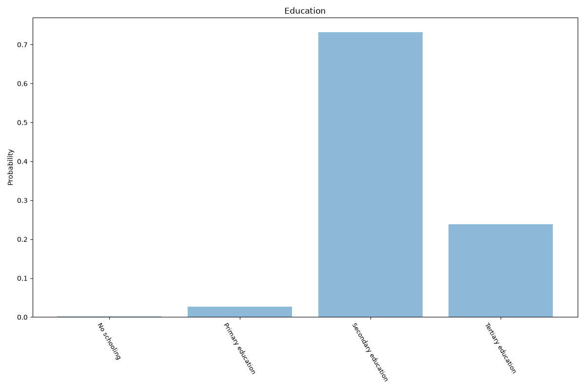
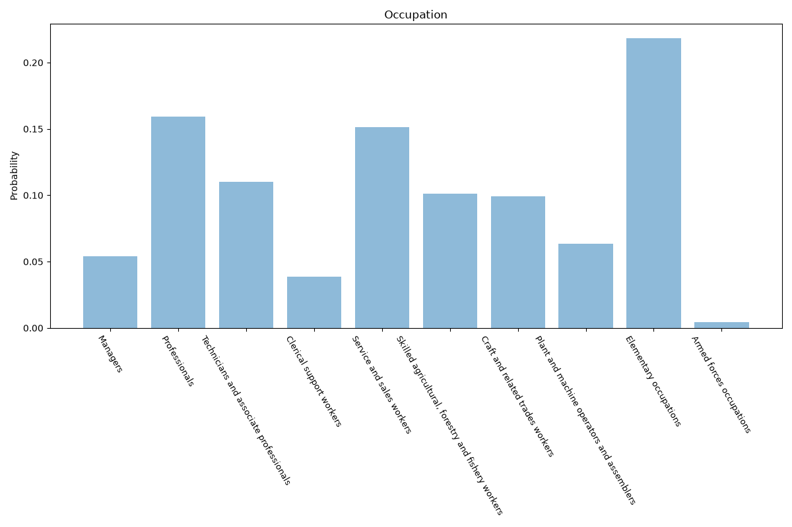
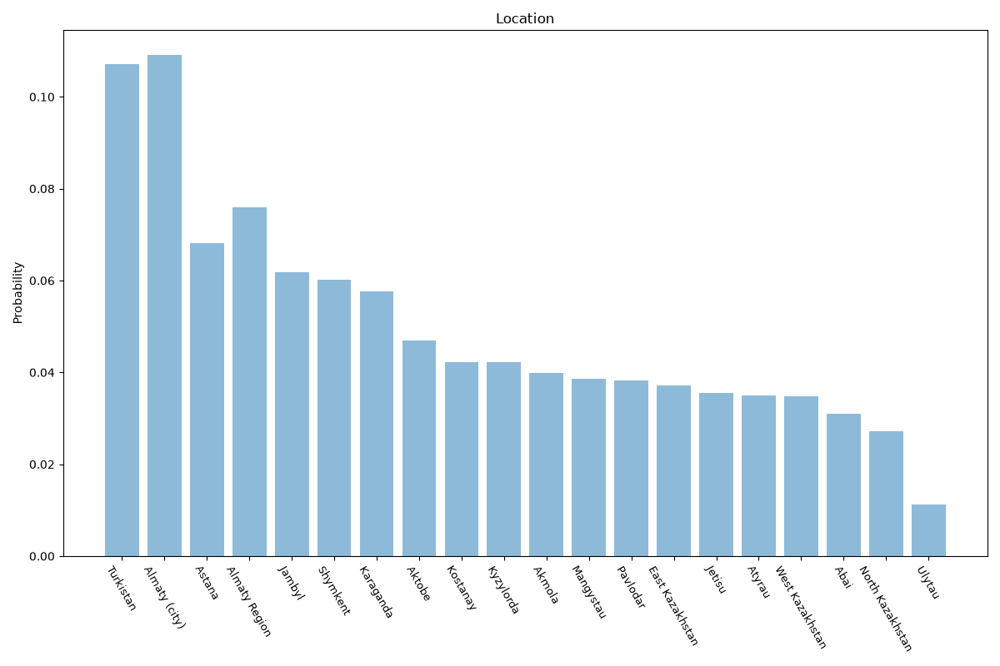

# Kazakhstan
**10 features:** age, sex, ethnicity, religion, residence, marital status, education, occupation, employment status and location.

## Age

## Sex

## Ethnicity

Population at the beginning of 2024; smaller reported groups are combined as Other ethnicities.

## Religion

## Residence

## Marital Status

## Education

## Occupation

## Employment Status

Population aged 15 and over.

## Location

## Sources

- [World Population Prospects 2024, United Nations (2024)](https://population.un.org/wpp/) — age, sex
- [2021 National Census (religion), Bureau of National Statistics (Kazakhstan) (2021)](https://stat.gov.kz/en/) — religion
- [Population by individual ethnic groups, Bureau of National Statistics (Kazakhstan) (2024)](https://stat.gov.kz/en/industries/social-%C3%82%C2%ADstatistics/demography/publications/157662/) — ethnicity
- [2021 National Census, Bureau of National Statistics (Kazakhstan) (2021)](https://stat.gov.kz/en/) — location
- [Urban population (% of total population), World Bank (2025)](https://data.worldbank.org/indicator/SP.URB.TOTL.IN.ZS) — residence
- [World Marriage Data 2019, United Nations (2015)](https://www.un.org/development/desa/pd/data/world-marriage-data) — marital status
- [Wittgenstein Centre Human Capital Data Explorer (Version 3.0, SSP2 scenario), IIASA (2020)](https://dataexplorer.wittgensteincentre.org/wcde-v3/) — education
- [Employment by sex and occupation (ISCO-08), ILOSTAT, International Labour Organization (2013)](https://ilostat.ilo.org/data/) — occupation
- [Labour force participation rate and unemployment rate (modelled ILO estimate), World Bank (2025)](https://data.worldbank.org/indicator/SL.TLF.CACT.ZS) — employment status
