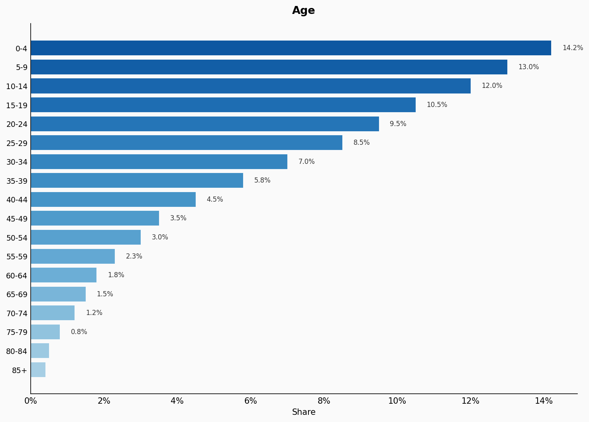
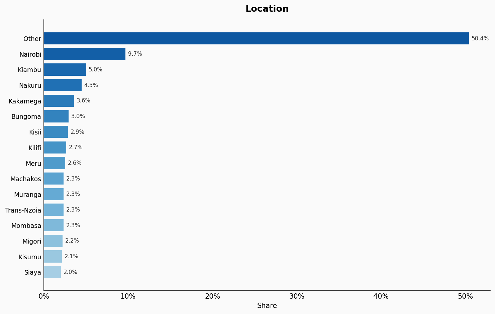
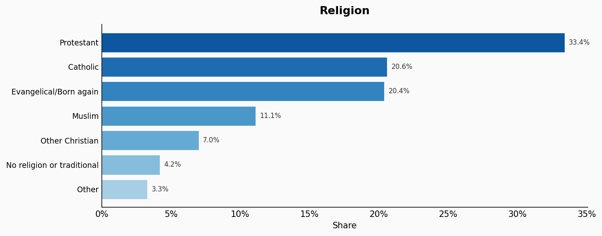
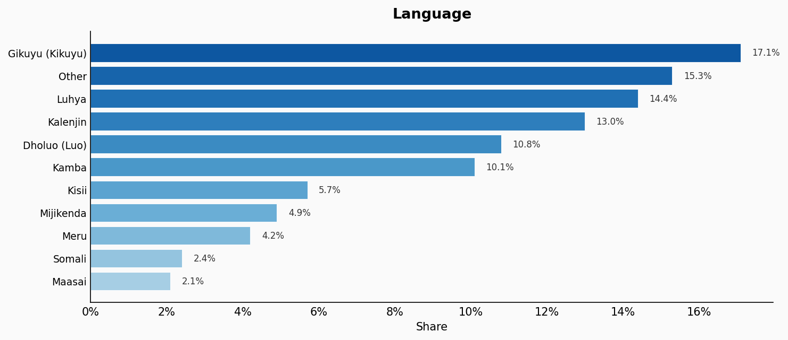
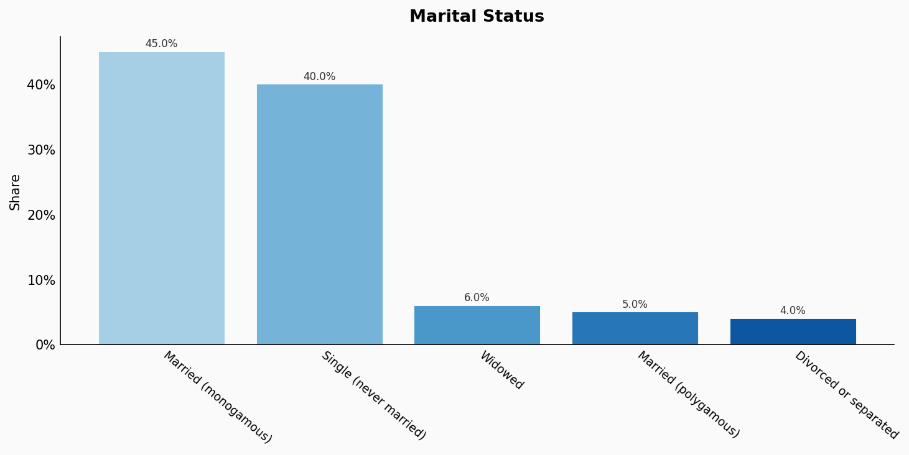
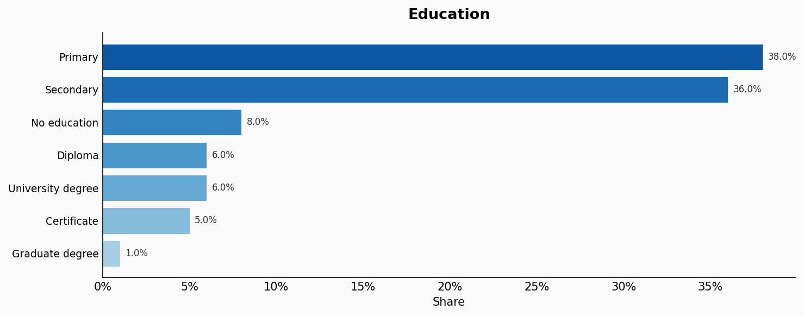
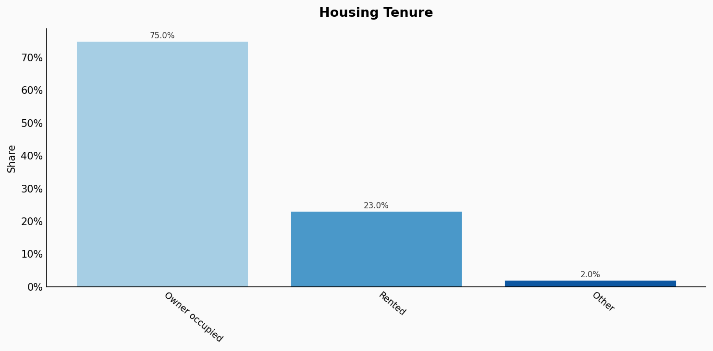
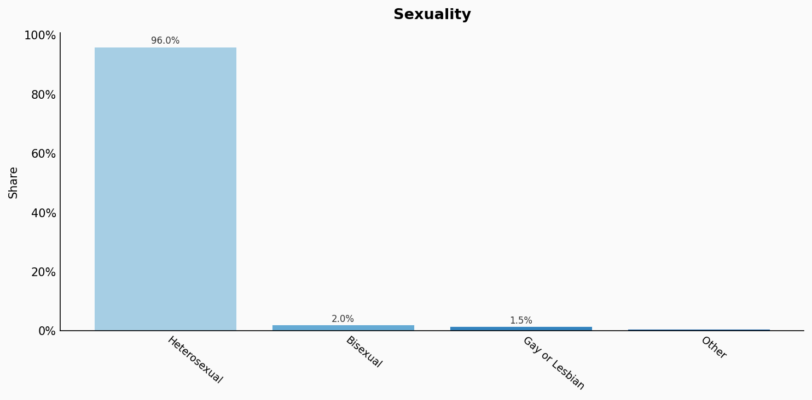

# Kenya

**11 features:** age, sex, location, religion, language, marital status, education, occupation, housing tenure, place of birth, and sexuality.

## Age

| Option | Share |
|---|---:|
| 0-4 | 14.2% |
| 5-9 | 13.0% |
| 10-14 | 12.0% |
| 15-19 | 10.5% |
| 20-24 | 9.5% |
| 25-29 | 8.5% |
| 30-34 | 7.0% |
| 35-39 | 5.8% |
| 40-44 | 4.5% |
| 45-49 | 3.5% |
| 50-54 | 3.0% |
| 55-59 | 2.3% |
| 60-64 | 1.8% |
| 65-69 | 1.5% |
| 70-74 | 1.2% |
| 75-79 | 0.8% |
| 80-84 | 0.5% |
| 85+ | 0.4% |

## Sex

| Option | Share |
|---|---:|
| Female | 50.1% |
| Male | 49.9% |

## Location

| Option | Share |
|---|---:|
| Other | 50.4% |
| Nairobi | 9.7% |
| Kiambu | 5.0% |
| Nakuru | 4.5% |
| Kakamega | 3.6% |
| Bungoma | 3.0% |
| Kisii | 2.9% |
| Kilifi | 2.7% |
| Meru | 2.6% |
| Machakos | 2.3% |
| Muranga | 2.3% |
| Trans-Nzoia | 2.3% |
| Mombasa | 2.3% |
| Migori | 2.2% |
| Kisumu | 2.1% |
| Siaya | 2.0% |

## Religion

| Option | Share |
|---|---:|
| Protestant | 33.4% |
| Catholic | 20.6% |
| Evangelical/Born again | 20.4% |
| Muslim | 11.1% |
| Other Christian | 7.0% |
| No religion or traditional | 4.2% |
| Other | 3.3% |

## Language

| Option | Share |
|---|---:|
| Gikuyu (Kikuyu) | 17.1% |
| Other | 15.3% |
| Luhya | 14.4% |
| Kalenjin | 13.0% |
| Dholuo (Luo) | 10.8% |
| Kamba | 10.1% |
| Kisii | 5.7% |
| Mijikenda | 4.9% |
| Meru | 4.2% |
| Somali | 2.4% |
| Maasai | 2.1% |

## Marital Status

| Option | Share |
|---|---:|
| Married (monogamous) | 45.0% |
| Single (never married) | 40.0% |
| Widowed | 6.0% |
| Married (polygamous) | 5.0% |
| Divorced or separated | 4.0% |

## Education

| Option | Share |
|---|---:|
| Primary | 38.0% |
| Secondary | 36.0% |
| No education | 8.0% |
| Diploma | 6.0% |
| University degree | 6.0% |
| Certificate | 5.0% |
| Graduate degree | 1.0% |

## Occupation

| Option | Share |
|---|---:|
| Agriculture | 36.0% |
| Elementary | 18.0% |
| Service and sales | 14.0% |
| Craft and trades | 10.0% |
| Professionals | 7.0% |
| Technicians | 6.0% |
| Administrative | 4.0% |
| Plant and machine operators | 3.0% |
| Management | 2.0% |

## Housing Tenure

| Option | Share |
|---|---:|
| Owner occupied | 75.0% |
| Rented | 23.0% |
| Other | 2.0% |

## Place Of Birth

| Option | Share |
|---|---:|
| Kenya | 96.5% |
| Other | 2.1% |
| Somalia | 0.5% |
| Uganda | 0.5% |
| Tanzania | 0.4% |

## Sexuality

| Option | Share |
|---|---:|
| Heterosexual | 96.0% |
| Bisexual | 2.0% |
| Gay or Lesbian | 1.5% |
| Other | 0.5% |

## Sources

- [Kenya Population and Housing Census 2019, Kenya National Bureau of Statistics (KNBS) (2019)](https://www.knbs.or.ke/2019-kenya-population-and-housing-census/)
  *Covers: `age`, `sex`, `location`, `marital status`, `housing tenure`, `place of birth`, `religion`*
- [Kenya Continuous Household Survey Programme 2022, KNBS (2022)](https://www.knbs.or.ke/)
  *Covers: `education`, `occupation`*
- [Kenya Population and Housing Census 2019 - Ethnicity, KNBS (2019)](https://www.knbs.or.ke/2019-kenya-population-and-housing-census/)
  *Covers: `language`*
- [African Barometer / Afrobarometer Kenya 2022 (2022)](https://www.afrobarometer.org/country/kenya/)
  *Covers: `sexuality`*