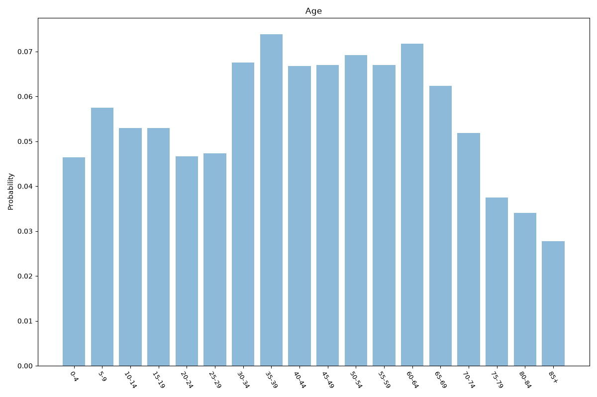
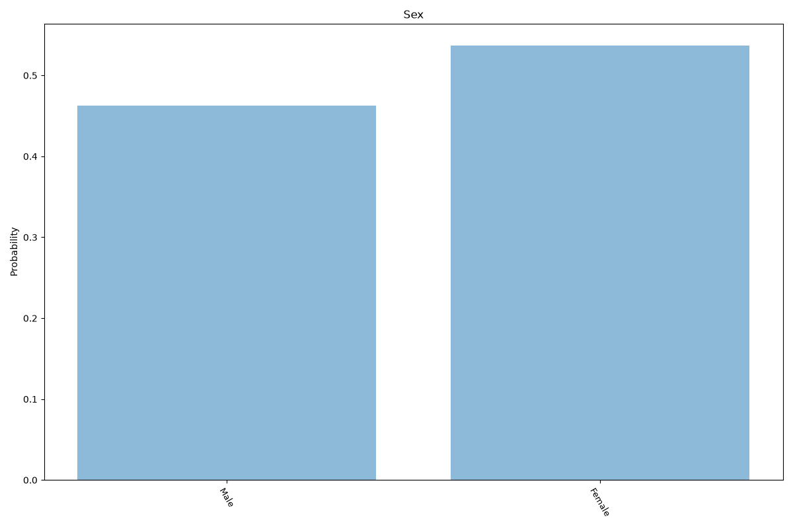
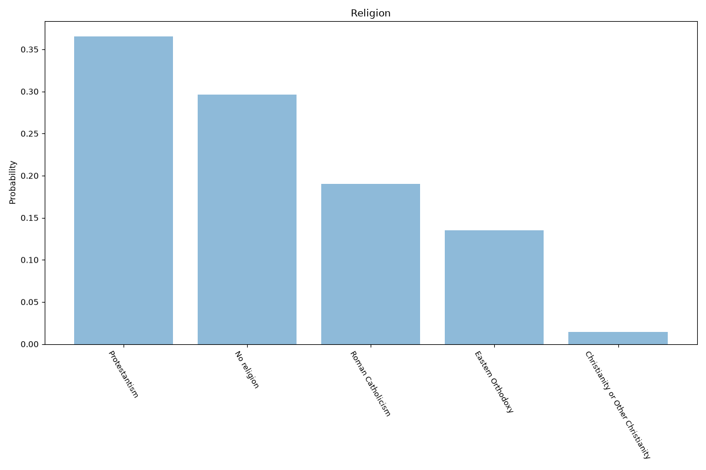
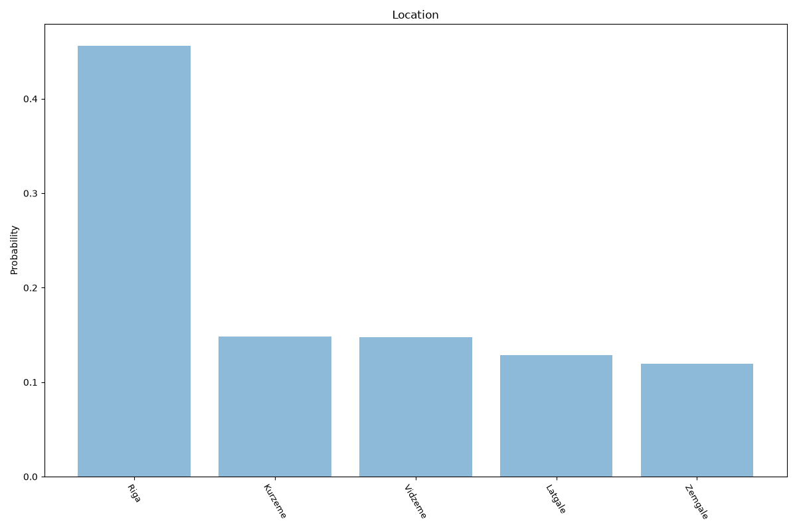

# Latvia
**4 features:** age, sex, religion and location.

## Age

## Sex

## Religion

## Location

## Sources

- [World Population Prospects 2024, United Nations (2024)](https://population.un.org/wpp/) — age, sex
- [2019 International Religious Freedom Report: Latvia, US Department of State (2019)](https://www.state.gov/reports/2019-report-on-international-religious-freedom/latvia/) — religion
- [Population by planning region, Central Statistical Bureau of Latvia (2025)](https://stat.gov.lv/en) — location