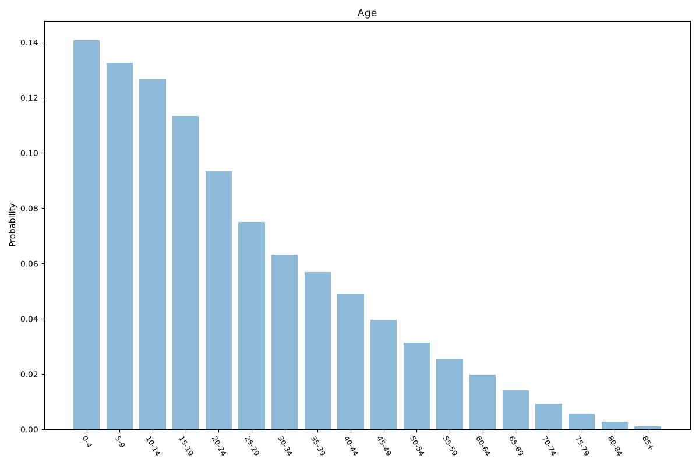
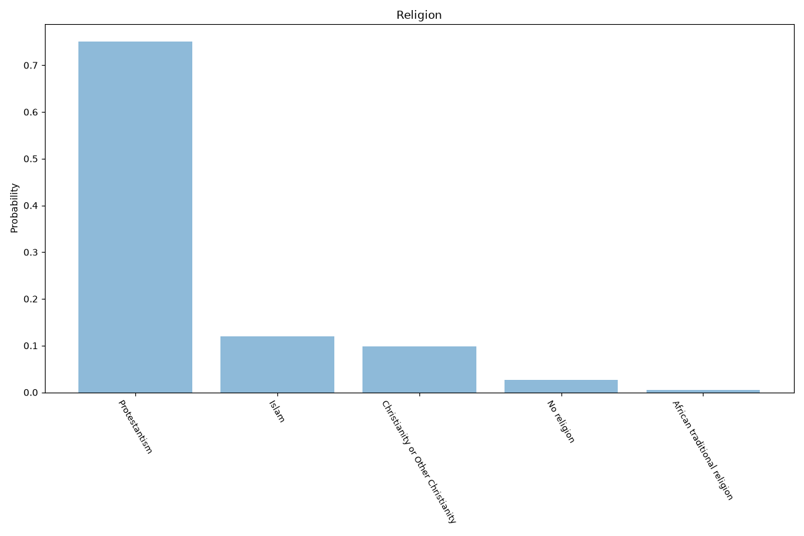
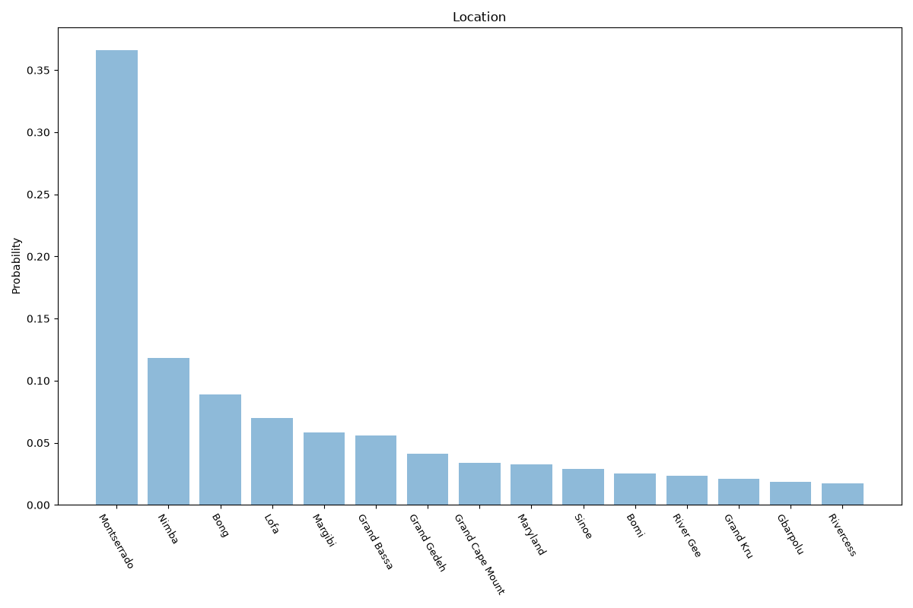

# Liberia
**4 features:** age, sex, religion and location.

## Age

## Sex

## Religion

## Location

## Sources

- [World Population Prospects 2024, United Nations (2024)](https://population.un.org/wpp/) — age, sex
- [2022 Census (religion), Liberia Institute of Statistics and Geo-Information Services (LISGIS) (2022)](https://www.lisgis.gov.lr/) — religion
- [2022 Population and Housing Census, Liberia Institute of Statistics and Geo-Information Services (LISGIS) (2022)](https://www.lisgis.gov.lr/) — location