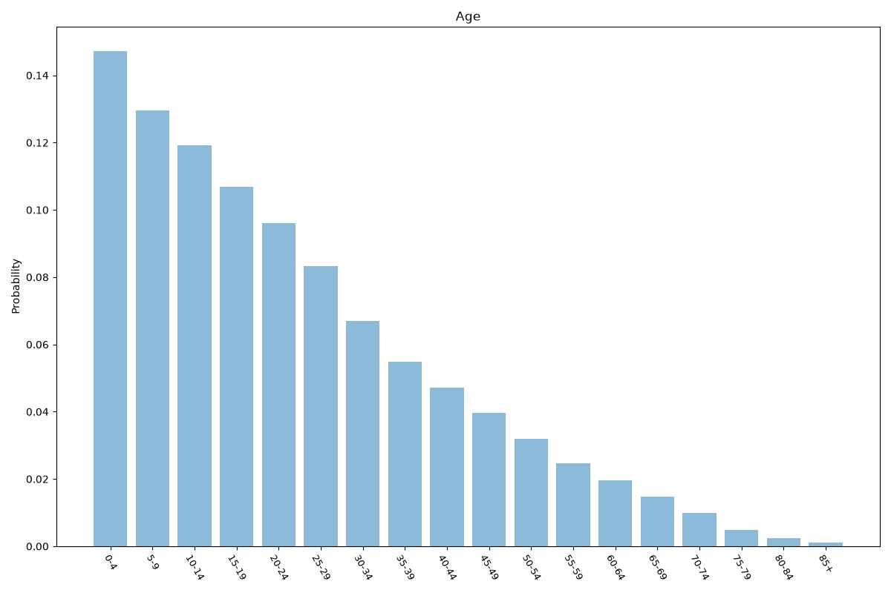
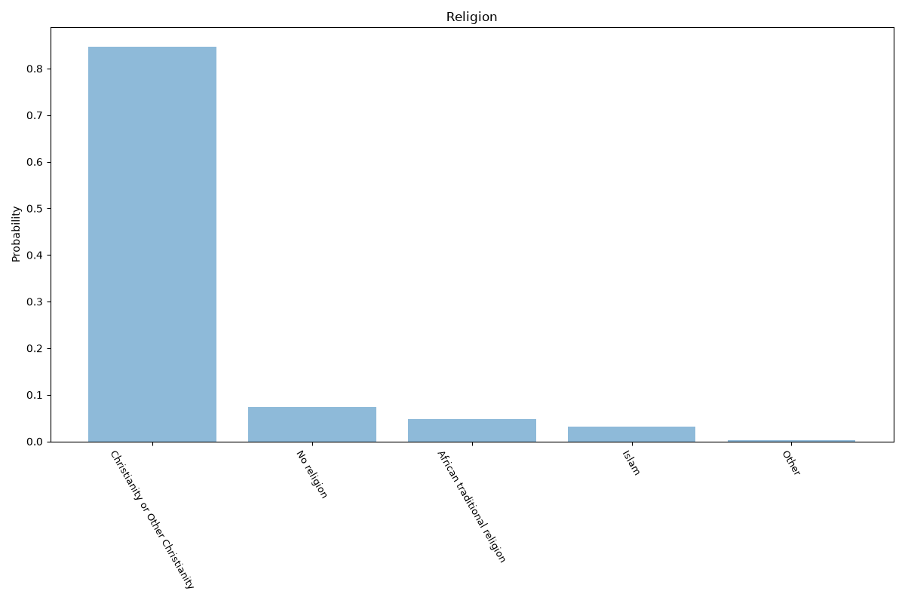
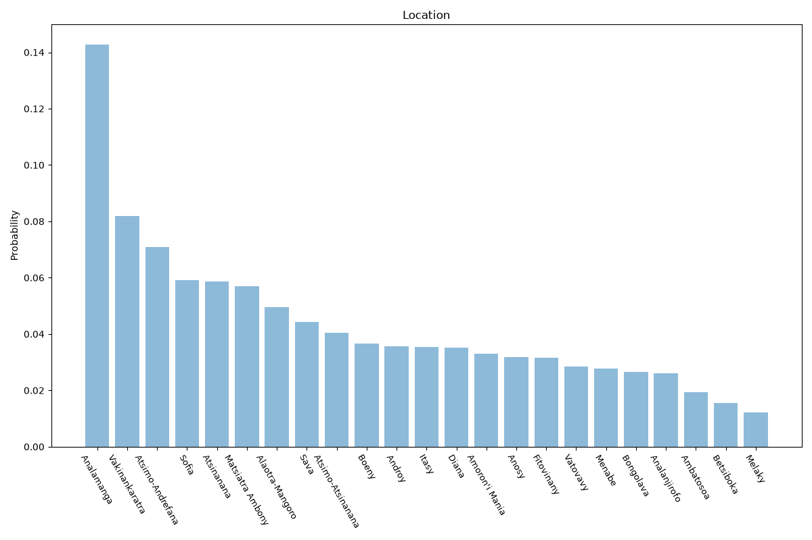

# Madagascar
**4 features:** age, sex, religion and location.

## Age

## Sex

## Religion

## Location

## Sources

- [World Population Prospects 2024, United Nations (2024)](https://population.un.org/wpp/) — age, sex
- [Global Religious Landscape, Pew Research Center (2020)](https://www.pewresearch.org/religion/) — religion
- [2018 Census, Institut National de la Statistique (INSTAT Madagascar) (2018)](https://www.instat.mg/) — location