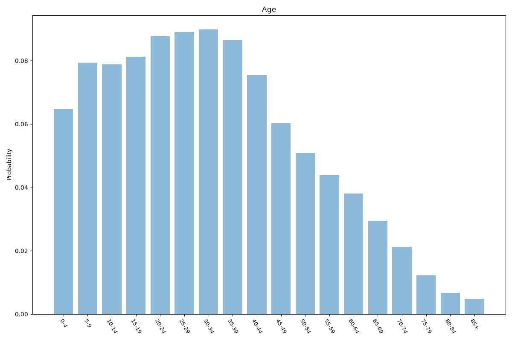
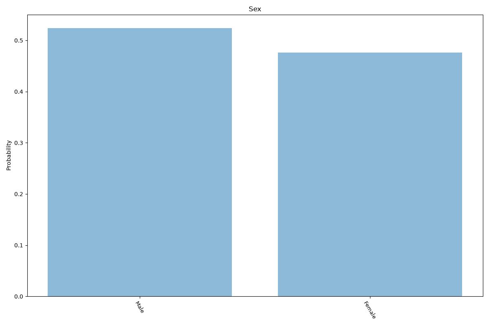
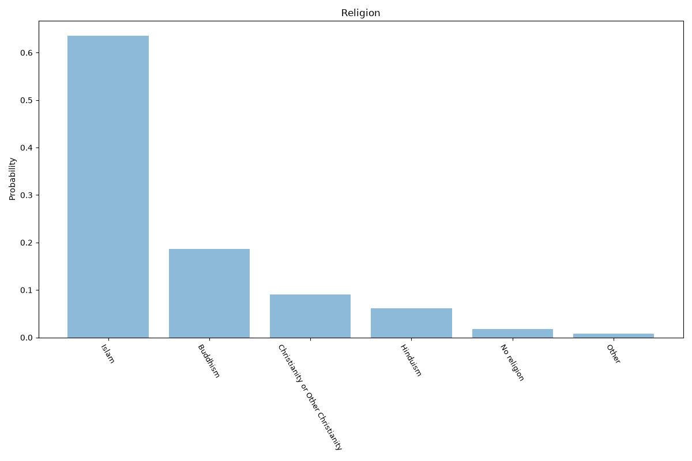
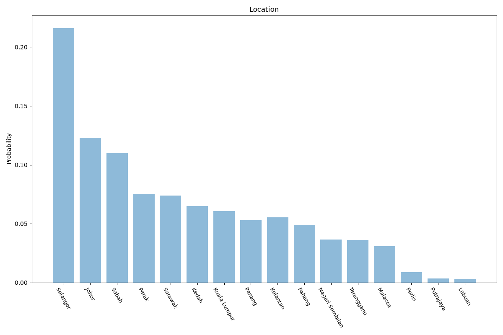

# Malaysia
**4 features:** age, sex, religion and location.

## Age

## Sex

## Religion

## Location

## Sources

- [World Population Prospects 2024, United Nations (2024)](https://population.un.org/wpp/) — age, sex
- [2020 Population and Housing Census (religion), Department of Statistics Malaysia (2020)](https://www.dosm.gov.my/) — religion
- [Population estimates, Department of Statistics Malaysia (DOSM) (2023)](https://www.dosm.gov.my/) — location