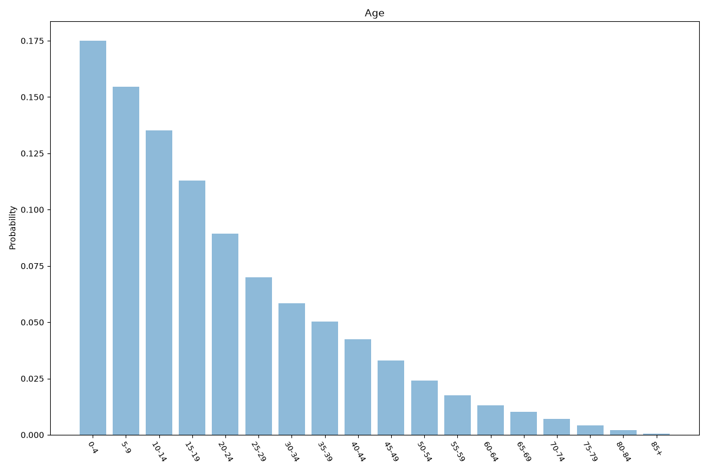
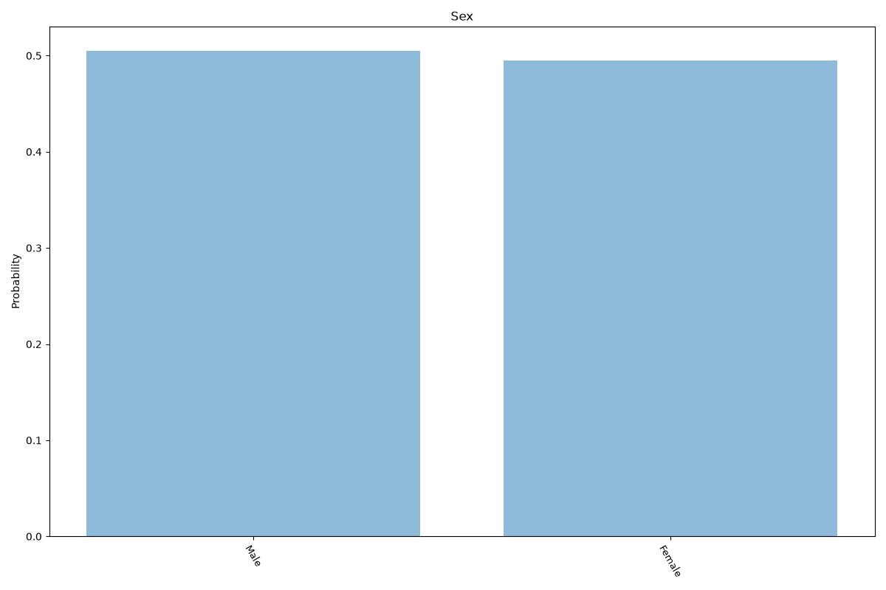
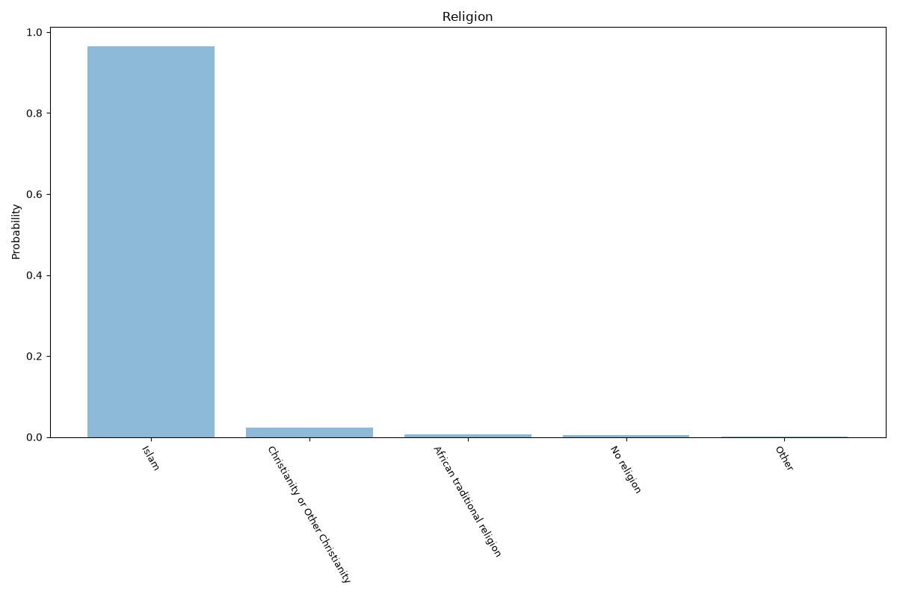
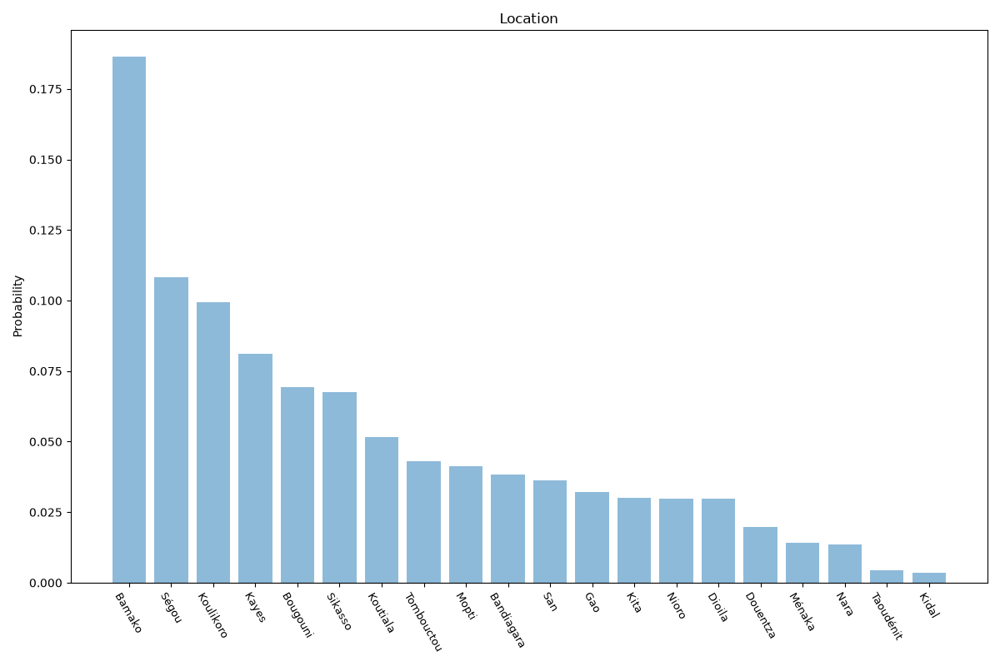

# Mali
**4 features:** age, sex, religion and location.

## Age

## Sex

## Religion

## Location

## Sources

- [World Population Prospects 2024, United Nations (2024)](https://population.un.org/wpp/) — age, sex
- [2022 Census (religion), Institut National de la Statistique (INSTAT Mali) (2022)](https://www.instat-mali.org/) — religion
- [Regional population estimates 2023, Institut National de la Statistique (INSTAT Mali) (2023)](https://www.instat-mali.org/) — location