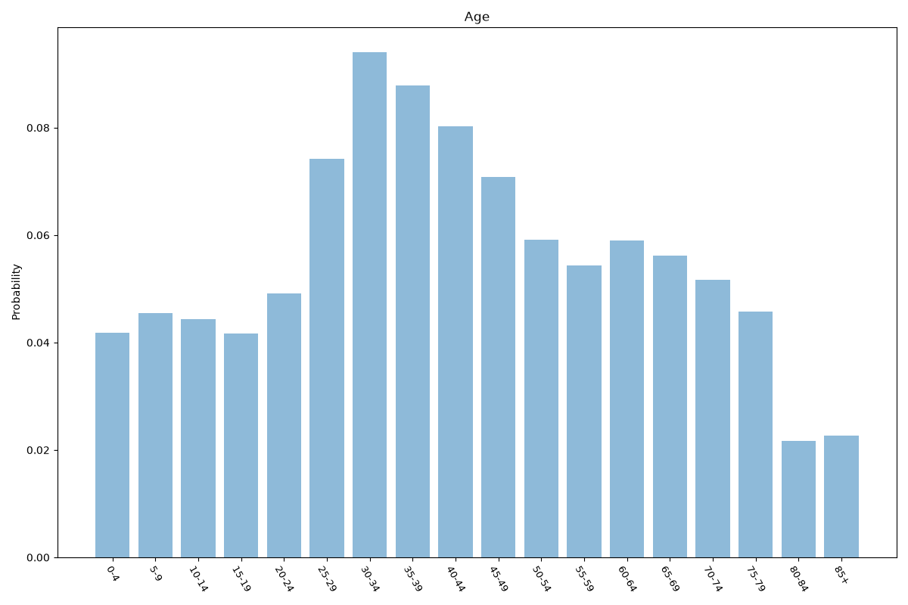
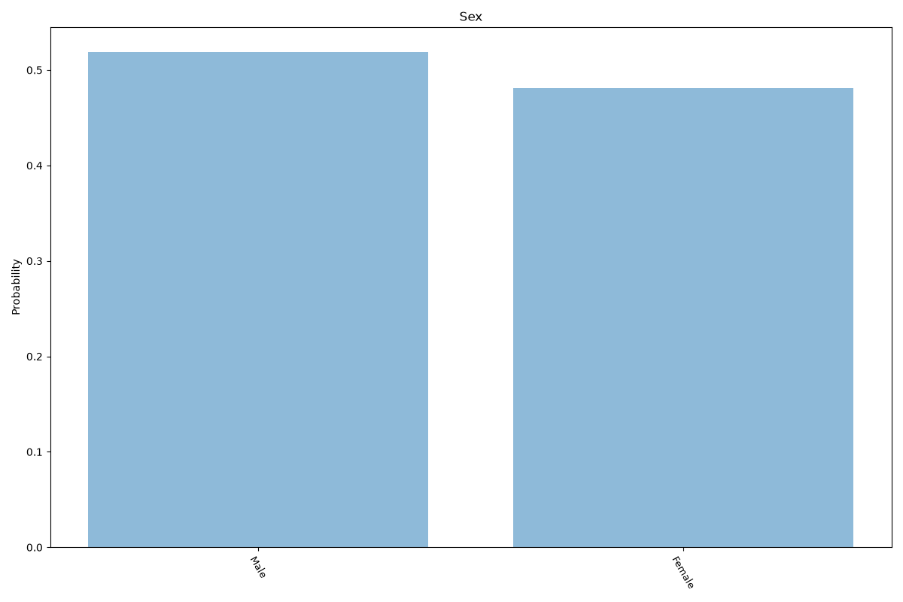
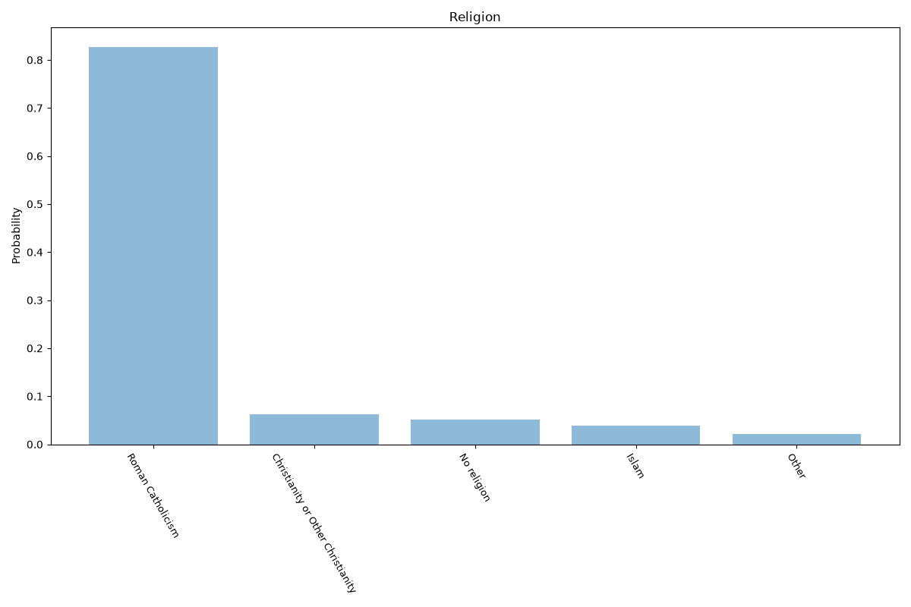
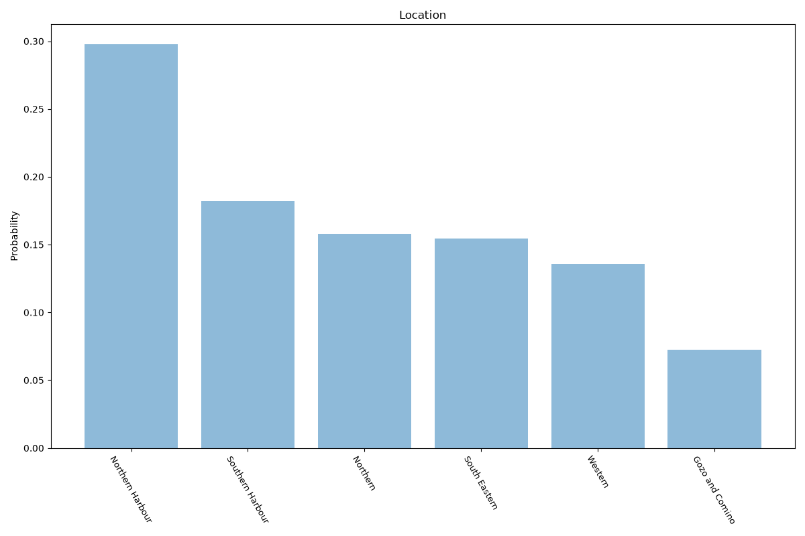

# Malta
**4 features:** age, sex, religion and location.

## Age

## Sex

## Religion

## Location

## Sources

- [World Population Prospects 2024, United Nations (2024)](https://population.un.org/wpp/) — age, sex
- [2021 Census (religion), National Statistics Office (Malta) (2021)](https://nso.gov.mt/) — religion
- [Population by district, National Statistics Office (Malta) (2016)](https://nso.gov.mt/) — location