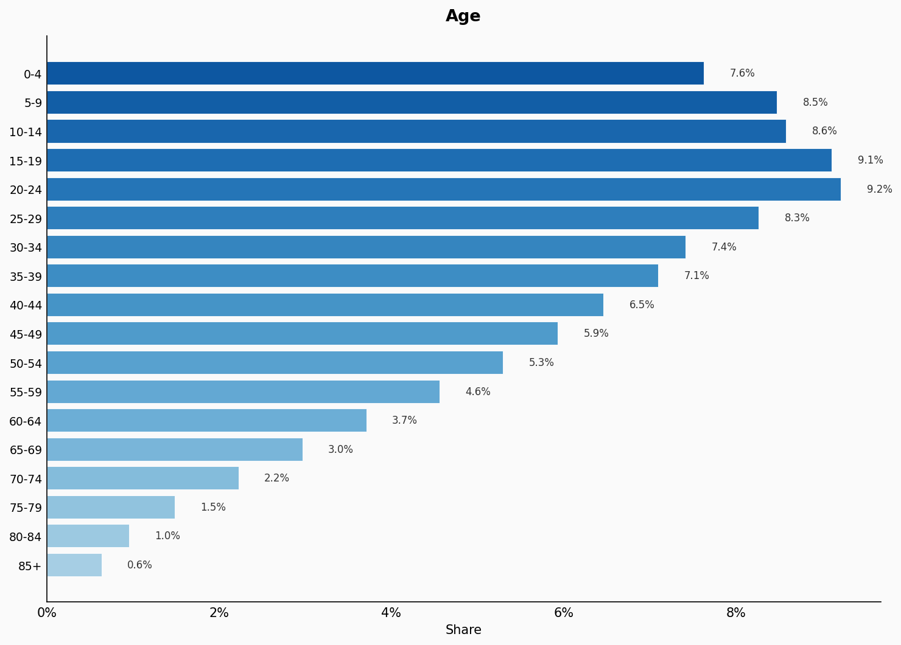
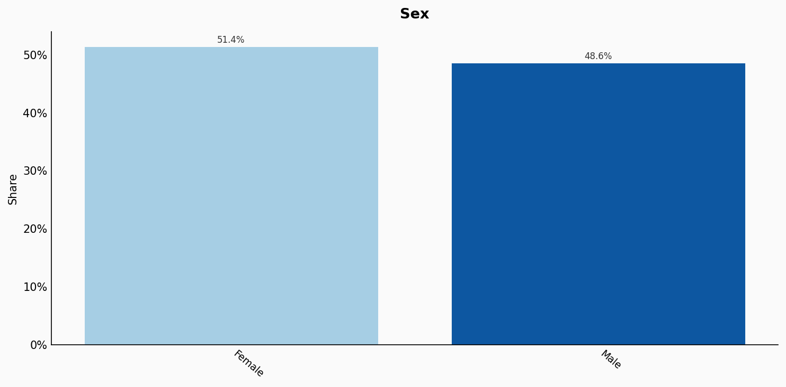
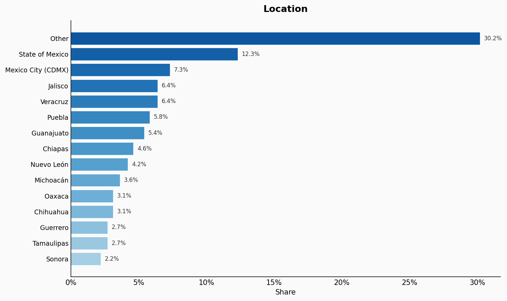
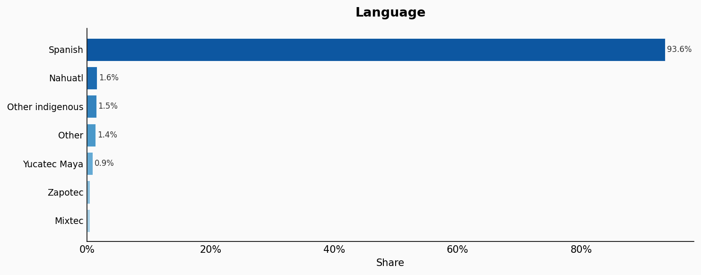
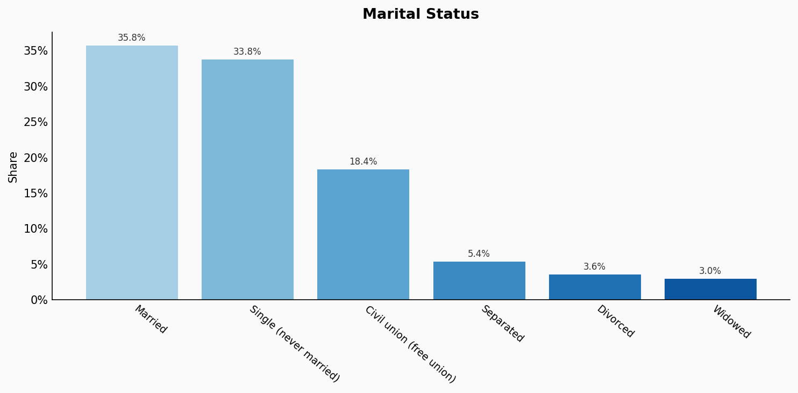
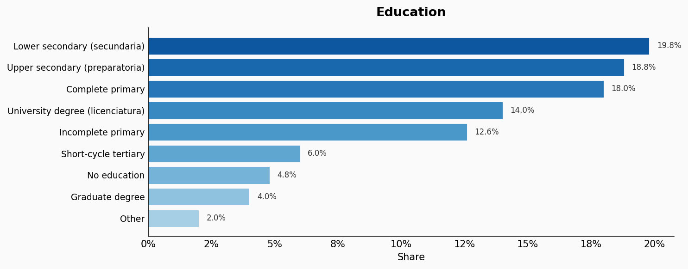
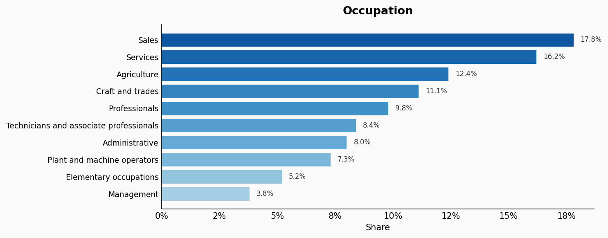
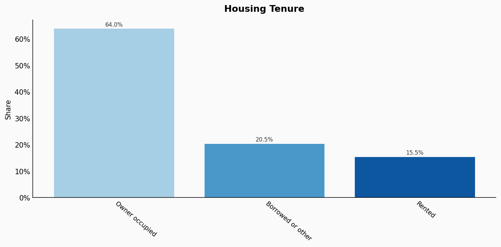
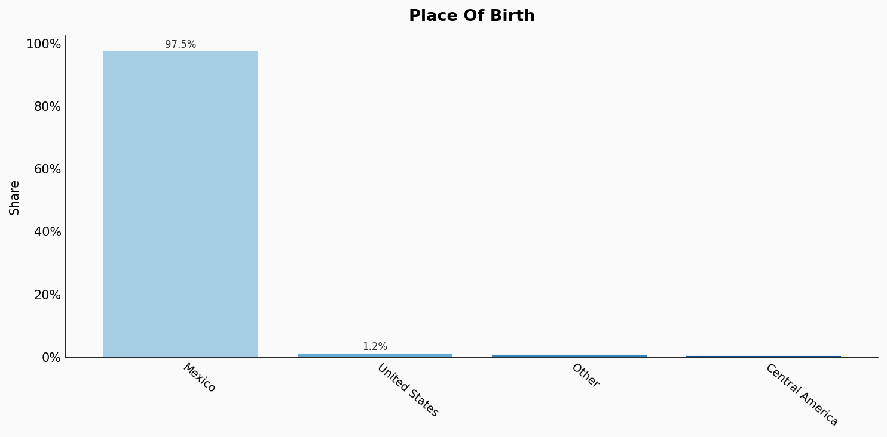
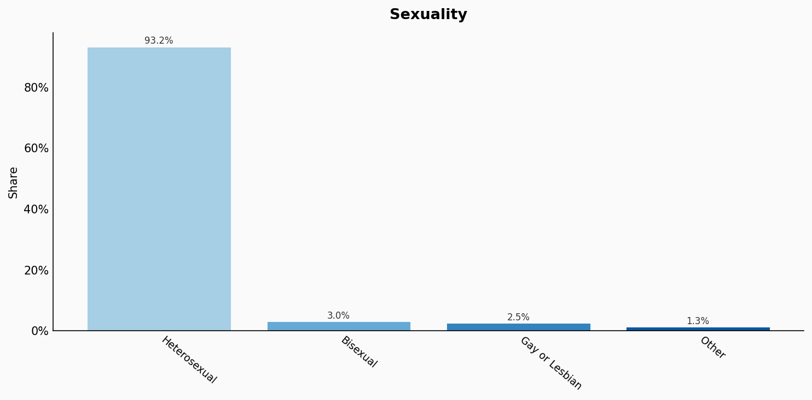

# Mexico

**11 features:** age, sex, location, religion, language, marital status, education, occupation, housing tenure, place of birth, and sexuality.

## Age

| Option | Share |
|---|---:|
| 0-4 | 7.6% |
| 5-9 | 8.5% |
| 10-14 | 8.6% |
| 15-19 | 9.1% |
| 20-24 | 9.2% |
| 25-29 | 8.3% |
| 30-34 | 7.4% |
| 35-39 | 7.1% |
| 40-44 | 6.5% |
| 45-49 | 5.9% |
| 50-54 | 5.3% |
| 55-59 | 4.6% |
| 60-64 | 3.7% |
| 65-69 | 3.0% |
| 70-74 | 2.2% |
| 75-79 | 1.5% |
| 80-84 | 1.0% |
| 85+ | 0.6% |

## Sex

| Option | Share |
|---|---:|
| Female | 51.4% |
| Male | 48.6% |

## Location

| Option | Share |
|---|---:|
| Other | 30.2% |
| State of Mexico | 12.3% |
| Mexico City (CDMX) | 7.3% |
| Jalisco | 6.4% |
| Veracruz | 6.4% |
| Puebla | 5.8% |
| Guanajuato | 5.4% |
| Chiapas | 4.6% |
| Nuevo León | 4.2% |
| Michoacán | 3.6% |
| Oaxaca | 3.1% |
| Chihuahua | 3.1% |
| Guerrero | 2.7% |
| Tamaulipas | 2.7% |
| Sonora | 2.2% |

## Religion

| Option | Share |
|---|---:|
| Catholic | 77.5% |
| Protestant/Evangelical | 11.3% |
| No religion | 8.6% |
| Jehovah's Witness | 1.3% |
| Other | 1.3% |

## Language

| Option | Share |
|---|---:|
| Spanish | 93.6% |
| Nahuatl | 1.6% |
| Other indigenous | 1.5% |
| Other | 1.4% |
| Yucatec Maya | 0.9% |
| Zapotec | 0.5% |
| Mixtec | 0.5% |

## Marital Status

| Option | Share |
|---|---:|
| Married | 35.8% |
| Single (never married) | 33.8% |
| Civil union (free union) | 18.4% |
| Separated | 5.4% |
| Divorced | 3.6% |
| Widowed | 3.0% |

## Education

| Option | Share |
|---|---:|
| Lower secondary (secundaria) | 19.8% |
| Upper secondary (preparatoria) | 18.8% |
| Complete primary | 18.0% |
| University degree (licenciatura) | 14.0% |
| Incomplete primary | 12.6% |
| Short-cycle tertiary | 6.0% |
| No education | 4.8% |
| Graduate degree | 4.0% |
| Other | 2.0% |

## Occupation

| Option | Share |
|---|---:|
| Sales | 17.8% |
| Services | 16.2% |
| Agriculture | 12.4% |
| Craft and trades | 11.1% |
| Professionals | 9.8% |
| Technicians and associate professionals | 8.4% |
| Administrative | 8.0% |
| Plant and machine operators | 7.3% |
| Elementary occupations | 5.2% |
| Management | 3.8% |

## Housing Tenure

| Option | Share |
|---|---:|
| Owner occupied | 64.0% |
| Borrowed or other | 20.5% |
| Rented | 15.5% |

## Place Of Birth

| Option | Share |
|---|---:|
| Mexico | 97.5% |
| United States | 1.2% |
| Other | 0.8% |
| Central America | 0.5% |

## Sexuality

| Option | Share |
|---|---:|
| Heterosexual | 93.2% |
| Bisexual | 3.0% |
| Gay or Lesbian | 2.5% |
| Other | 1.3% |

## Sources

- [Censo de Población y Vivienda 2020, INEGI (2020)](https://www.inegi.org.mx/programas/ccpv/2020/)
  *Covers: `age`, `sex`, `marital status`, `location`, `religion`, `language`, `housing tenure`*
- [Encuesta Nacional de Ocupación y Empleo (ENOE) 2022, INEGI (2022)](https://www.inegi.org.mx/programas/enoe/15ymas/)
  *Covers: `education`, `occupation`*
- [Encuesta Nacional sobre Discriminación 2022, CONAPRED/INEGI (2022)](https://www.inegi.org.mx/programas/enadis/2022/)
  *Covers: `place of birth`*
- [Encuesta Nacional sobre Diversidad Sexual y de Género (ENDISEG) 2021, INEGI (2021)](https://www.inegi.org.mx/programas/endiseg/2021/)
  *Covers: `sexuality`*