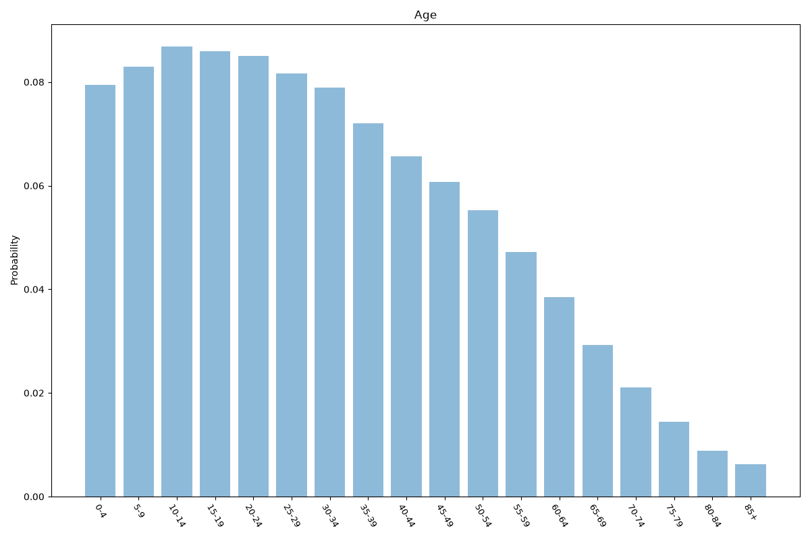
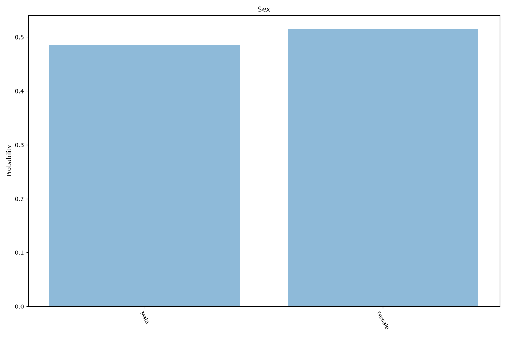
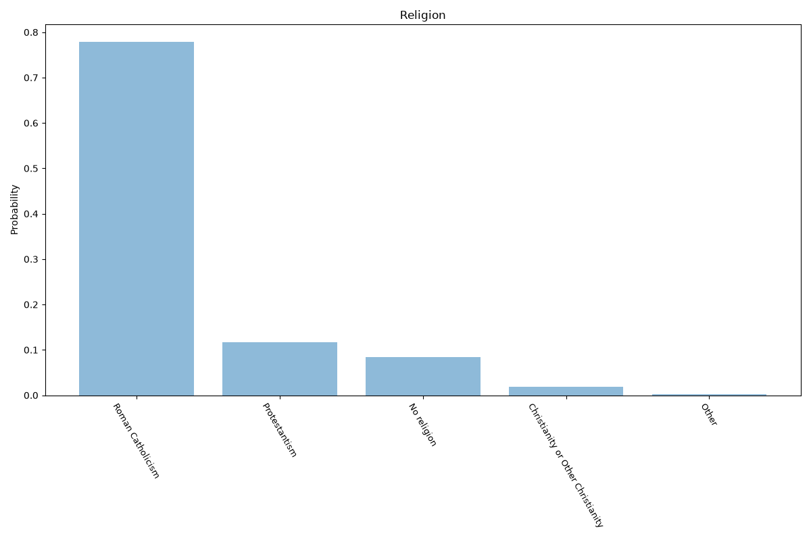
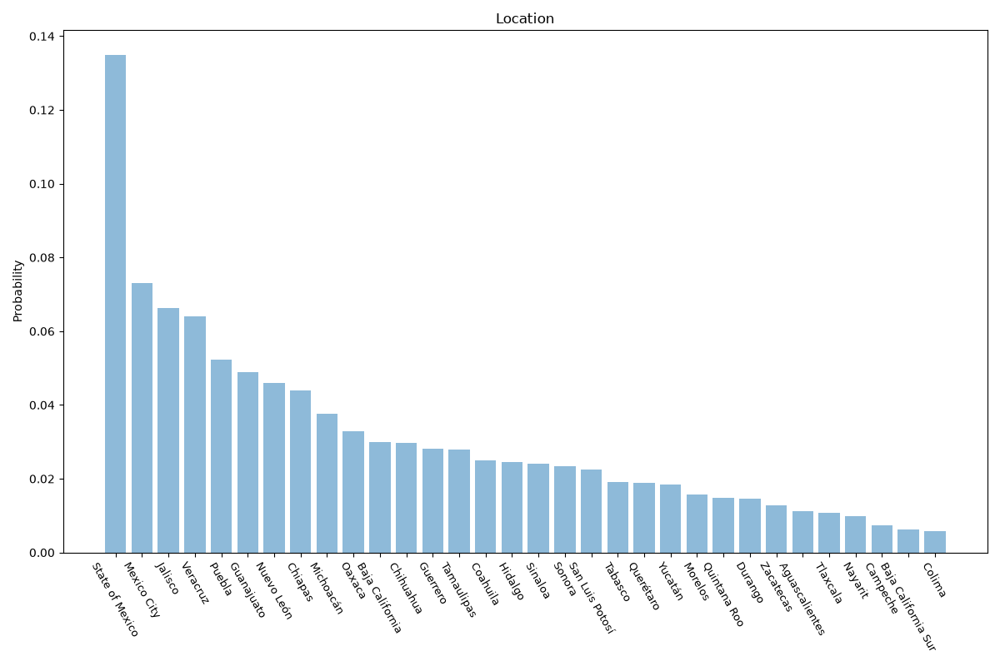

# Mexico
**4 features:** age, sex, religion and location.

## Age

## Sex

## Religion

## Location

## Sources

- [World Population Prospects 2024, United Nations (2024)](https://population.un.org/wpp/) — age, sex
- [Census 2020 (religion), INEGI (2020)](https://en.www.inegi.org.mx/) — religion
- [Census 2020, National Institute of Statistics and Geography (INEGI) (2020)](https://en.www.inegi.org.mx/) — location