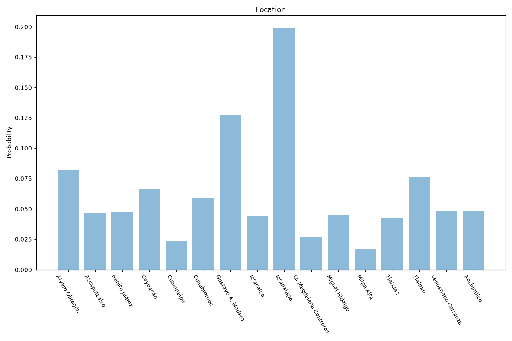
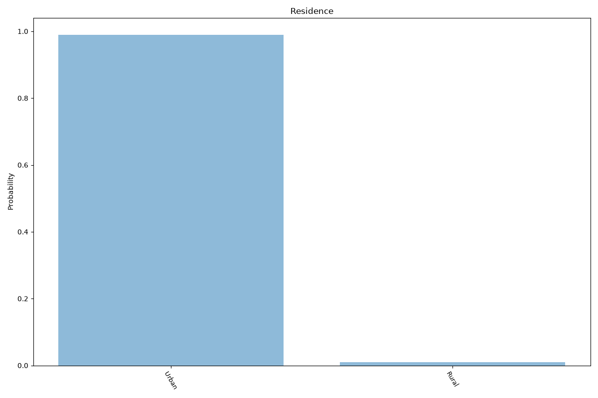

# Mexico City
**2 features:** location and residence.

## Location

## Residence

## Sources

- [Censo de Población y Vivienda 2020, INEGI (2020)](https://en.www.inegi.org.mx/) — location
- [World Urbanization Prospects 2018, United Nations (2018)](https://population.un.org/wup/) — residence