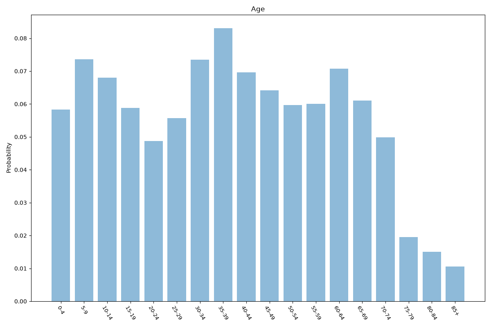
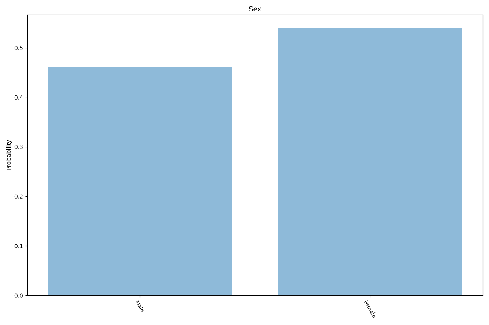
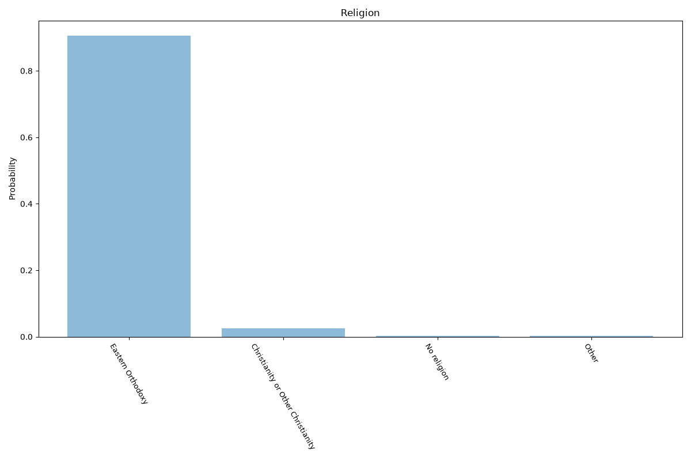
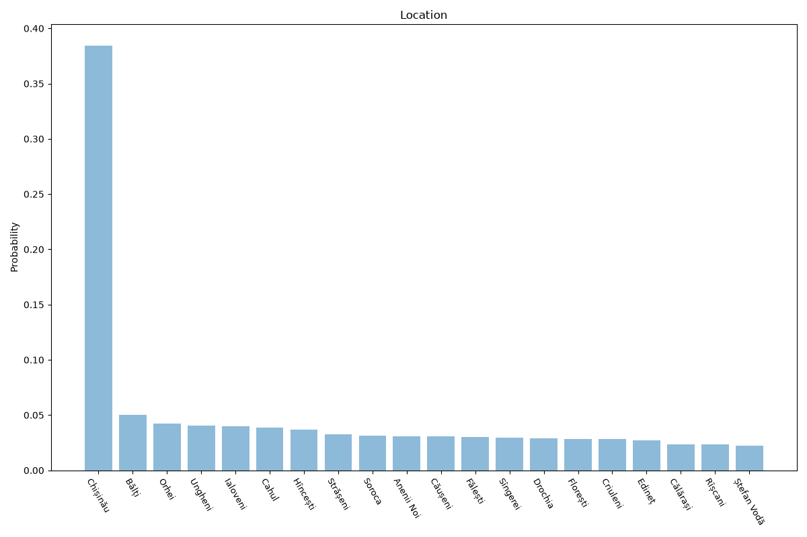

# Moldova
**4 features:** age, sex, religion and location.

## Age

## Sex

## Religion

## Location

## Sources

- [World Population Prospects 2024, United Nations (2024)](https://population.un.org/wpp/) — age, sex
- [2014 Census (religion), National Bureau of Statistics (Moldova) (2014)](https://statistica.gov.md/en) — religion
- [Population estimates, National Bureau of Statistics (Moldova) (2024)](https://statistica.gov.md/en) — location