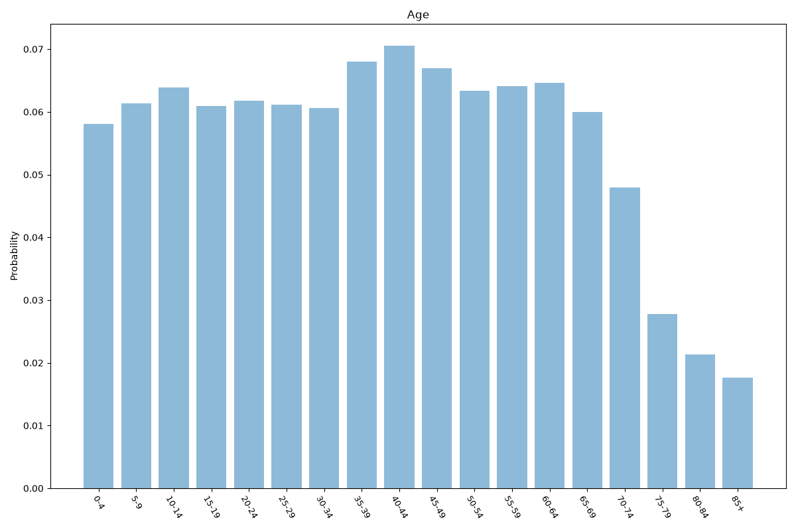
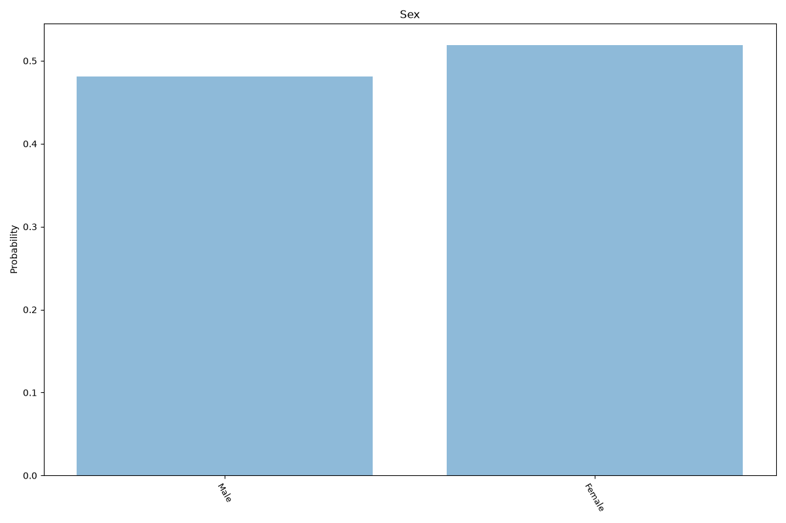
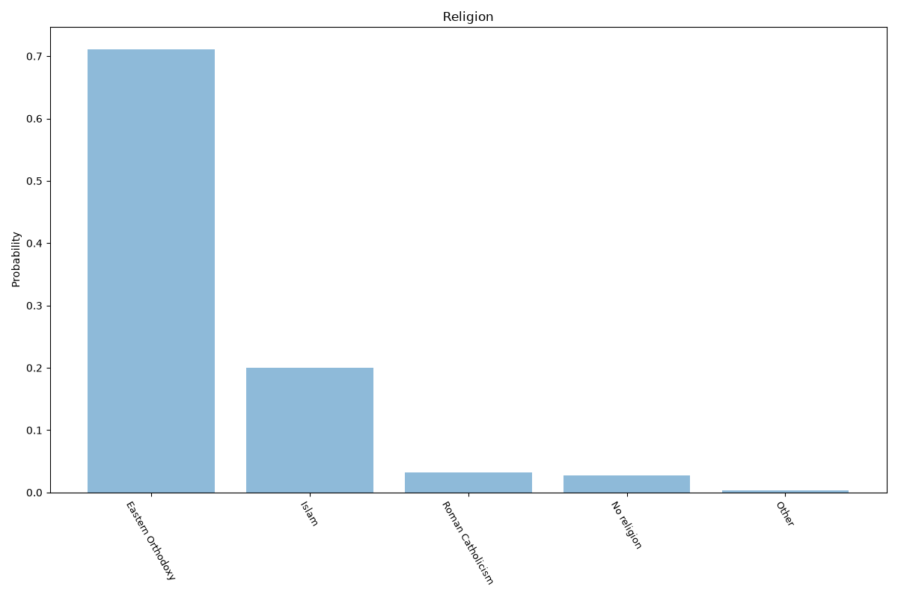
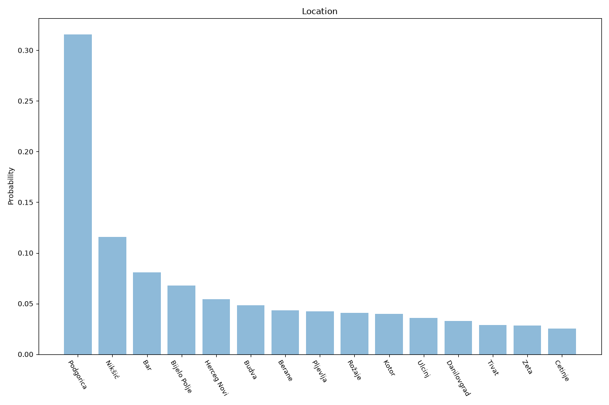

# Montenegro
**4 features:** age, sex, religion and location.

## Age

## Sex

## Religion

## Location

## Sources

- [World Population Prospects 2024, United Nations (2024)](https://population.un.org/wpp/) — age, sex
- [2023 Census (religion), Statistical Office of Montenegro (MONSTAT) (2023)](https://www.monstat.org/eng) — religion
- [2023 Census, Statistical Office of Montenegro (MONSTAT) (2023)](https://www.monstat.org/eng) — location