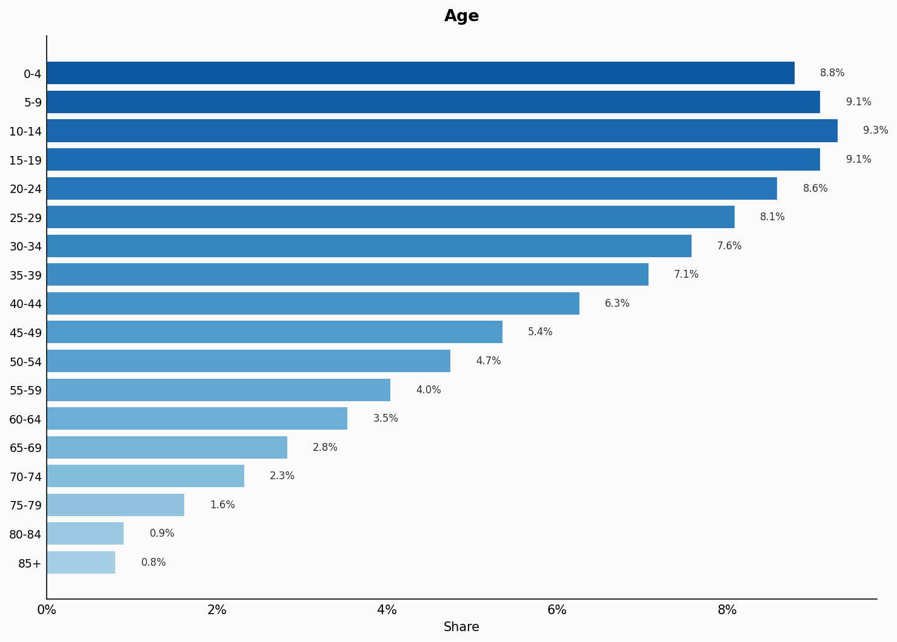
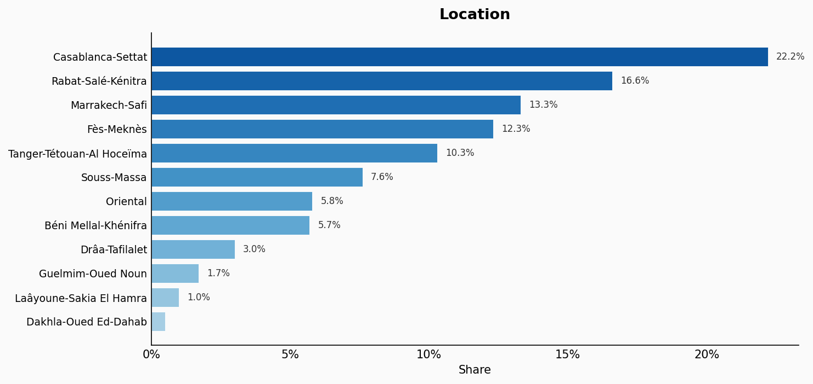
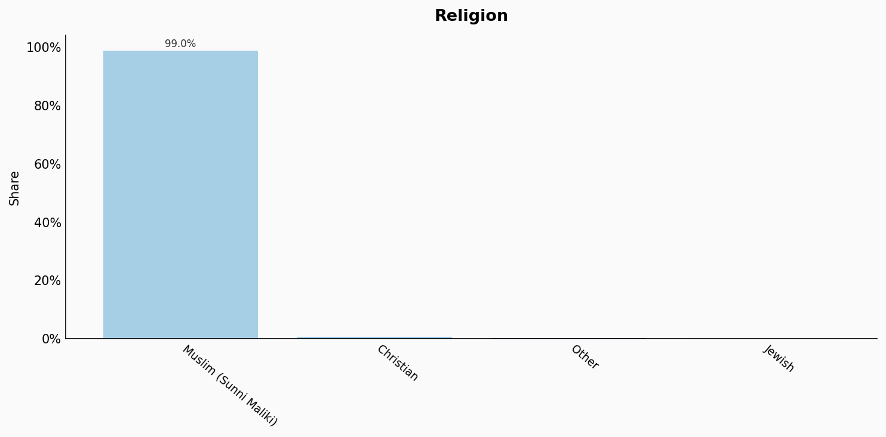
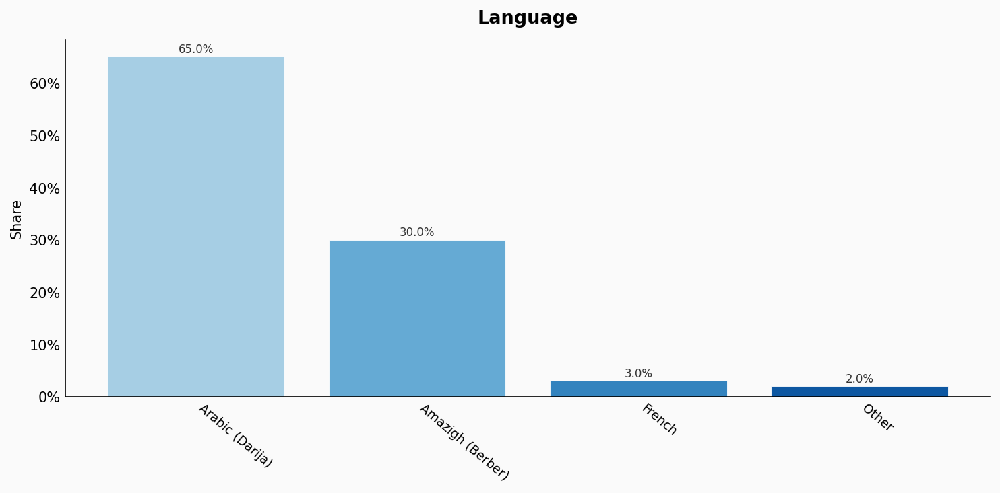
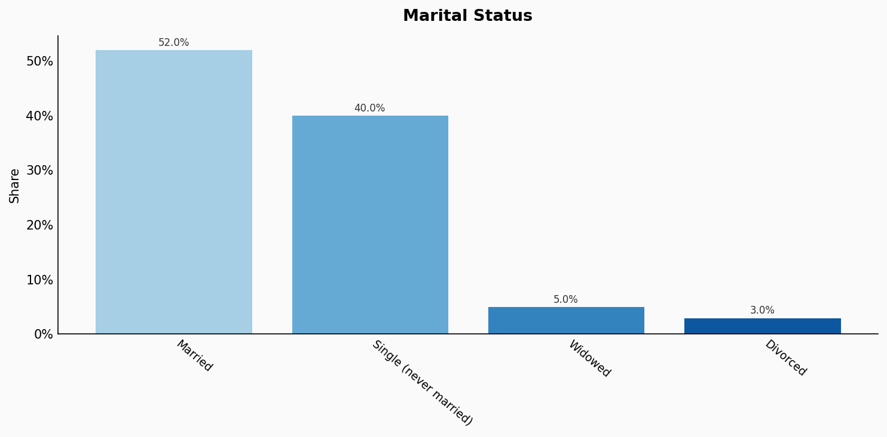
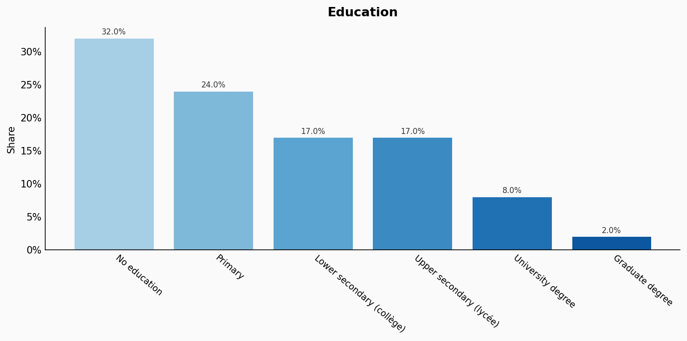
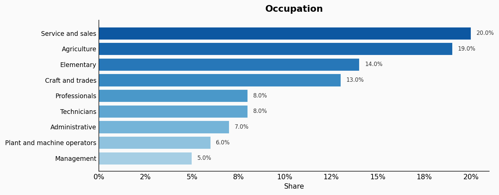
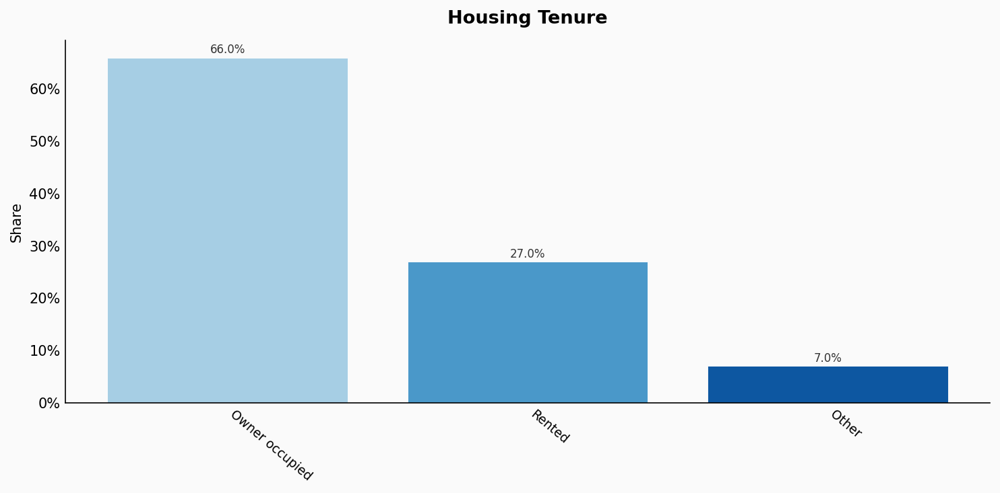
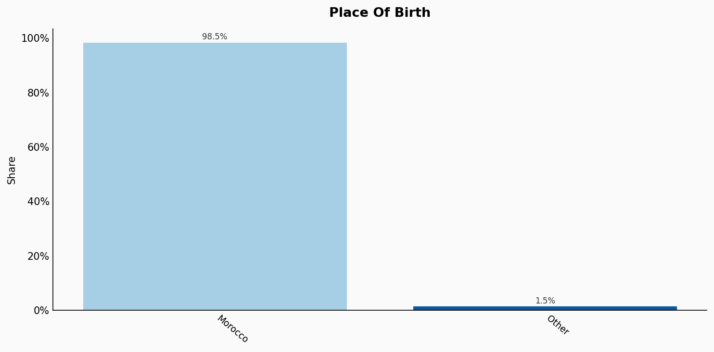

# Morocco

**11 features:** age, sex, location, religion, language, marital status, education, occupation, housing tenure, place of birth, and sexuality.

## Age

| Option | Share |
|---|---:|
| 0-4 | 8.8% |
| 5-9 | 9.1% |
| 10-14 | 9.3% |
| 15-19 | 9.1% |
| 20-24 | 8.6% |
| 25-29 | 8.1% |
| 30-34 | 7.6% |
| 35-39 | 7.1% |
| 40-44 | 6.3% |
| 45-49 | 5.4% |
| 50-54 | 4.7% |
| 55-59 | 4.0% |
| 60-64 | 3.5% |
| 65-69 | 2.8% |
| 70-74 | 2.3% |
| 75-79 | 1.6% |
| 80-84 | 0.9% |
| 85+ | 0.8% |

## Sex

| Option | Share |
|---|---:|
| Female | 50.3% |
| Male | 49.7% |

## Location

| Option | Share |
|---|---:|
| Casablanca-Settat | 22.2% |
| Rabat-Salé-Kénitra | 16.6% |
| Marrakech-Safi | 13.3% |
| Fès-Meknès | 12.3% |
| Tanger-Tétouan-Al Hoceïma | 10.3% |
| Souss-Massa | 7.6% |
| Oriental | 5.8% |
| Béni Mellal-Khénifra | 5.7% |
| Drâa-Tafilalet | 3.0% |
| Guelmim-Oued Noun | 1.7% |
| Laâyoune-Sakia El Hamra | 1.0% |
| Dakhla-Oued Ed-Dahab | 0.5% |

## Religion

| Option | Share |
|---|---:|
| Muslim (Sunni Maliki) | 99.0% |
| Christian | 0.5% |
| Other | 0.3% |
| Jewish | 0.2% |

## Language

| Option | Share |
|---|---:|
| Arabic (Darija) | 65.0% |
| Amazigh (Berber) | 30.0% |
| French | 3.0% |
| Other | 2.0% |

## Marital Status

| Option | Share |
|---|---:|
| Married | 52.0% |
| Single (never married) | 40.0% |
| Widowed | 5.0% |
| Divorced | 3.0% |

## Education

| Option | Share |
|---|---:|
| No education | 32.0% |
| Primary | 24.0% |
| Lower secondary (collège) | 17.0% |
| Upper secondary (lycée) | 17.0% |
| University degree | 8.0% |
| Graduate degree | 2.0% |

## Occupation

| Option | Share |
|---|---:|
| Service and sales | 20.0% |
| Agriculture | 19.0% |
| Elementary | 14.0% |
| Craft and trades | 13.0% |
| Professionals | 8.0% |
| Technicians | 8.0% |
| Administrative | 7.0% |
| Plant and machine operators | 6.0% |
| Management | 5.0% |

## Housing Tenure

| Option | Share |
|---|---:|
| Owner occupied | 66.0% |
| Rented | 27.0% |
| Other | 7.0% |

## Place Of Birth

| Option | Share |
|---|---:|
| Morocco | 98.5% |
| Other | 1.5% |

## Sexuality

| Option | Share |
|---|---:|
| Heterosexual | 97.0% |
| Bisexual | 1.5% |
| Gay or Lesbian | 1.0% |
| Other | 0.5% |

## Sources

- [Recensement Général de la Population et de l'Habitat 2014, Haut-Commissariat au Plan (HCP) (2014)](https://www.hcp.ma/Recensement-general-de-la-population-et-de-l-habitat-2014_a633.html)
  *Covers: `age`, `sex`, `location`, `marital status`, `housing tenure`, `place of birth`*
- [Enquête Nationale sur l'Emploi 2022, HCP (2022)](https://www.hcp.ma/Resultats-de-l-enquete-nationale-sur-l-emploi_r26.html)
  *Covers: `education`, `occupation`*
- [Constitution du Maroc 2011 / Pew Research Center 2012 (2012)](https://www.pewresearch.org/religion/2012/08/09/the-worlds-muslims-unity-and-diversity-executive-summary/)
  *Covers: `religion`*
- [Recensement 2014 - Langue, HCP (2014)](https://www.hcp.ma/Recensement-general-de-la-population-et-de-l-habitat-2014_a633.html)
  *Covers: `language`*
- [Arab Barometer Wave VI - Morocco 2021 (2021)](https://www.arabbarometer.org/)
  *Covers: `sexuality`*