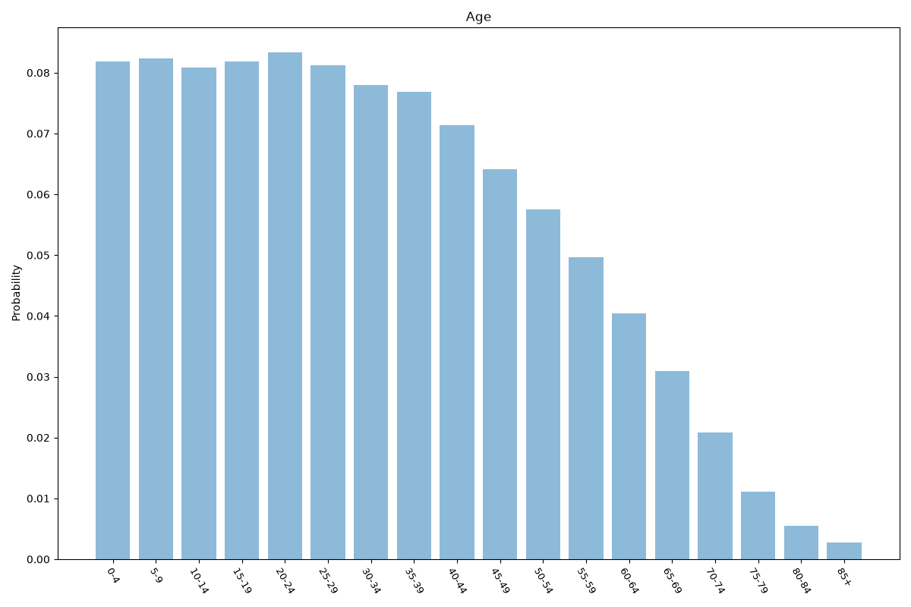
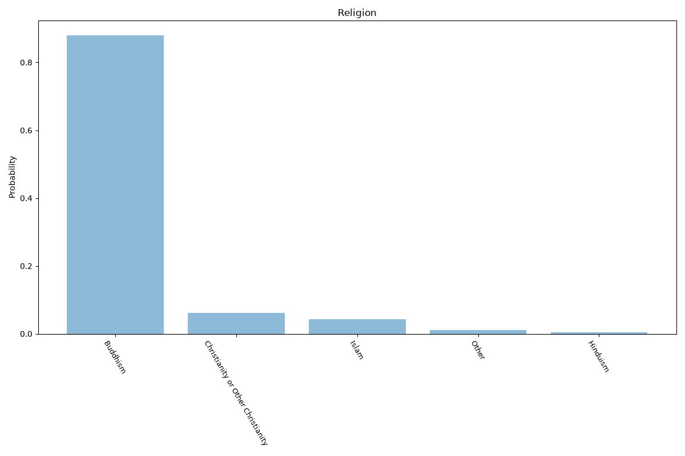
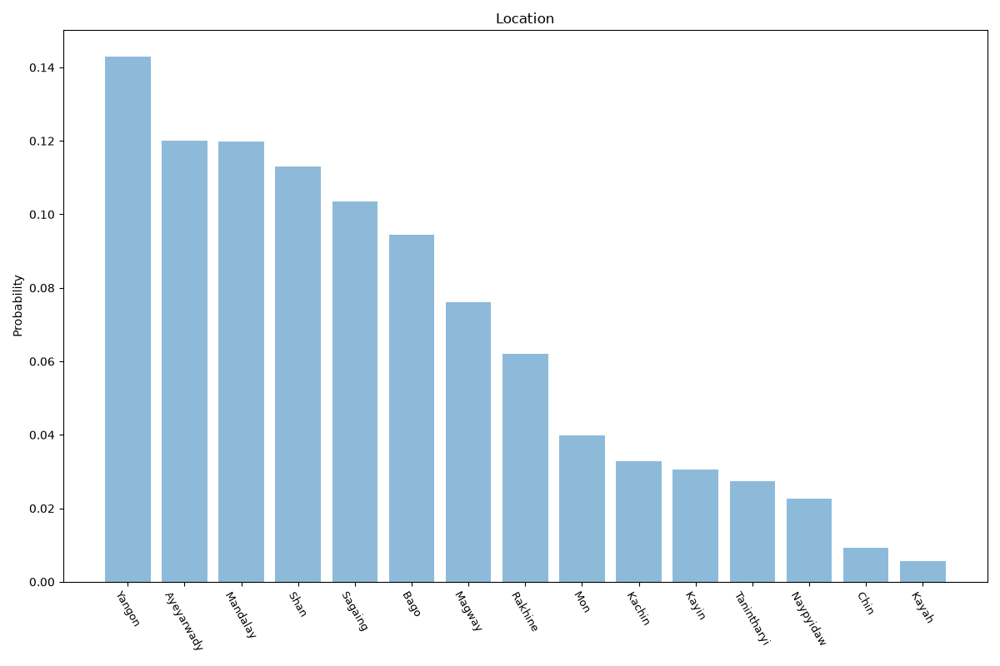

# Myanmar
**4 features:** age, sex, religion and location.

## Age

## Sex

## Religion

## Location

## Sources

- [World Population Prospects 2024, United Nations (2024)](https://population.un.org/wpp/) — age, sex
- [2014 Myanmar Population and Housing Census (religion), Department of Population (2014)](https://www.dop.gov.mm/) — religion
- [2014 Myanmar Population and Housing Census, Department of Population (2014)](https://www.dop.gov.mm/) — location