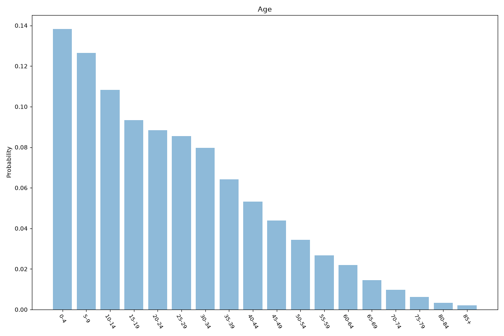
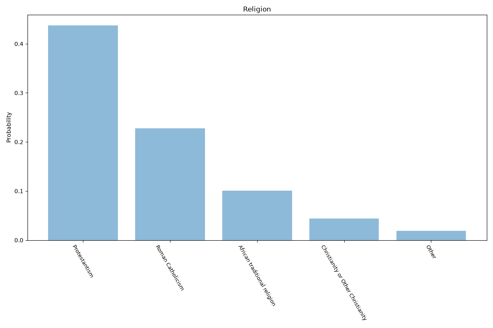
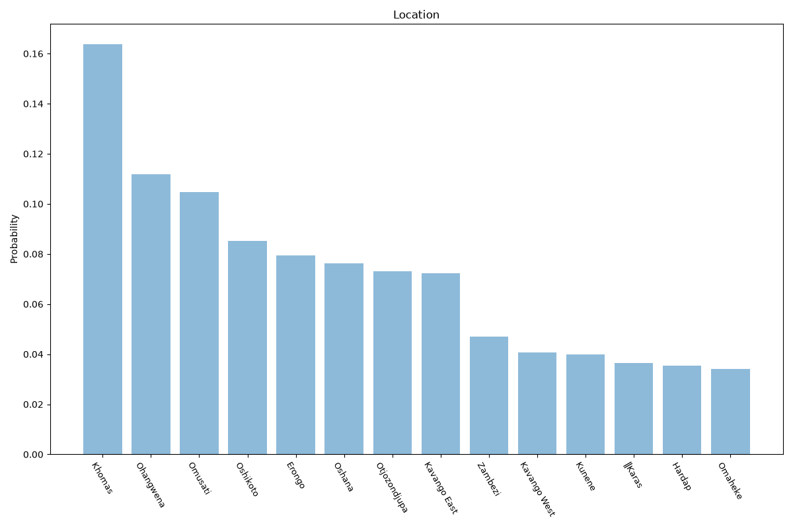

# Namibia
**4 features:** age, sex, religion and location.

## Age

## Sex

## Religion

## Location

## Sources

- [World Population Prospects 2024, United Nations (2024)](https://population.un.org/wpp/) — age, sex
- [Namibia Demographic and Health Survey (2013)](https://dhsprogram.com/) — religion
- [2023 Census, Namibia Statistics Agency (2023)](https://nsa.nsa.org.na/) — location