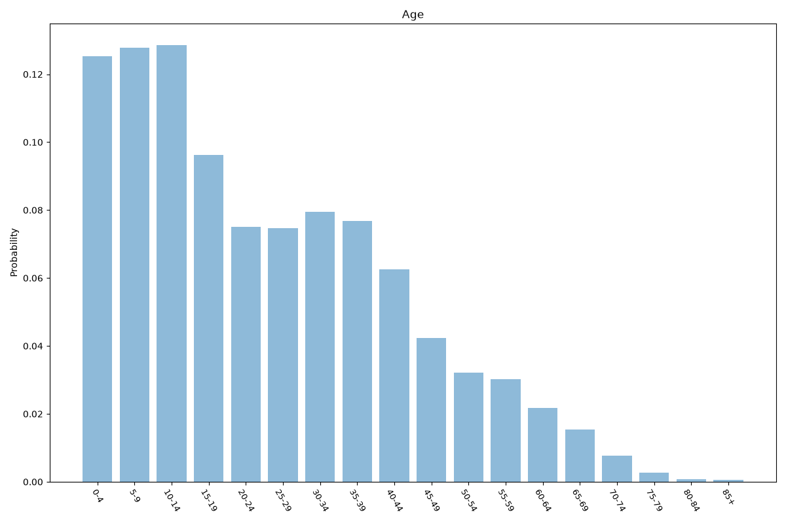
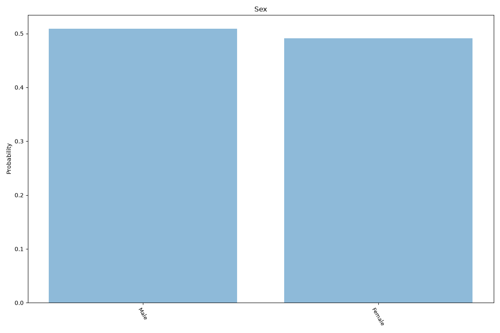
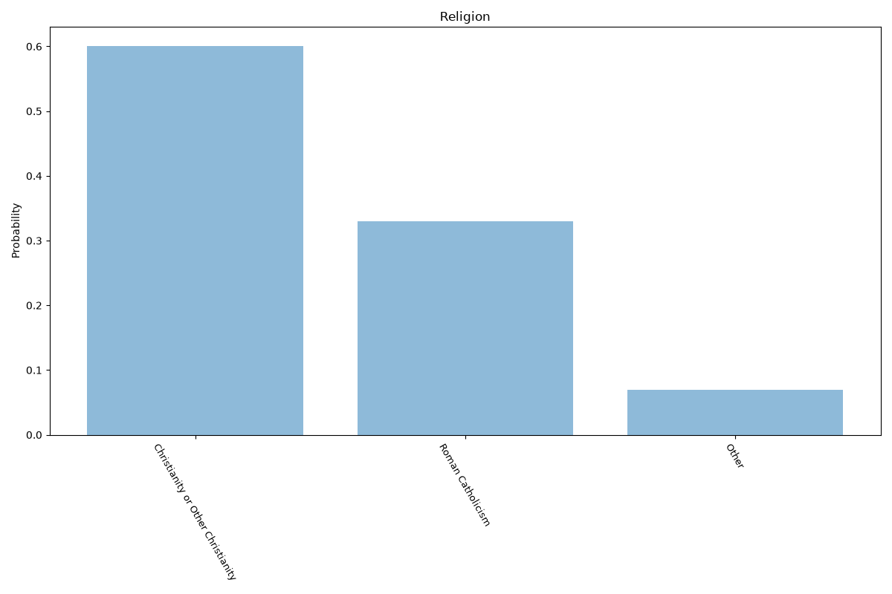
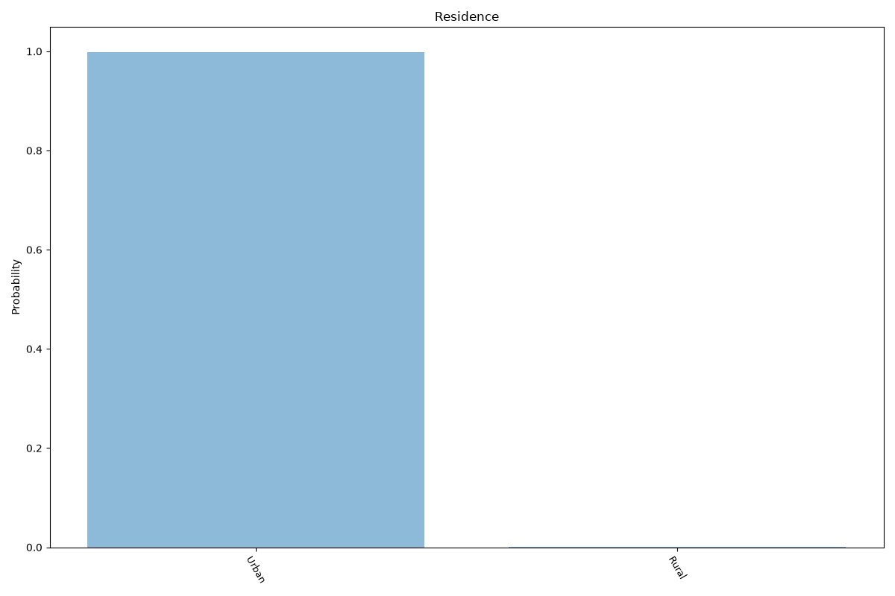
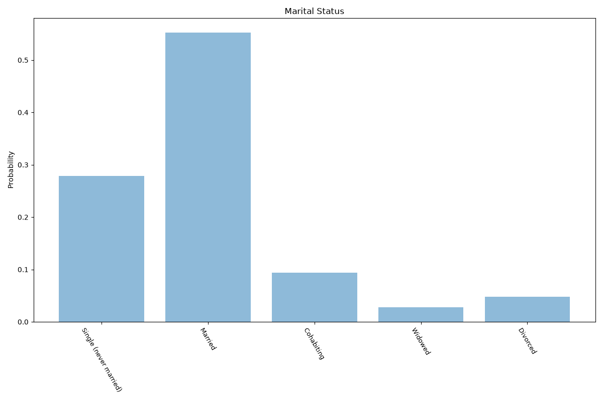

# Nauru
**5 features:** age, sex, religion, residence and marital status.

## Age

## Sex

## Religion

## Residence

## Marital Status

## Sources

- [World Population Prospects 2024, United Nations (2024)](https://population.un.org/wpp/) — age, sex
- [The World Factbook, Central Intelligence Agency (2020)](https://www.cia.gov/the-world-factbook/countries/nauru/) — religion
- [Urban population (% of total population), World Bank (2025)](https://data.worldbank.org/indicator/SP.URB.TOTL.IN.ZS) — residence
- [World Marriage Data 2019, United Nations (2007)](https://www.un.org/development/desa/pd/data/world-marriage-data) — marital status