# Netherlands

**11 features:** age, sex, location, religion, language, marital status, education, occupation, housing tenure, place of birth, and sexuality.

## Age

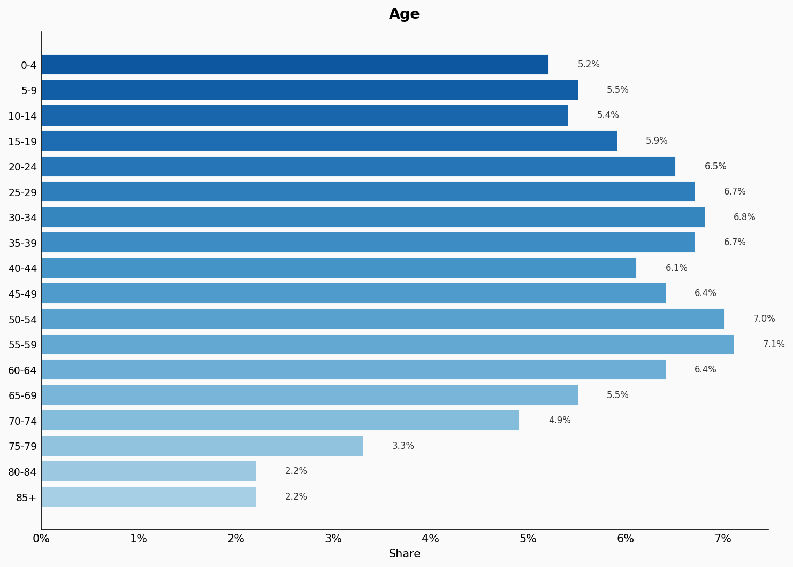

| Option | Share |
|---|---:|
| 0-4 | 5.2% |
| 5-9 | 5.5% |
| 10-14 | 5.4% |
| 15-19 | 5.9% |
| 20-24 | 6.5% |
| 25-29 | 6.7% |
| 30-34 | 6.8% |
| 35-39 | 6.7% |
| 40-44 | 6.1% |
| 45-49 | 6.4% |
| 50-54 | 7.0% |
| 55-59 | 7.1% |
| 60-64 | 6.4% |
| 65-69 | 5.5% |
| 70-74 | 4.9% |
| 75-79 | 3.3% |
| 80-84 | 2.2% |
| 85+ | 2.2% |

## Sex

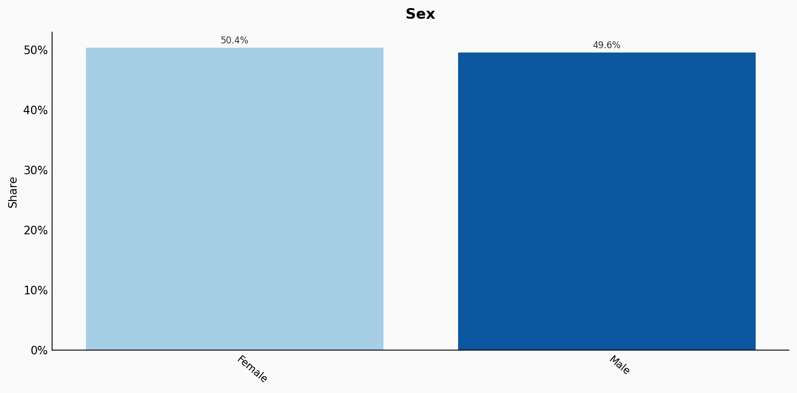

| Option | Share |
|---|---:|
| Female | 50.4% |
| Male | 49.6% |

## Location

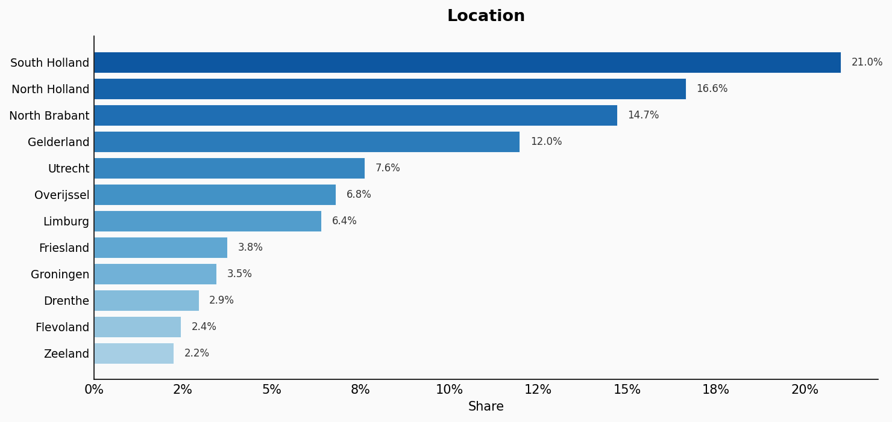

| Option | Share |
|---|---:|
| South Holland | 21.0% |
| North Holland | 16.6% |
| North Brabant | 14.7% |
| Gelderland | 12.0% |
| Utrecht | 7.6% |
| Overijssel | 6.8% |
| Limburg | 6.4% |
| Friesland | 3.8% |
| Groningen | 3.5% |
| Drenthe | 2.9% |
| Flevoland | 2.4% |
| Zeeland | 2.2% |

## Religion

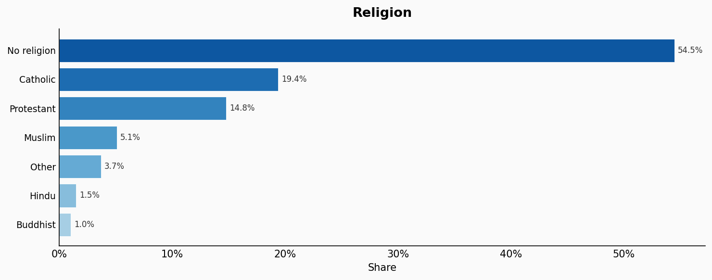

| Option | Share |
|---|---:|
| No religion | 54.5% |
| Catholic | 19.4% |
| Protestant | 14.8% |
| Muslim | 5.1% |
| Other | 3.7% |
| Hindu | 1.5% |
| Buddhist | 1.0% |

## Language

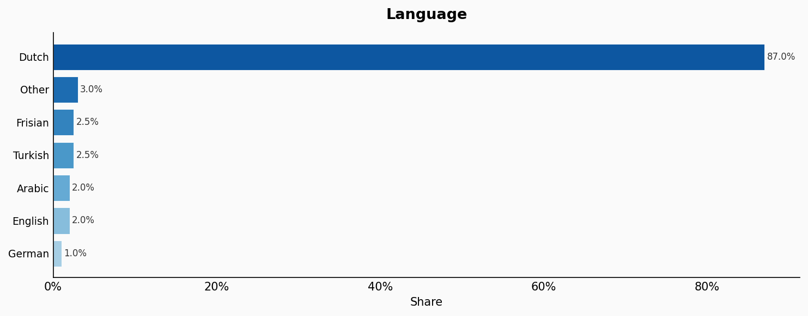

| Option | Share |
|---|---:|
| Dutch | 87.0% |
| Other | 3.0% |
| Frisian | 2.5% |
| Turkish | 2.5% |
| Arabic | 2.0% |
| English | 2.0% |
| German | 1.0% |

## Marital Status

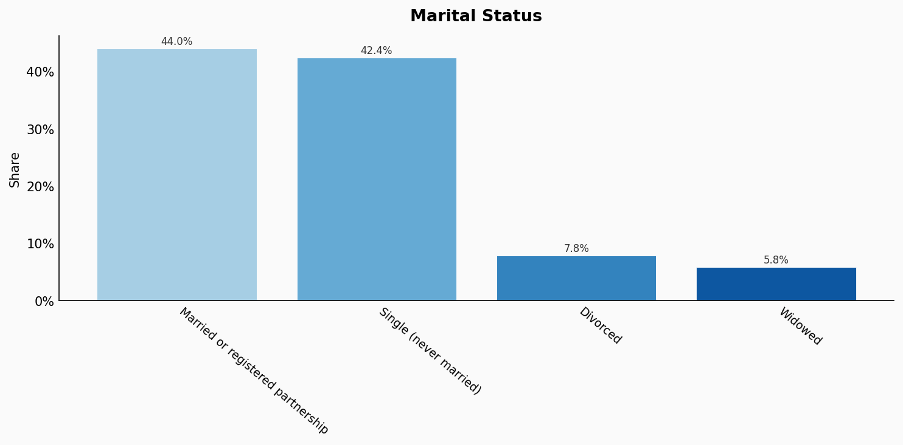

| Option | Share |
|---|---:|
| Married or registered partnership | 44.0% |
| Single (never married) | 42.4% |
| Divorced | 7.8% |
| Widowed | 5.8% |

## Education

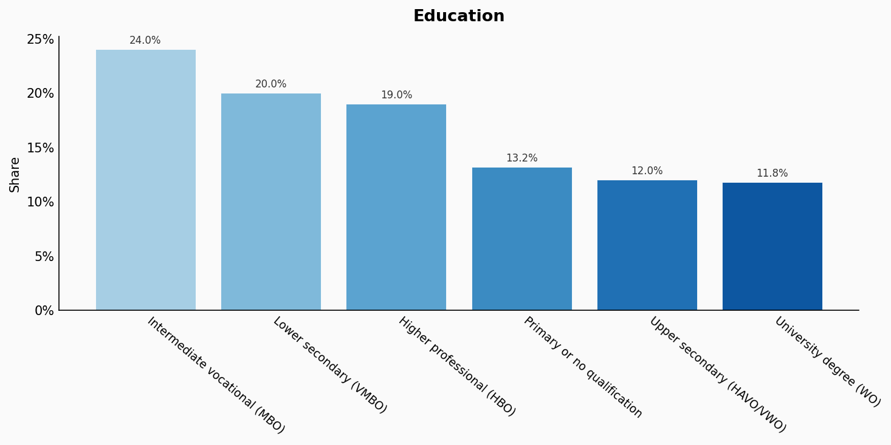

| Option | Share |
|---|---:|
| Intermediate vocational (MBO) | 24.0% |
| Lower secondary (VMBO) | 20.0% |
| Higher professional (HBO) | 19.0% |
| Primary or no qualification | 13.2% |
| Upper secondary (HAVO/VWO) | 12.0% |
| University degree (WO) | 11.8% |

## Occupation

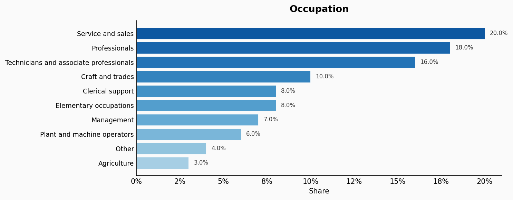

| Option | Share |
|---|---:|
| Service and sales | 20.0% |
| Professionals | 18.0% |
| Technicians and associate professionals | 16.0% |
| Craft and trades | 10.0% |
| Clerical support | 8.0% |
| Elementary occupations | 8.0% |
| Management | 7.0% |
| Plant and machine operators | 6.0% |
| Other | 4.0% |
| Agriculture | 3.0% |

## Housing Tenure

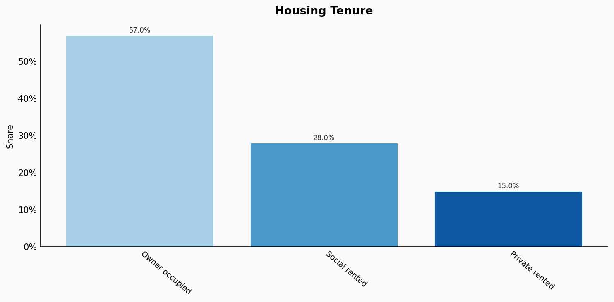

| Option | Share |
|---|---:|
| Owner occupied | 57.0% |
| Social rented | 28.0% |
| Private rented | 15.0% |

## Place Of Birth

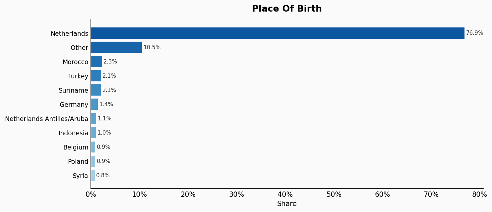

| Option | Share |
|---|---:|
| Netherlands | 76.9% |
| Other | 10.5% |
| Morocco | 2.3% |
| Turkey | 2.1% |
| Suriname | 2.1% |
| Germany | 1.4% |
| Netherlands Antilles/Aruba | 1.1% |
| Indonesia | 1.0% |
| Belgium | 0.9% |
| Poland | 0.9% |
| Syria | 0.8% |

## Sexuality

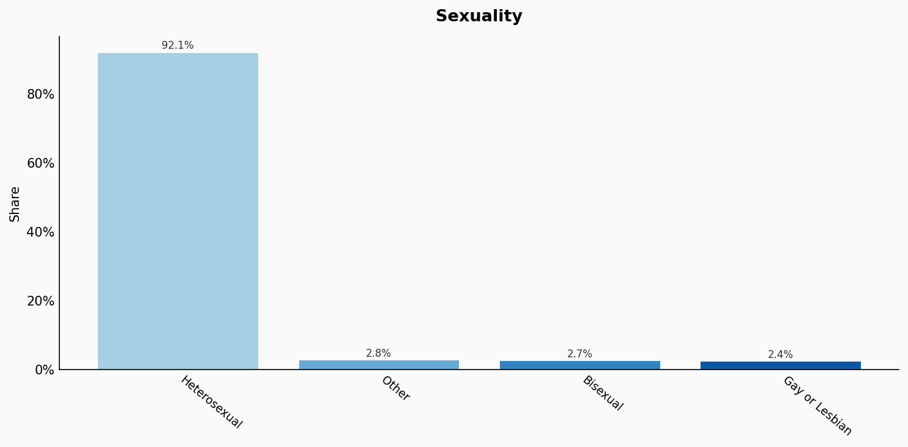

| Option | Share |
|---|---:|
| Heterosexual | 92.1% |
| Other | 2.8% |
| Bisexual | 2.7% |
| Gay or Lesbian | 2.4% |

## Sources

- [Bevolkingsstatistieken 2022, CBS (2022)](https://www.cbs.nl/nl-nl/dossier/bevolking)
  *Covers: `age`, `sex`, `marital status`, `location`, `place of birth`*
- [Arbeid in cijfers 2022, CBS (2022)](https://www.cbs.nl/nl-nl/publicatie/2022/30/arbeid-in-cijfers-2022)
  *Covers: `education`, `occupation`, `housing tenure`*
- [Religie in Nederland 2022, CBS (2022)](https://www.cbs.nl/nl-nl/longread/rapportages/2022/religie-in-nederland-2022)
  *Covers: `religion`*
- [Leefstijlmonitor 2020, CBS / RIVM (2020)](https://www.cbs.nl/nl-nl/nieuws/2020/11/een-op-de-twaalf-nederlanders-is-niet-heteroseksueel)
  *Covers: `sexuality`*