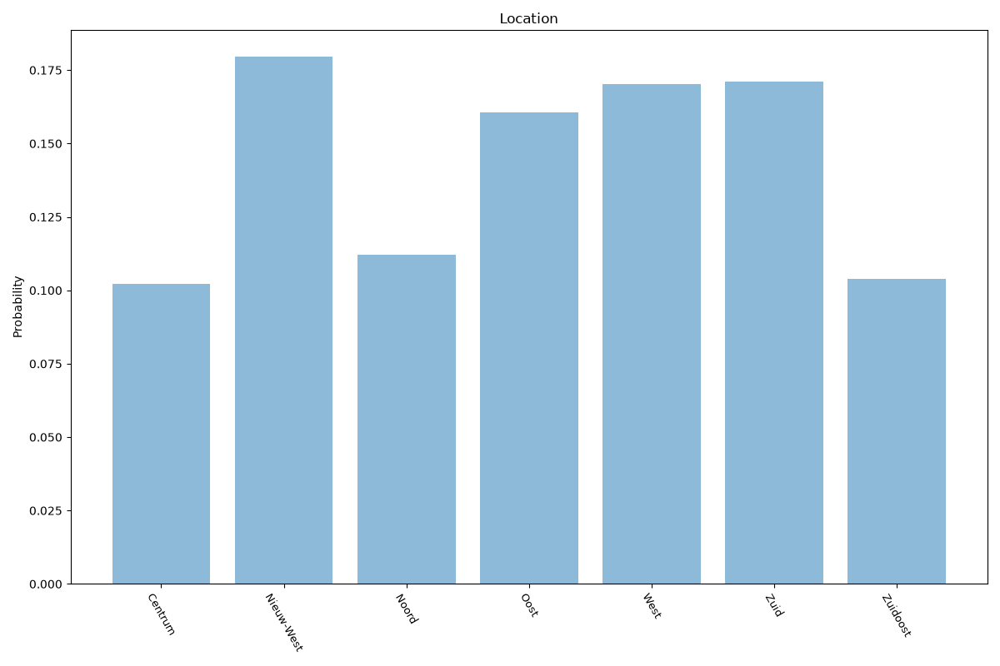

# Amsterdam
**2 features:** location and residence.

## Location

## Residence

## Sources

- [Bevolking per stadsdeel, Centraal Bureau voor de Statistiek (CBS) (2023)](https://www.cbs.nl/) — location
- [World Urbanization Prospects 2018, United Nations (2018)](https://population.un.org/wup/) — residence