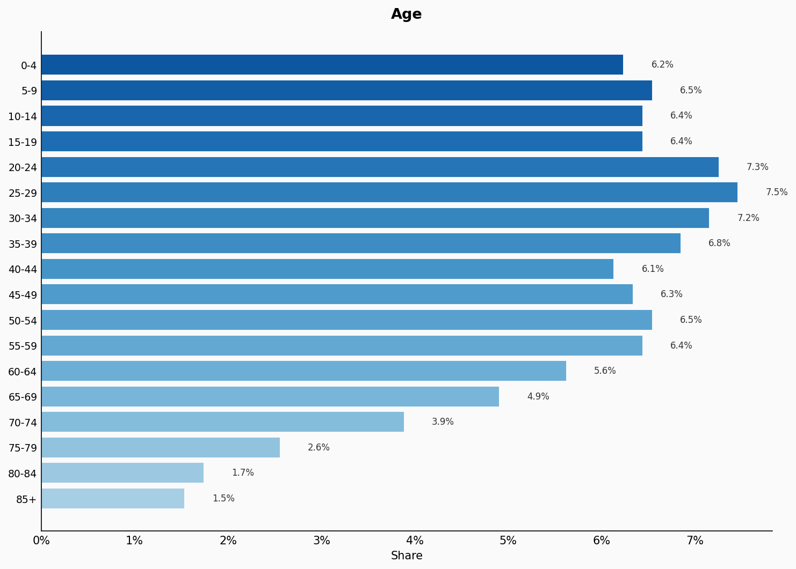
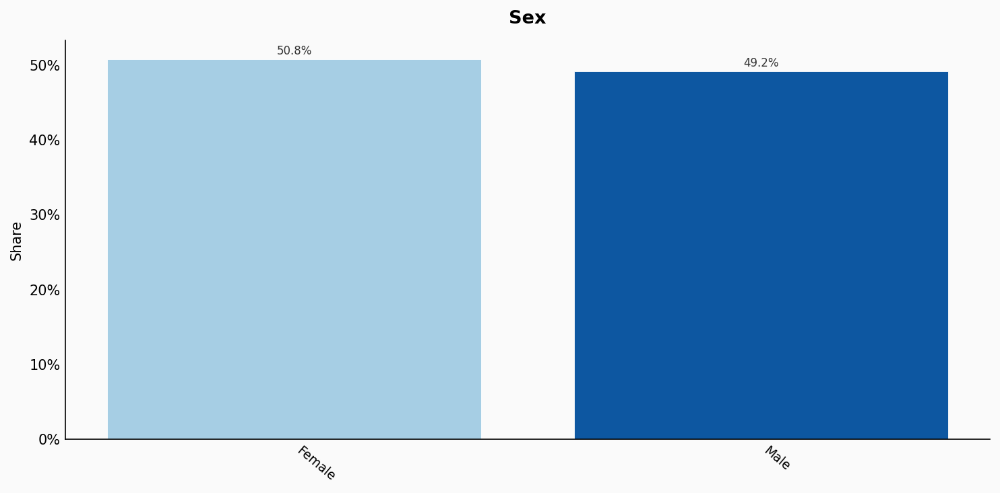
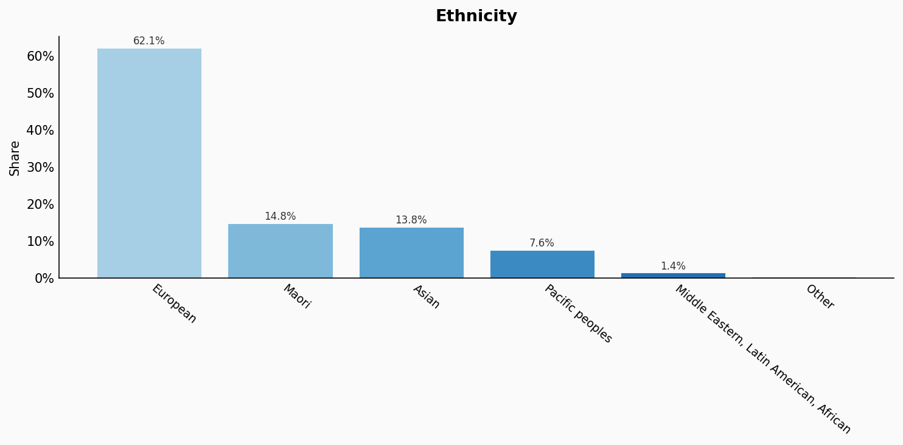
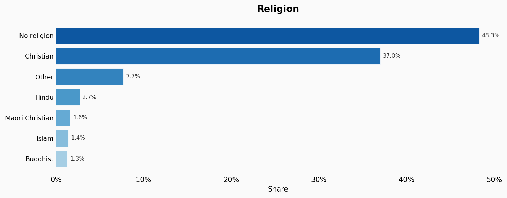
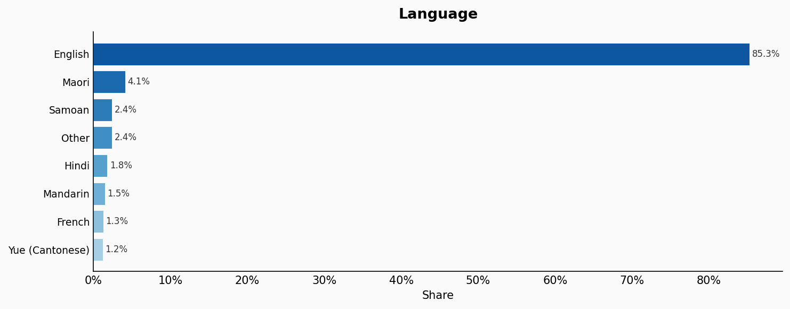
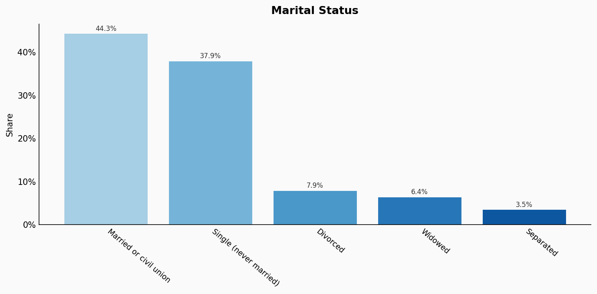
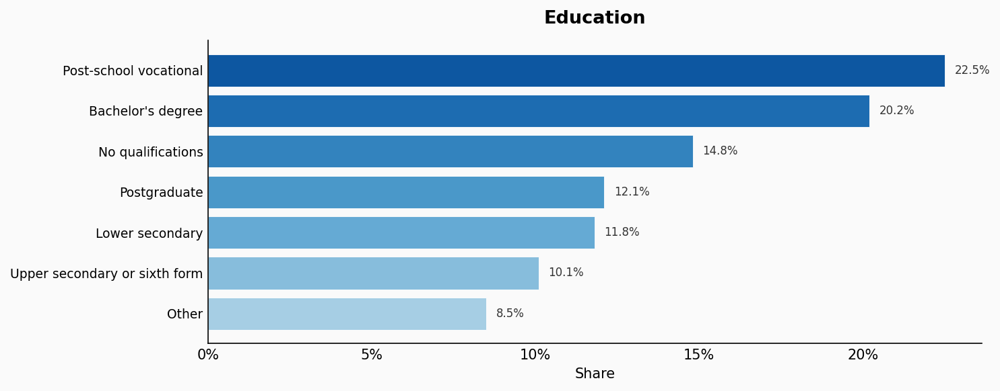
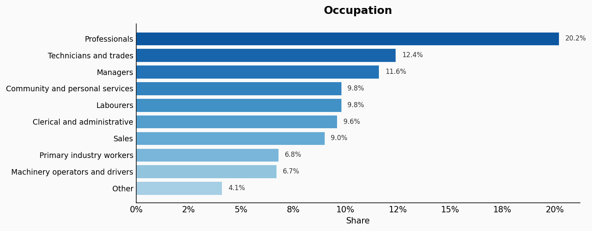
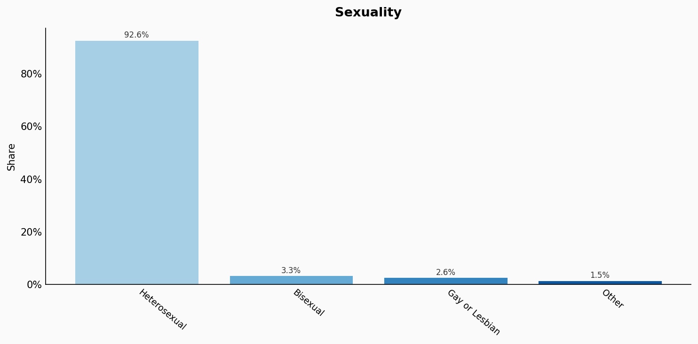

# New Zealand

**12 features:** age, sex, location, ethnicity, religion, language, marital status, education, occupation, housing tenure, place of birth, and sexuality.

## Age

| Option | Share |
|---|---:|
| 0-4 | 6.2% |
| 5-9 | 6.5% |
| 10-14 | 6.4% |
| 15-19 | 6.4% |
| 20-24 | 7.3% |
| 25-29 | 7.5% |
| 30-34 | 7.2% |
| 35-39 | 6.8% |
| 40-44 | 6.1% |
| 45-49 | 6.3% |
| 50-54 | 6.5% |
| 55-59 | 6.4% |
| 60-64 | 5.6% |
| 65-69 | 4.9% |
| 70-74 | 3.9% |
| 75-79 | 2.6% |
| 80-84 | 1.7% |
| 85+ | 1.5% |

## Sex

| Option | Share |
|---|---:|
| Female | 50.8% |
| Male | 49.2% |

## Location

| Option | Share |
|---|---:|
| Auckland | 33.1% |
| Canterbury | 11.9% |
| Wellington | 11.5% |
| Waikato | 9.5% |
| Bay of Plenty | 6.4% |
| Otago | 5.0% |
| Manawatu-Whanganui | 4.4% |
| Nelson-Tasman-Marlborough | 4.1% |
| Northland | 3.4% |
| Hawke's Bay | 3.3% |
| Taranaki | 2.7% |
| Southland | 2.3% |
| Gisborne | 1.3% |
| West Coast | 1.0% |

## Ethnicity

| Option | Share |
|---|---:|
| European | 62.1% |
| Maori | 14.8% |
| Asian | 13.8% |
| Pacific peoples | 7.6% |
| Middle Eastern, Latin American, African | 1.4% |
| Other | 0.4% |

## Religion

| Option | Share |
|---|---:|
| No religion | 48.3% |
| Christian | 37.0% |
| Other | 7.7% |
| Hindu | 2.7% |
| Maori Christian | 1.6% |
| Islam | 1.4% |
| Buddhist | 1.3% |

## Language

| Option | Share |
|---|---:|
| English | 85.3% |
| Maori | 4.1% |
| Samoan | 2.4% |
| Other | 2.4% |
| Hindi | 1.8% |
| Mandarin | 1.5% |
| French | 1.3% |
| Yue (Cantonese) | 1.2% |

## Marital Status

| Option | Share |
|---|---:|
| Married or civil union | 44.3% |
| Single (never married) | 37.9% |
| Divorced | 7.9% |
| Widowed | 6.4% |
| Separated | 3.5% |

## Education

| Option | Share |
|---|---:|
| Post-school vocational | 22.5% |
| Bachelor's degree | 20.2% |
| No qualifications | 14.8% |
| Postgraduate | 12.1% |
| Lower secondary | 11.8% |
| Upper secondary or sixth form | 10.1% |
| Other | 8.5% |

## Occupation

| Option | Share |
|---|---:|
| Professionals | 20.2% |
| Technicians and trades | 12.4% |
| Managers | 11.6% |
| Community and personal services | 9.8% |
| Labourers | 9.8% |
| Clerical and administrative | 9.6% |
| Sales | 9.0% |
| Primary industry workers | 6.8% |
| Machinery operators and drivers | 6.7% |
| Other | 4.1% |

## Housing Tenure

| Option | Share |
|---|---:|
| Owner occupied | 64.4% |
| Rented | 32.8% |
| Other | 2.8% |

## Place Of Birth

| Option | Share |
|---|---:|
| New Zealand | 72.6% |
| United Kingdom | 5.8% |
| Other | 5.5% |
| India | 4.2% |
| China | 3.6% |
| Australia | 2.2% |
| South Africa | 1.8% |
| Samoa | 1.7% |
| Philippines | 1.5% |
| Fiji | 1.1% |

## Sexuality

| Option | Share |
|---|---:|
| Heterosexual | 92.6% |
| Bisexual | 3.3% |
| Gay or Lesbian | 2.6% |
| Other | 1.5% |

## Sources

- [Census 2018, Stats NZ (2018)](https://www.stats.govt.nz/2018-census/)
  *Covers: `age`, `sex`, `marital status`, `location`, `ethnicity`, `place of birth`*
- [Household Labour Force Survey 2022, Stats NZ (2022)](https://www.stats.govt.nz/topics/labour-market)
  *Covers: `education`, `occupation`, `housing tenure`*
- [Census 2018 – Religious affiliation, Stats NZ (2018)](https://www.stats.govt.nz/information-releases/religious-affiliation-2018-census-of-population-and-dwellings)
  *Covers: `religion`*
- [New Zealand Health Survey, Ministry of Health (2021)](https://www.health.govt.nz/publication/new-zealand-health-survey-annual-update-key-findings-2020-21)
  *Covers: `sexuality`*