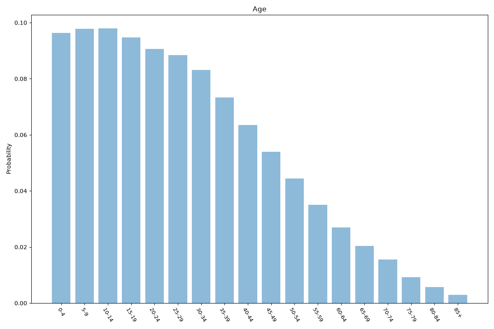
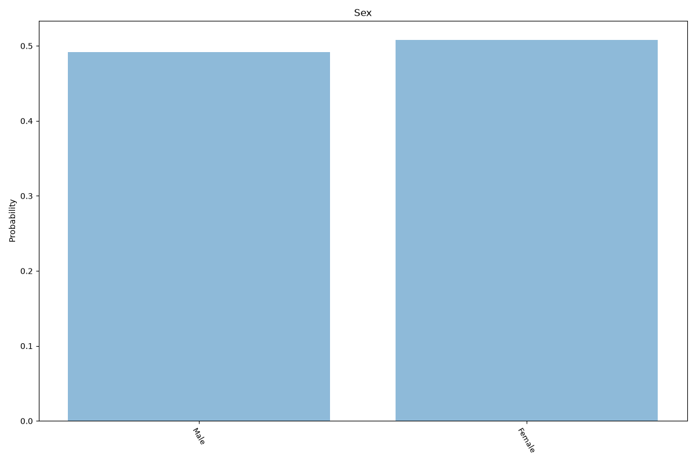
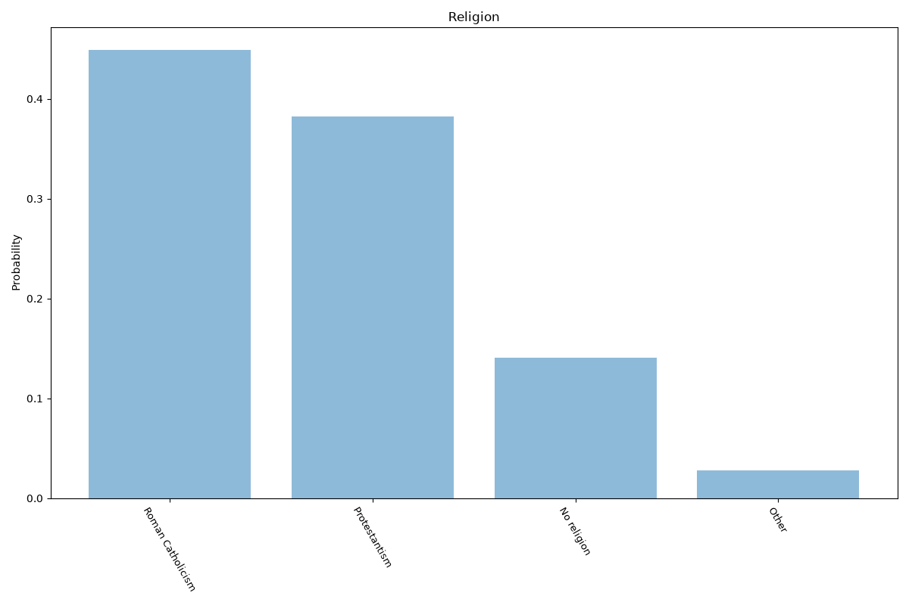
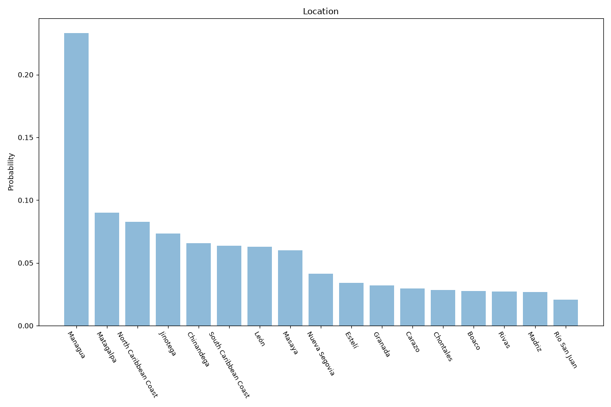

# Nicaragua
**4 features:** age, sex, religion and location.

## Age

## Sex

## Religion

## Location

## Sources

- [World Population Prospects 2024, United Nations (2024)](https://population.un.org/wpp/) — age, sex
- [The World Factbook: Nicaragua (religion), CIA (2020)](https://www.cia.gov/the-world-factbook/countries/nicaragua/) — religion
- [Population estimates 2023, Instituto Nacional de Información de Desarrollo (INIDE) (2023)](https://www.inide.gob.ni/) — location