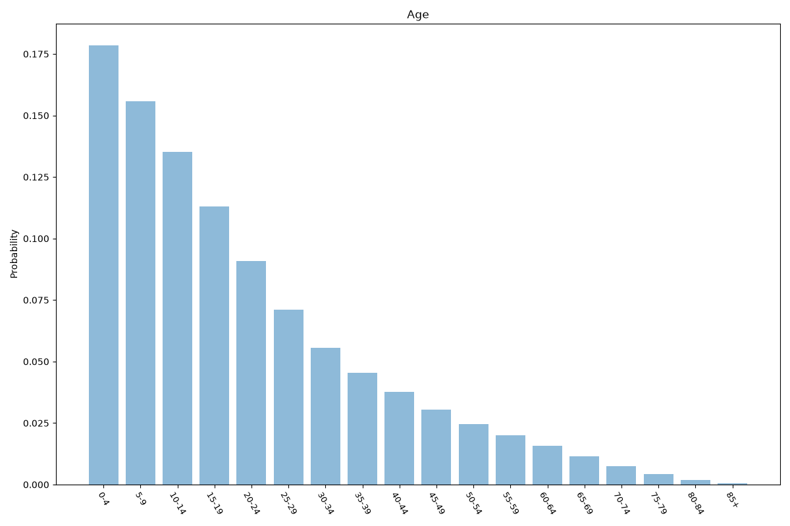
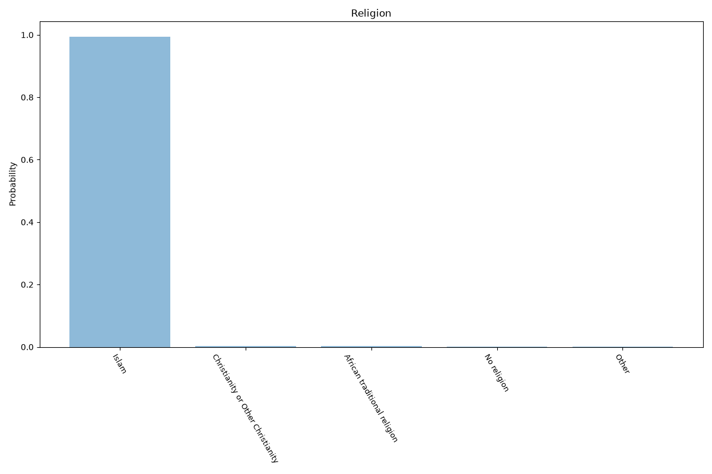
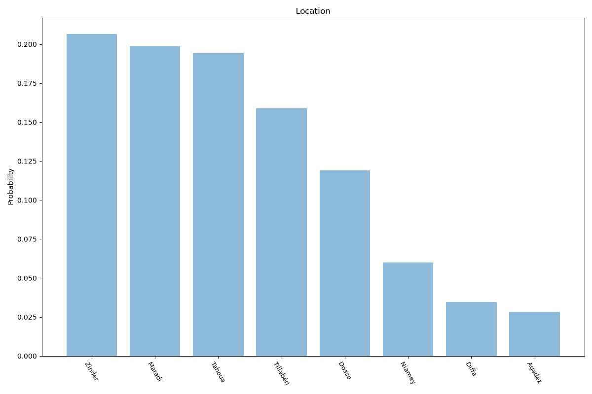

# Niger
**4 features:** age, sex, religion and location.

## Age

## Sex

## Religion

## Location

## Sources

- [World Population Prospects 2024, United Nations (2024)](https://population.un.org/wpp/) — age, sex
- [2012 Census (religion), Institut National de la Statistique (Niger) (2012)](https://www.stat-niger.org/) — religion
- [Population estimates, Institut National de la Statistique (Niger) (2020)](https://www.stat-niger.org/) — location