# Nigeria

**11 features:** age, sex, location, religion, language, marital status, education, occupation, housing tenure, place of birth, and sexuality.

## Age

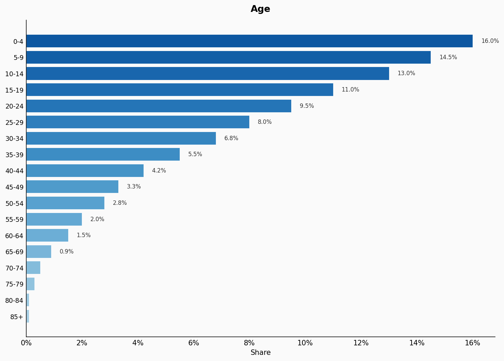

| Option | Share |
|---|---:|
| 0-4 | 16.0% |
| 5-9 | 14.5% |
| 10-14 | 13.0% |
| 15-19 | 11.0% |
| 20-24 | 9.5% |
| 25-29 | 8.0% |
| 30-34 | 6.8% |
| 35-39 | 5.5% |
| 40-44 | 4.2% |
| 45-49 | 3.3% |
| 50-54 | 2.8% |
| 55-59 | 2.0% |
| 60-64 | 1.5% |
| 65-69 | 0.9% |
| 70-74 | 0.5% |
| 75-79 | 0.3% |
| 80-84 | 0.1% |
| 85+ | 0.1% |

## Sex

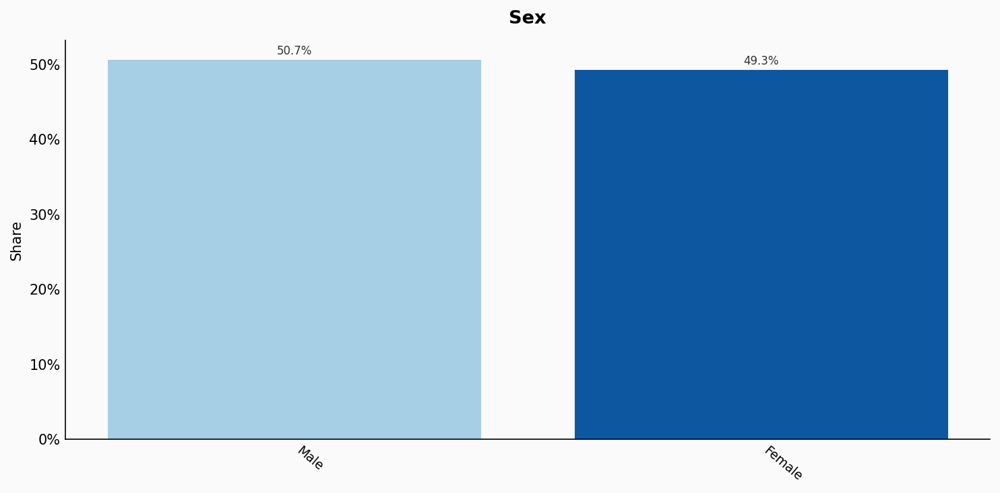

| Option | Share |
|---|---:|
| Male | 50.7% |
| Female | 49.3% |

## Location

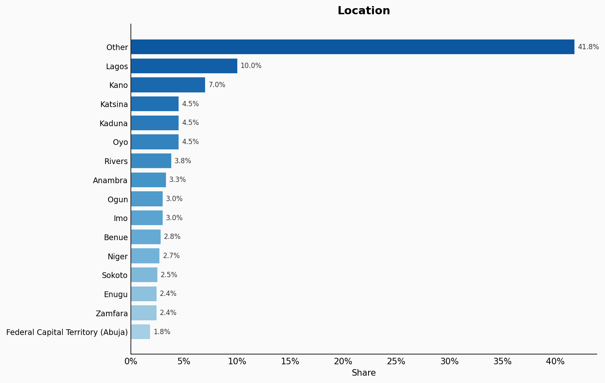

| Option | Share |
|---|---:|
| Other | 41.8% |
| Lagos | 10.0% |
| Kano | 7.0% |
| Katsina | 4.5% |
| Kaduna | 4.5% |
| Oyo | 4.5% |
| Rivers | 3.8% |
| Anambra | 3.3% |
| Ogun | 3.0% |
| Imo | 3.0% |
| Benue | 2.8% |
| Niger | 2.7% |
| Sokoto | 2.5% |
| Enugu | 2.4% |
| Zamfara | 2.4% |
| Federal Capital Territory (Abuja) | 1.8% |

## Religion

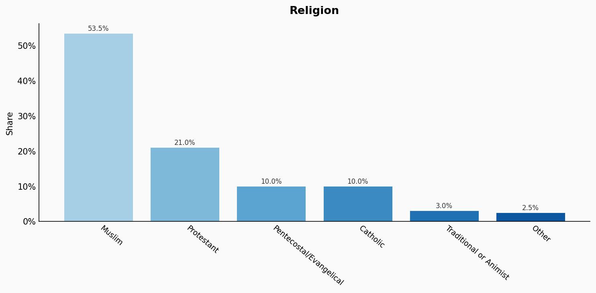

| Option | Share |
|---|---:|
| Muslim | 53.5% |
| Protestant | 21.0% |
| Pentecostal/Evangelical | 10.0% |
| Catholic | 10.0% |
| Traditional or Animist | 3.0% |
| Other | 2.5% |

## Language

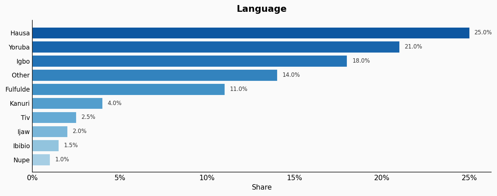

| Option | Share |
|---|---:|
| Hausa | 25.0% |
| Yoruba | 21.0% |
| Igbo | 18.0% |
| Other | 14.0% |
| Fulfulde | 11.0% |
| Kanuri | 4.0% |
| Tiv | 2.5% |
| Ijaw | 2.0% |
| Ibibio | 1.5% |
| Nupe | 1.0% |

## Marital Status

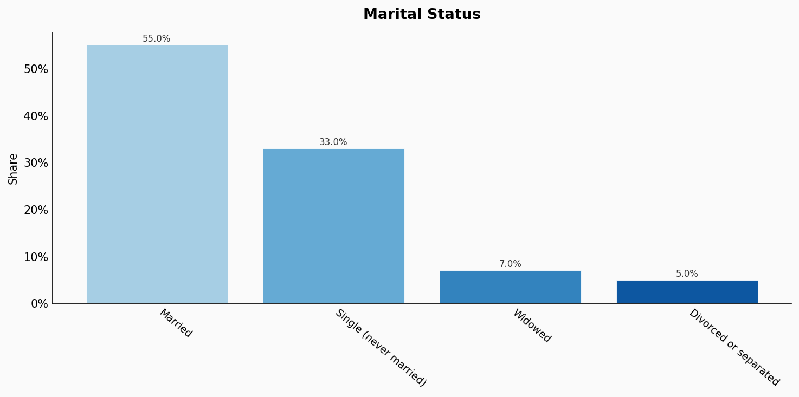

| Option | Share |
|---|---:|
| Married | 55.0% |
| Single (never married) | 33.0% |
| Widowed | 7.0% |
| Divorced or separated | 5.0% |

## Education

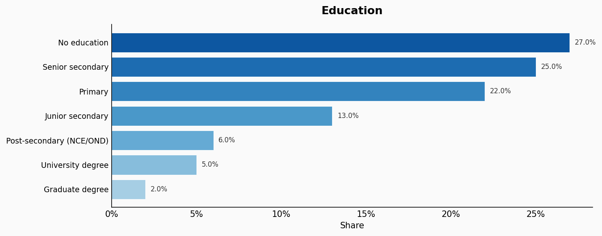

| Option | Share |
|---|---:|
| No education | 27.0% |
| Senior secondary | 25.0% |
| Primary | 22.0% |
| Junior secondary | 13.0% |
| Post-secondary (NCE/OND) | 6.0% |
| University degree | 5.0% |
| Graduate degree | 2.0% |

## Occupation

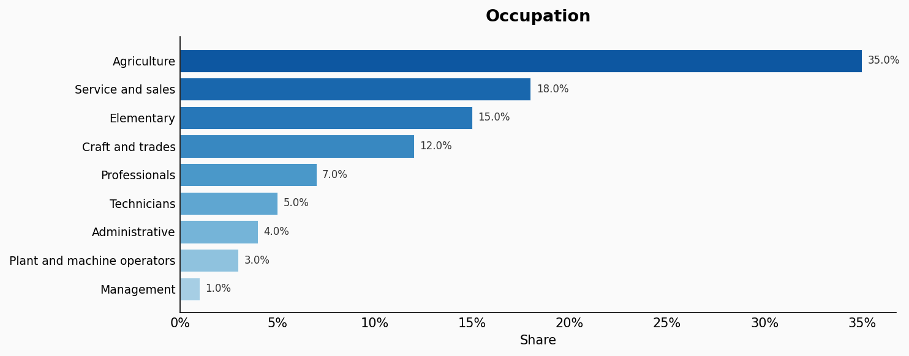

| Option | Share |
|---|---:|
| Agriculture | 35.0% |
| Service and sales | 18.0% |
| Elementary | 15.0% |
| Craft and trades | 12.0% |
| Professionals | 7.0% |
| Technicians | 5.0% |
| Administrative | 4.0% |
| Plant and machine operators | 3.0% |
| Management | 1.0% |

## Housing Tenure

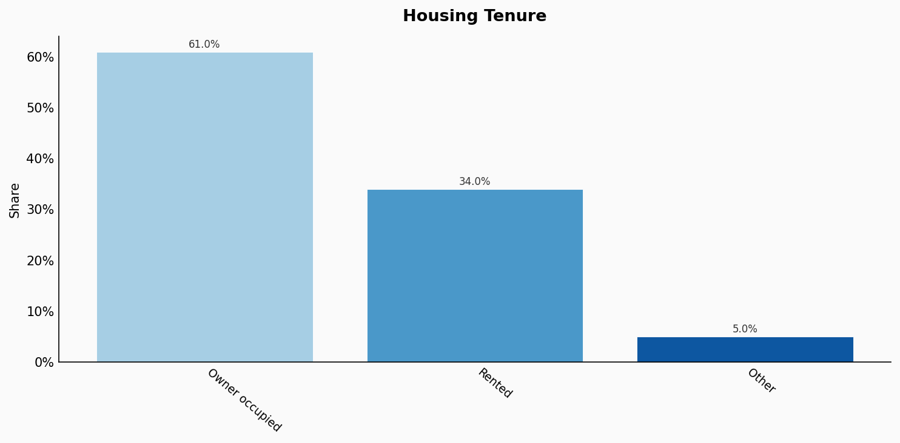

| Option | Share |
|---|---:|
| Owner occupied | 61.0% |
| Rented | 34.0% |
| Other | 5.0% |

## Place Of Birth

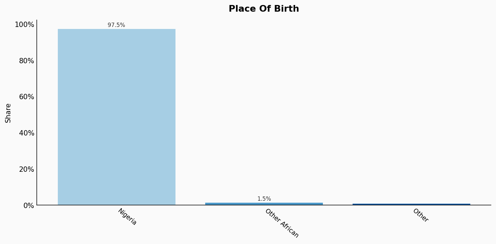

| Option | Share |
|---|---:|
| Nigeria | 97.5% |
| Other African | 1.5% |
| Other | 1.0% |

## Sexuality

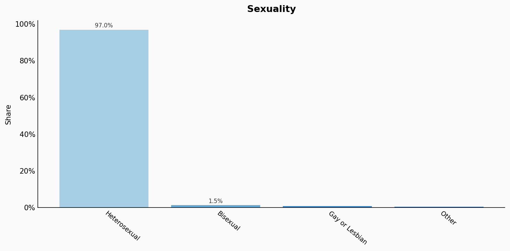

| Option | Share |
|---|---:|
| Heterosexual | 97.0% |
| Bisexual | 1.5% |
| Gay or Lesbian | 1.0% |
| Other | 0.5% |

## Sources

- [Nigeria Living Standards Survey (NLSS) 2018-2019, National Bureau of Statistics (NBS) (2019)](https://www.nigerianstat.gov.ng/elibrary/read/1241)
  *Covers: `age`, `sex`, `location`, `marital status`, `housing tenure`, `place of birth`*
- [Labour Force Survey 2022, NBS Nigeria (2022)](https://www.nigerianstat.gov.ng/elibrary?q=labour+force)
  *Covers: `education`, `occupation`*
- [Nigeria Demographic and Health Survey (NDHS) 2018, NBS/ICF (2018)](https://dhsprogram.com/pubs/pdf/FR359/FR359.pdf)
  *Covers: `religion`*
- [Ethnologue: Languages of Nigeria (2023) / NBS Estimates (2023)](https://www.ethnologue.com/country/NG/)
  *Covers: `language`*
- [Afrobarometer Nigeria 2022 (2022)](https://www.afrobarometer.org/country/nigeria/)
  *Covers: `sexuality`*