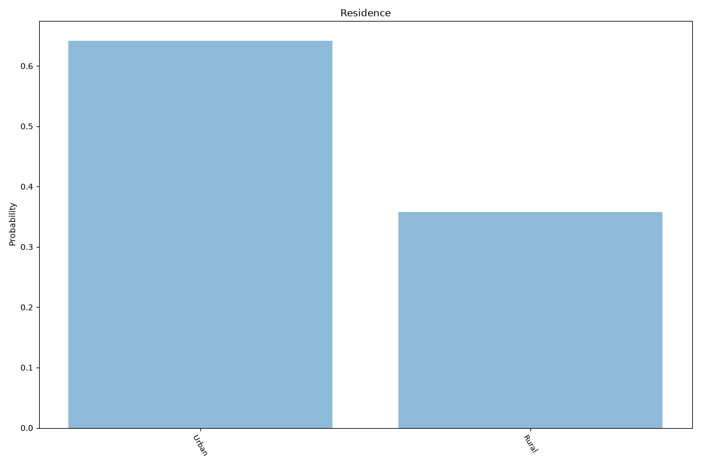
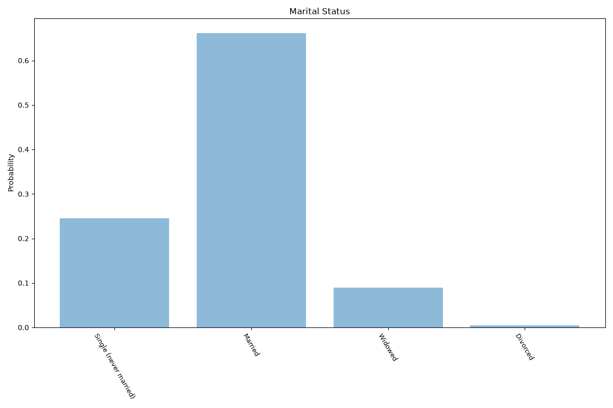

# North Korea
**6 features:** age, sex, religion, residence, marital status and location.

## Age

## Sex

## Religion

## Residence

## Marital Status

## Location

## Sources

- [World Population Prospects 2024, United Nations (2024)](https://population.un.org/wpp/) — age, sex
- [Religious composition estimate, Association of Religion Data Archives (ARDA) (2020)](https://www.thearda.com/) — religion
- [2008 Population Census of DPR Korea, Central Bureau of Statistics (via UNFPA) (2008)](https://www.unfpa.org/) — location
- [Urban population (% of total population), World Bank (2025)](https://data.worldbank.org/indicator/SP.URB.TOTL.IN.ZS) — residence
- [World Marriage Data 2019, United Nations (2008)](https://www.un.org/development/desa/pd/data/world-marriage-data) — marital status