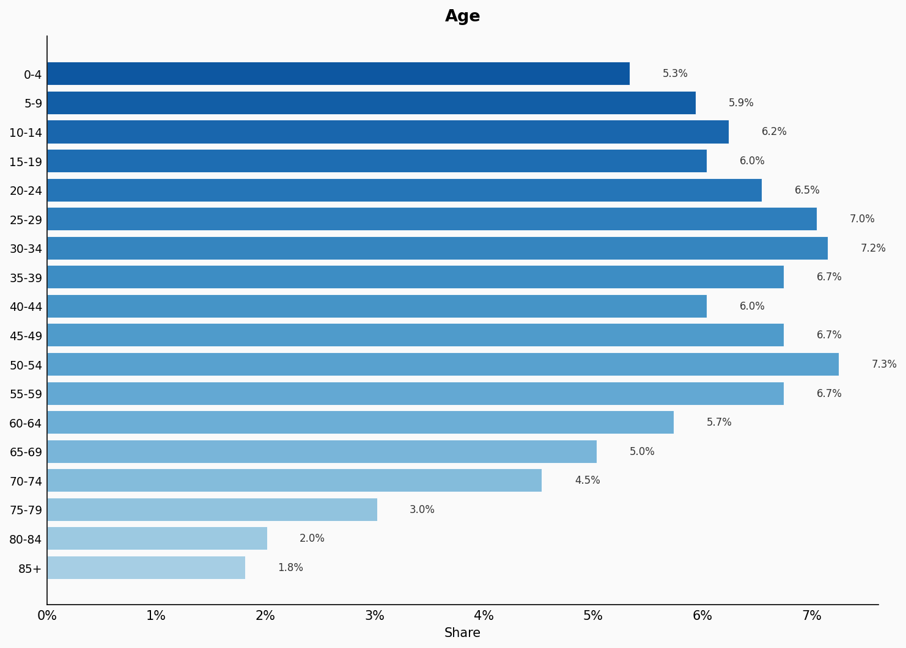
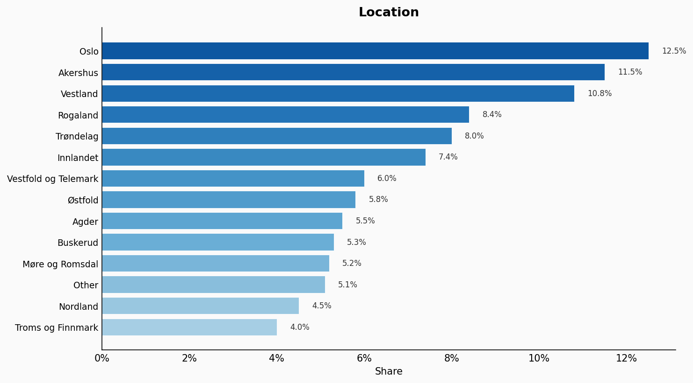
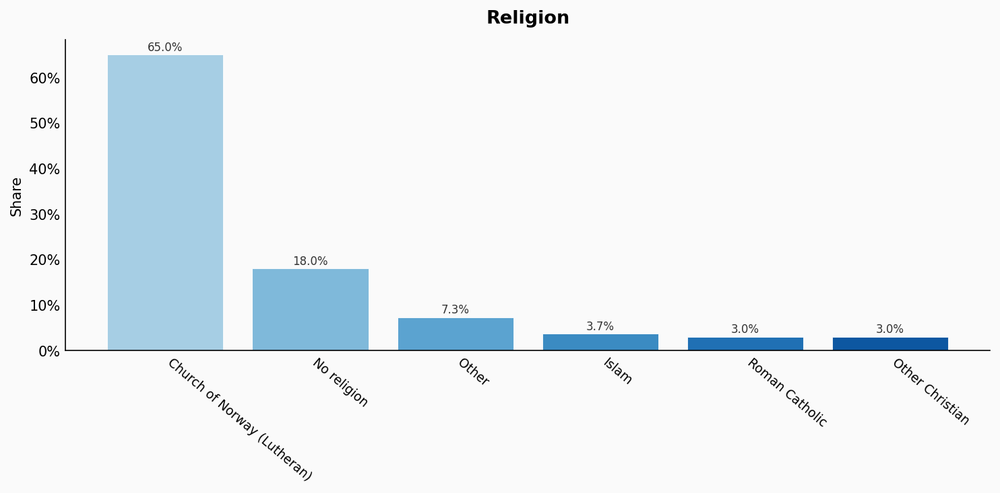
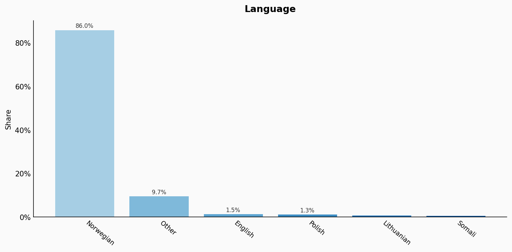
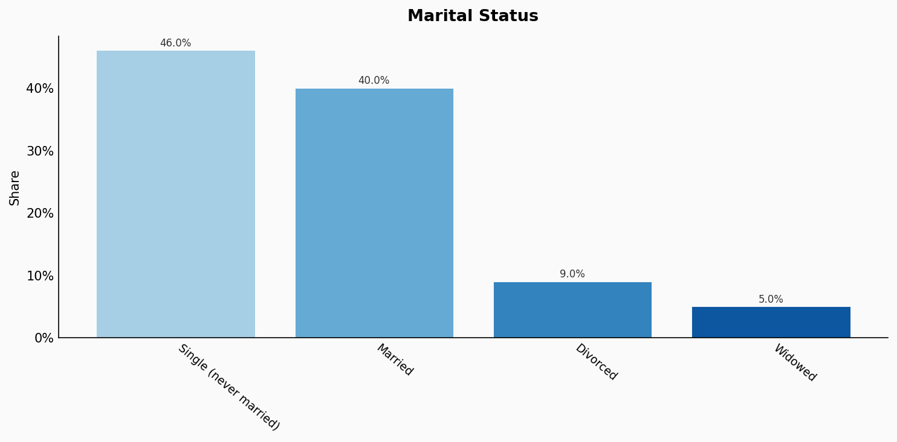
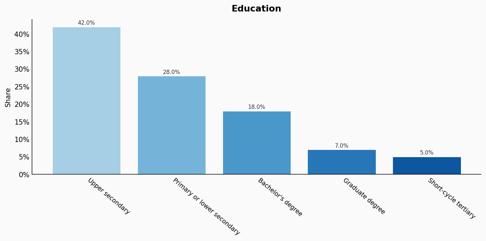
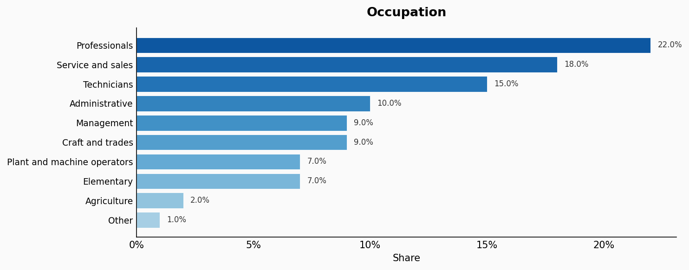
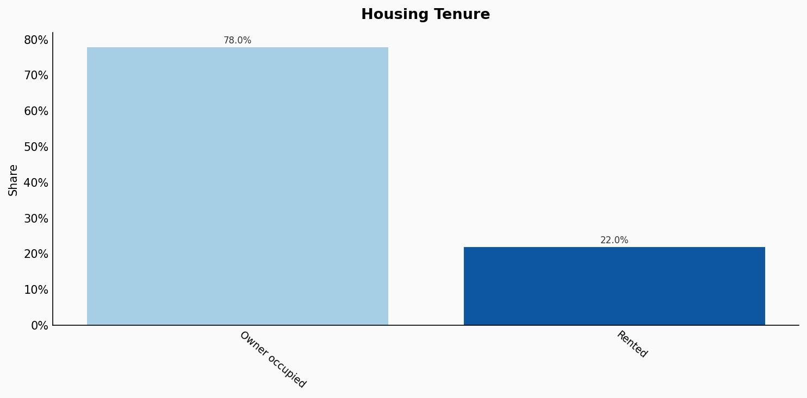
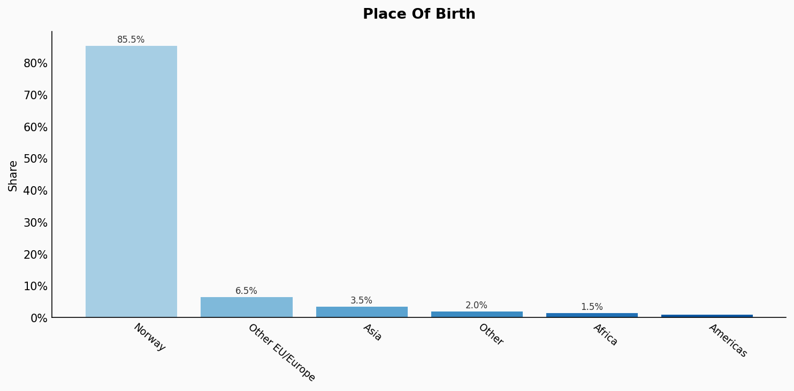
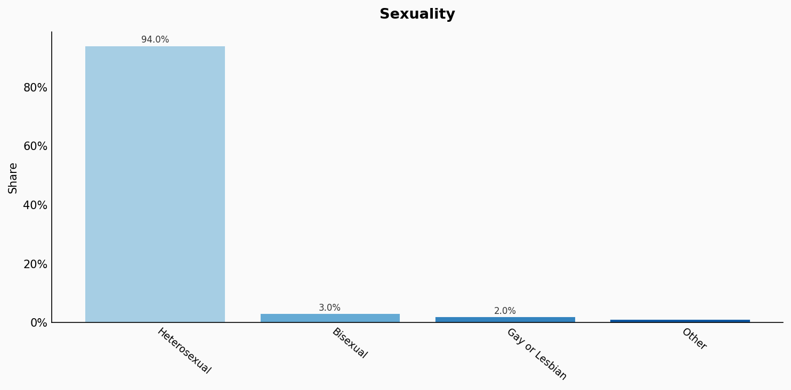

# Norway

**11 features:** age, sex, location, religion, language, marital status, education, occupation, housing tenure, place of birth, and sexuality.

## Age

| Option | Share |
|---|---:|
| 0-4 | 5.3% |
| 5-9 | 5.9% |
| 10-14 | 6.2% |
| 15-19 | 6.0% |
| 20-24 | 6.5% |
| 25-29 | 7.0% |
| 30-34 | 7.2% |
| 35-39 | 6.7% |
| 40-44 | 6.0% |
| 45-49 | 6.7% |
| 50-54 | 7.3% |
| 55-59 | 6.7% |
| 60-64 | 5.7% |
| 65-69 | 5.0% |
| 70-74 | 4.5% |
| 75-79 | 3.0% |
| 80-84 | 2.0% |
| 85+ | 1.8% |

## Sex

| Option | Share |
|---|---:|
| Male | 50.2% |
| Female | 49.8% |

## Location

| Option | Share |
|---|---:|
| Oslo | 12.5% |
| Akershus | 11.5% |
| Vestland | 10.8% |
| Rogaland | 8.4% |
| Trøndelag | 8.0% |
| Innlandet | 7.4% |
| Vestfold og Telemark | 6.0% |
| Østfold | 5.8% |
| Agder | 5.5% |
| Buskerud | 5.3% |
| Møre og Romsdal | 5.2% |
| Other | 5.1% |
| Nordland | 4.5% |
| Troms og Finnmark | 4.0% |

## Religion

| Option | Share |
|---|---:|
| Church of Norway (Lutheran) | 65.0% |
| No religion | 18.0% |
| Other | 7.3% |
| Islam | 3.7% |
| Roman Catholic | 3.0% |
| Other Christian | 3.0% |

## Language

| Option | Share |
|---|---:|
| Norwegian | 86.0% |
| Other | 9.7% |
| English | 1.5% |
| Polish | 1.3% |
| Lithuanian | 0.8% |
| Somali | 0.7% |

## Marital Status

| Option | Share |
|---|---:|
| Single (never married) | 46.0% |
| Married | 40.0% |
| Divorced | 9.0% |
| Widowed | 5.0% |

## Education

| Option | Share |
|---|---:|
| Upper secondary | 42.0% |
| Primary or lower secondary | 28.0% |
| Bachelor's degree | 18.0% |
| Graduate degree | 7.0% |
| Short-cycle tertiary | 5.0% |

## Occupation

| Option | Share |
|---|---:|
| Professionals | 22.0% |
| Service and sales | 18.0% |
| Technicians | 15.0% |
| Administrative | 10.0% |
| Management | 9.0% |
| Craft and trades | 9.0% |
| Plant and machine operators | 7.0% |
| Elementary | 7.0% |
| Agriculture | 2.0% |
| Other | 1.0% |

## Housing Tenure

| Option | Share |
|---|---:|
| Owner occupied | 78.0% |
| Rented | 22.0% |

## Place Of Birth

| Option | Share |
|---|---:|
| Norway | 85.5% |
| Other EU/Europe | 6.5% |
| Asia | 3.5% |
| Other | 2.0% |
| Africa | 1.5% |
| Americas | 1.0% |

## Sexuality

| Option | Share |
|---|---:|
| Heterosexual | 94.0% |
| Bisexual | 3.0% |
| Gay or Lesbian | 2.0% |
| Other | 1.0% |

## Sources

- [Folke- og boligtelling 2021, Statistisk sentralbyrå (SSB) (2021)](https://www.ssb.no/en/befolkning/folketelling)
  *Covers: `age`, `sex`, `location`, `marital status`, `housing tenure`, `place of birth`*
- [Arbeidskraftundersøkelsen 2022, SSB (2022)](https://www.ssb.no/en/arbeid-og-lonn/sysselsetting/statistikk/arbeidskraftundersokelsen)
  *Covers: `education`, `occupation`*
- [Tros- og livssynssamfunn 2022, SSB (2022)](https://www.ssb.no/en/kultur-og-fritid/religion-og-livssyn/statistikk/trus-og-livssynssamfunn)
  *Covers: `religion`*
- [Innvandring og innvandrere 2022, SSB (2022)](https://www.ssb.no/en/befolkning/innvandrere/statistikk/innvandrere-og-norskfodte-med-innvandrerforeldre)
  *Covers: `language`*
- [Levekårsundersøkelsen om seksuell orientering 2020, SSB (2020)](https://www.ssb.no/sosiale-forhold-og-kriminalitet/artikler-og-publikasjoner/seksuell-orientering-og-levekaar)
  *Covers: `sexuality`*