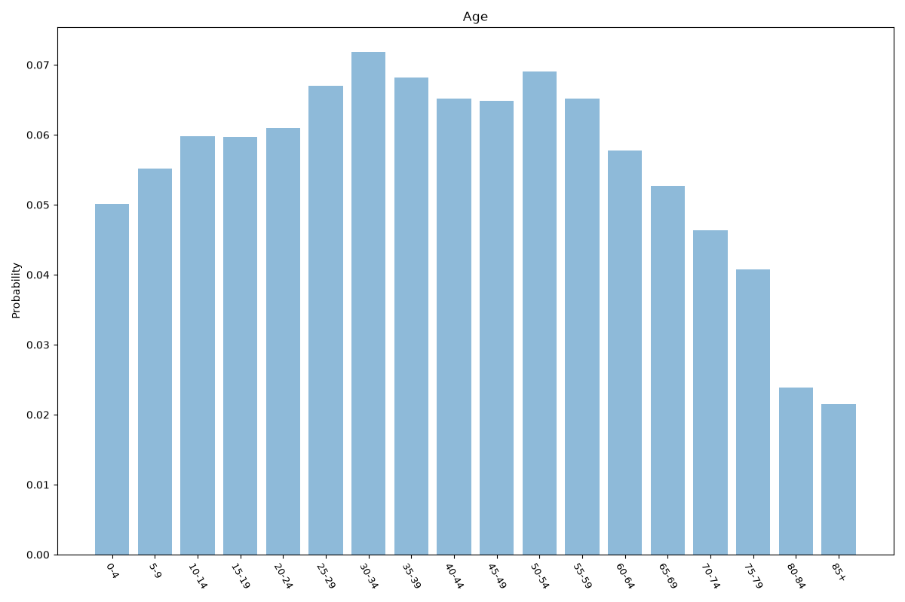
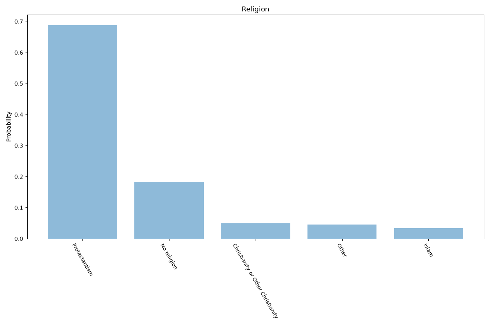
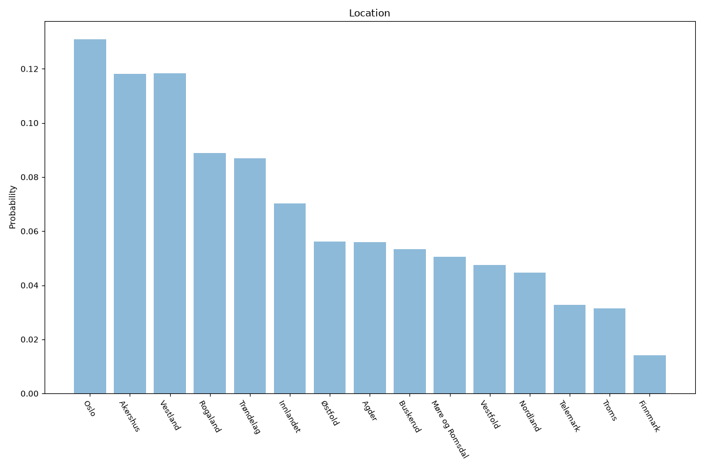

# Norway
**4 features:** age, sex, religion and location.

## Age

## Sex

## Religion

## Location

## Sources

- [World Population Prospects 2024, United Nations (2024)](https://population.un.org/wpp/) — age, sex
- [Members of religious and life-stance communities 2019, Statistics Norway (SSB) (2019)](https://www.ssb.no/en) — religion
- [Population 2024, Statistics Norway (SSB) (2024)](https://www.ssb.no/en) — location