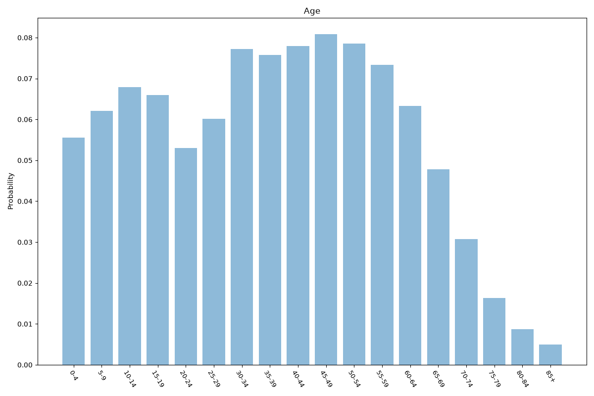
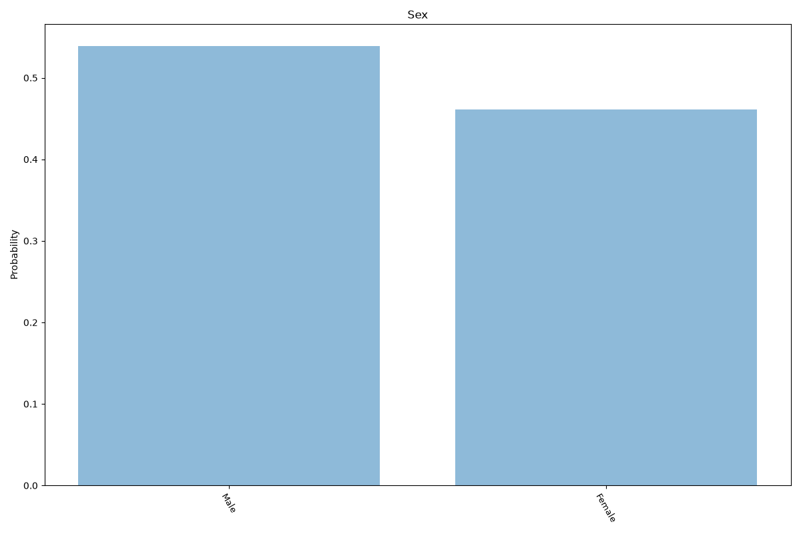
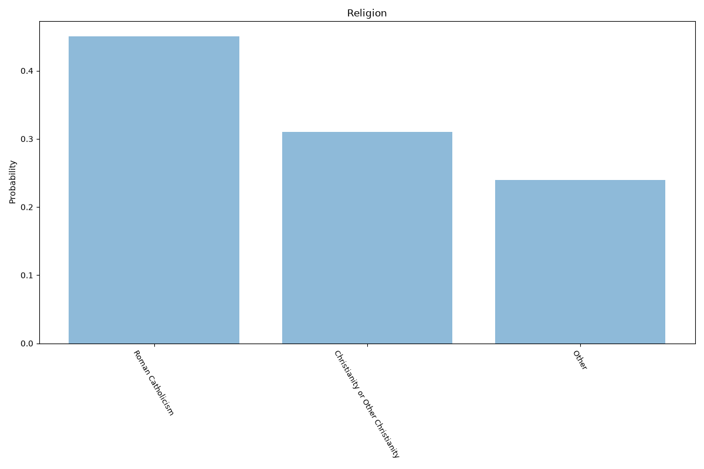
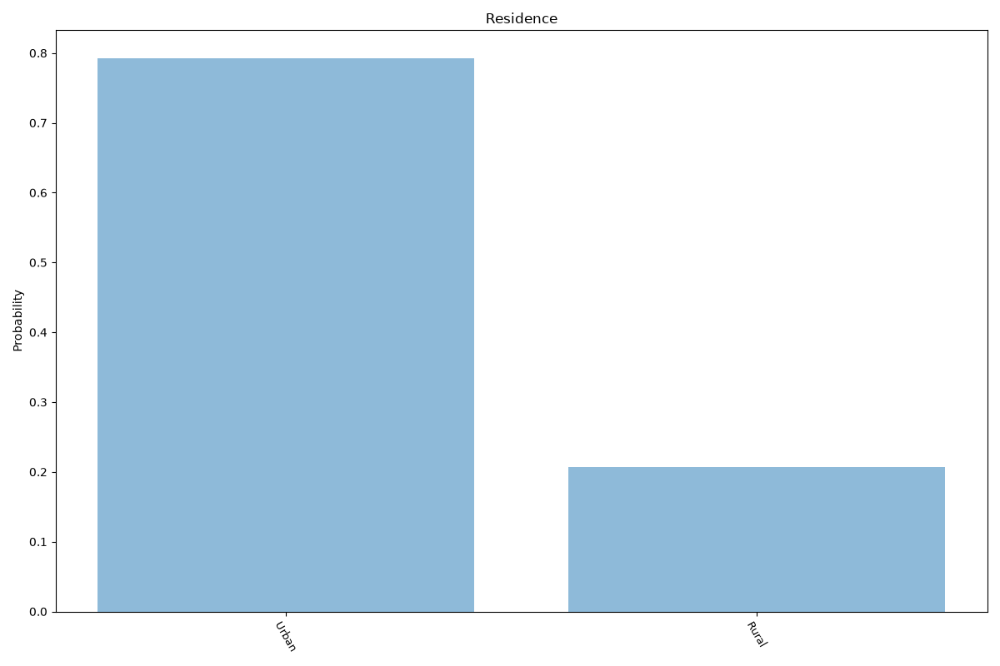
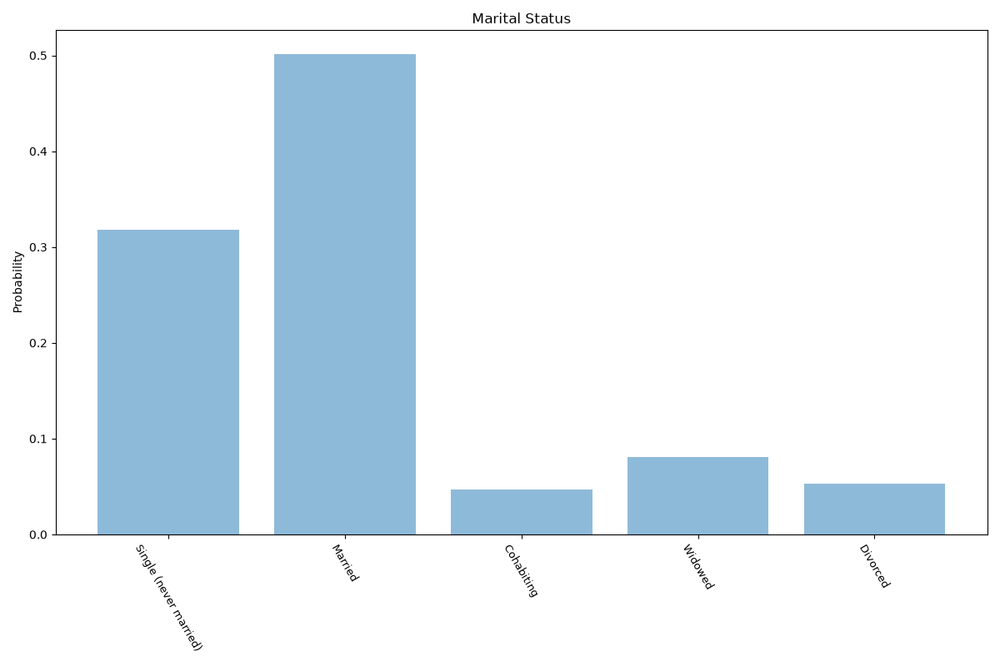
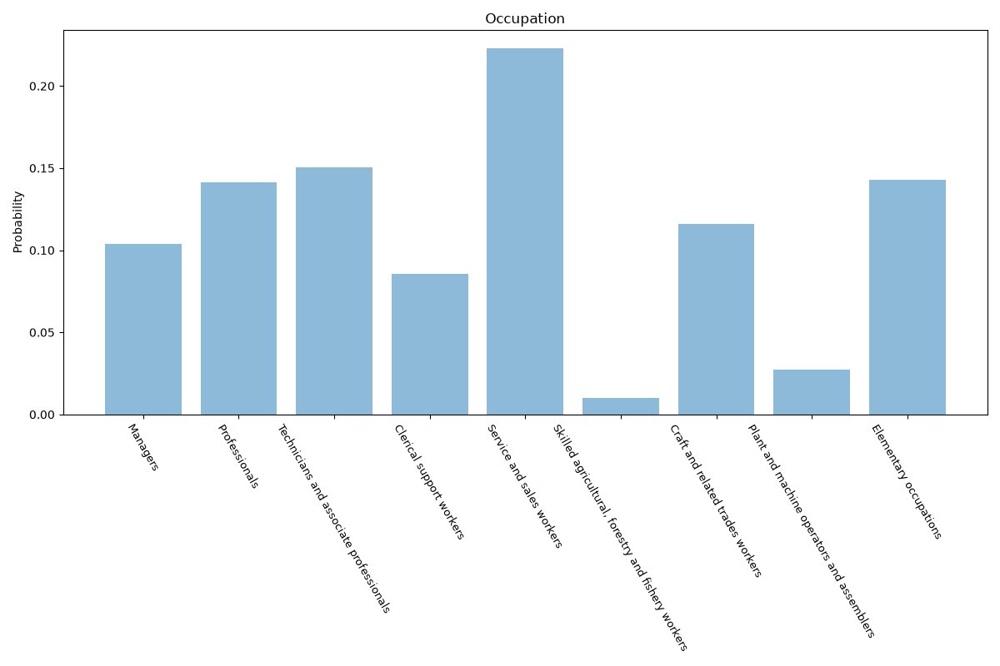

# Palau
**6 features:** age, sex, religion, residence, marital status and occupation.

## Age

## Sex

## Religion

## Residence

## Marital Status

## Occupation

## Sources

- [World Population Prospects 2024, United Nations (2024)](https://population.un.org/wpp/) — age, sex
- [The World Factbook, Central Intelligence Agency (2020)](https://www.cia.gov/the-world-factbook/countries/palau/) — religion
- [Urban population (% of total population), World Bank (2025)](https://data.worldbank.org/indicator/SP.URB.TOTL.IN.ZS) — residence
- [World Marriage Data 2019, United Nations (2015)](https://www.un.org/development/desa/pd/data/world-marriage-data) — marital status
- [Employment by sex and occupation (ISCO-08), ILOSTAT, International Labour Organization (2023)](https://ilostat.ilo.org/data/) — occupation