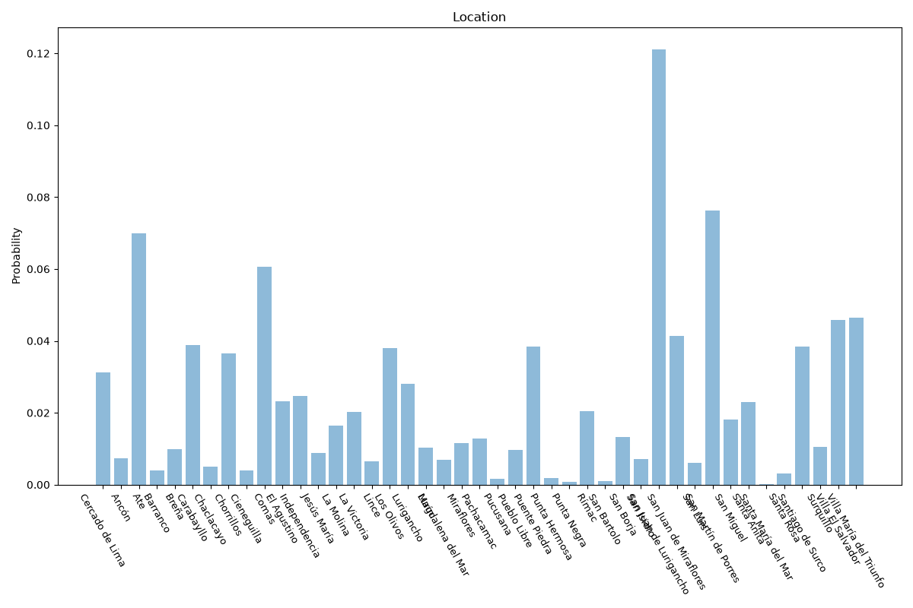

# Lima
**2 features:** location and residence.

## Location

## Residence

## Sources

- [Censos Nacionales 2017, Instituto Nacional de Estadística e Informática (INEI) (2017)](https://www.inei.gob.pe/) — location
- [World Urbanization Prospects 2018, United Nations (2018)](https://population.un.org/wup/) — residence