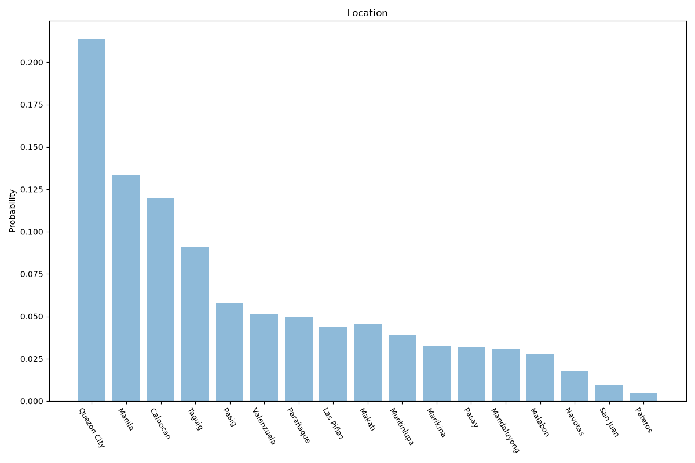

# Metro Manila
**2 features:** location and residence.

## Location

## Residence

## Sources

- [Census of Population and Housing 2020, Philippine Statistics Authority (PSA) (2020)](https://psa.gov.ph/) — location
- [World Urbanization Prospects 2018, United Nations (2018)](https://population.un.org/wup/) — residence