# Poland

**11 features:** age, sex, location, religion, language, marital status, education, occupation, housing tenure, place of birth, and sexuality.

## Age

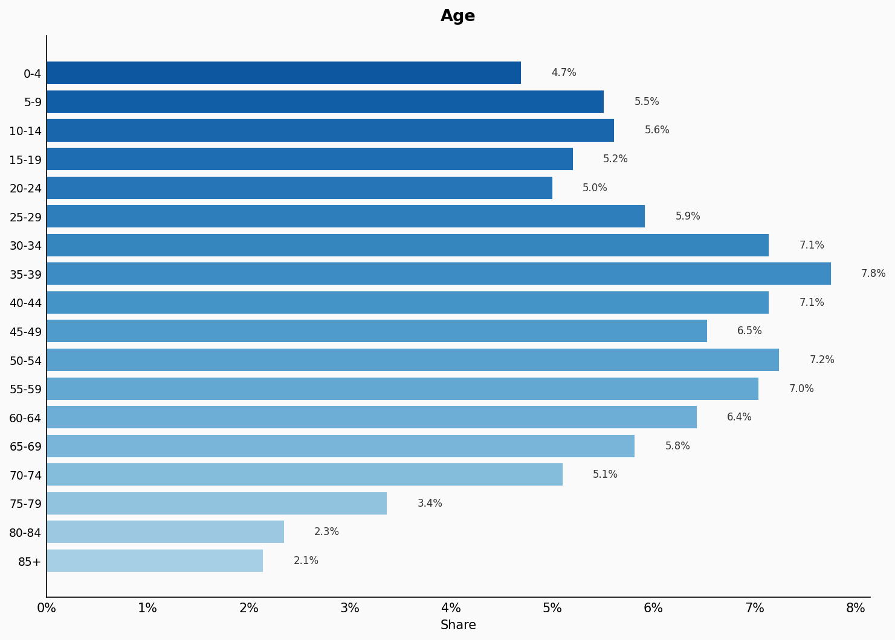

| Option | Share |
|---|---:|
| 0-4 | 4.7% |
| 5-9 | 5.5% |
| 10-14 | 5.6% |
| 15-19 | 5.2% |
| 20-24 | 5.0% |
| 25-29 | 5.9% |
| 30-34 | 7.1% |
| 35-39 | 7.8% |
| 40-44 | 7.1% |
| 45-49 | 6.5% |
| 50-54 | 7.2% |
| 55-59 | 7.0% |
| 60-64 | 6.4% |
| 65-69 | 5.8% |
| 70-74 | 5.1% |
| 75-79 | 3.4% |
| 80-84 | 2.3% |
| 85+ | 2.1% |

## Sex

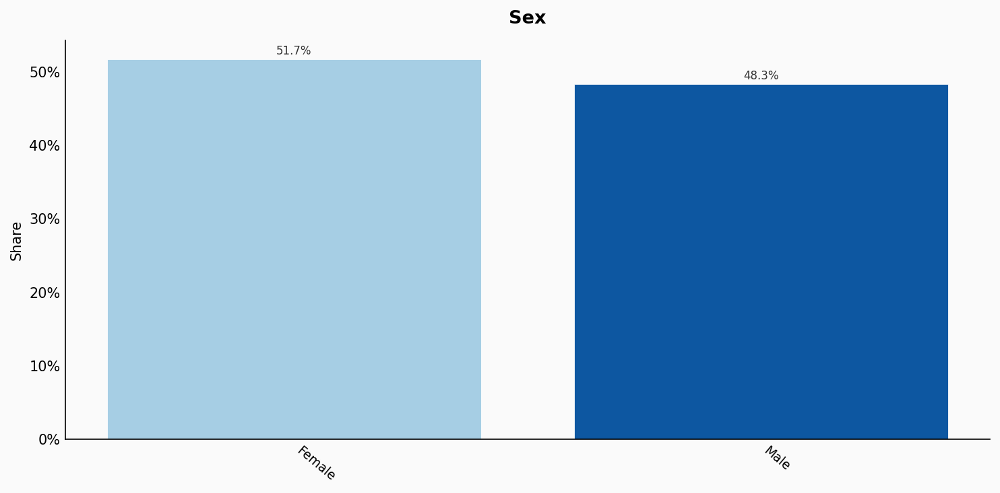

| Option | Share |
|---|---:|
| Female | 51.7% |
| Male | 48.3% |

## Location

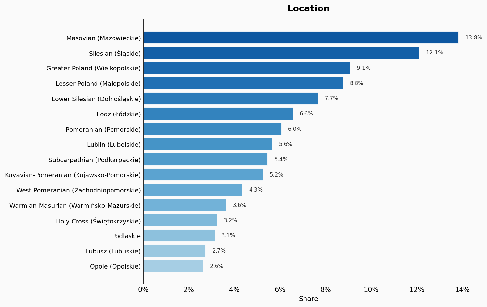

| Option | Share |
|---|---:|
| Masovian (Mazowieckie) | 13.8% |
| Silesian (Śląskie) | 12.1% |
| Greater Poland (Wielkopolskie) | 9.1% |
| Lesser Poland (Małopolskie) | 8.8% |
| Lower Silesian (Dolnośląskie) | 7.7% |
| Lodz (Łódzkie) | 6.6% |
| Pomeranian (Pomorskie) | 6.0% |
| Lublin (Lubelskie) | 5.6% |
| Subcarpathian (Podkarpackie) | 5.4% |
| Kuyavian-Pomeranian (Kujawsko-Pomorskie) | 5.2% |
| West Pomeranian (Zachodniopomorskie) | 4.3% |
| Warmian-Masurian (Warmińsko-Mazurskie) | 3.6% |
| Holy Cross (Świętokrzyskie) | 3.2% |
| Podlaskie | 3.1% |
| Lubusz (Lubuskie) | 2.7% |
| Opole (Opolskie) | 2.6% |

## Religion

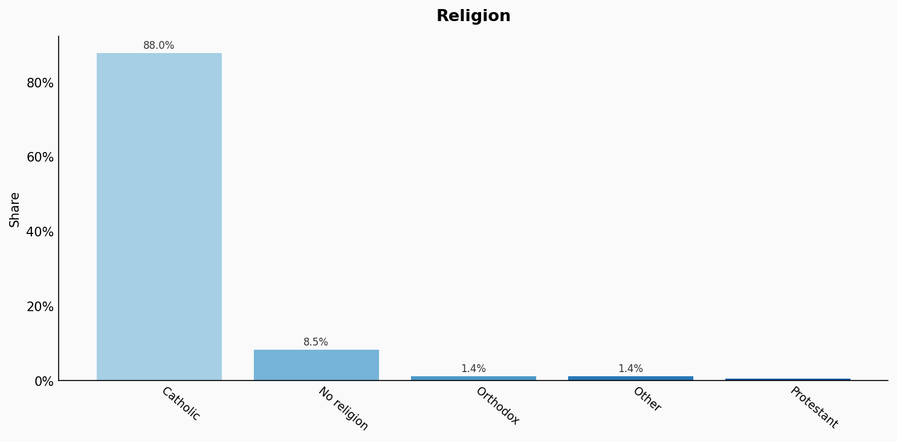

| Option | Share |
|---|---:|
| Catholic | 88.0% |
| No religion | 8.5% |
| Orthodox | 1.4% |
| Other | 1.4% |
| Protestant | 0.7% |

## Language

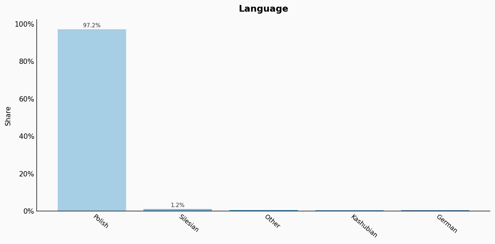

| Option | Share |
|---|---:|
| Polish | 97.2% |
| Silesian | 1.2% |
| Other | 0.7% |
| Kashubian | 0.5% |
| German | 0.4% |

## Marital Status

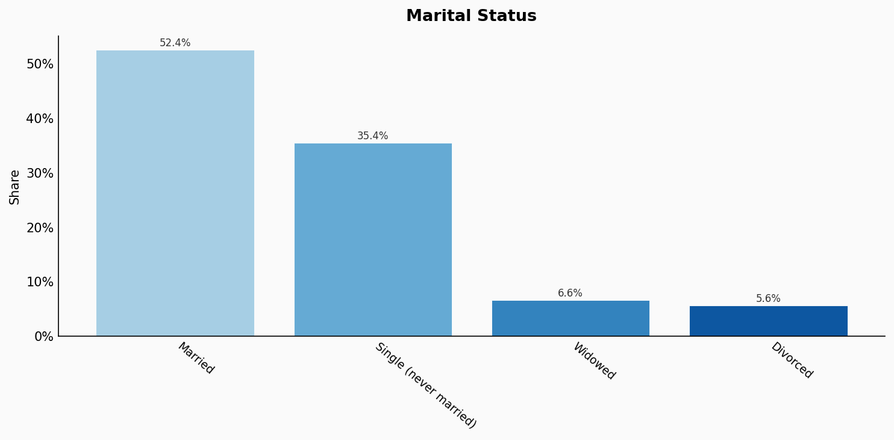

| Option | Share |
|---|---:|
| Married | 52.4% |
| Single (never married) | 35.4% |
| Widowed | 6.6% |
| Divorced | 5.6% |

## Education

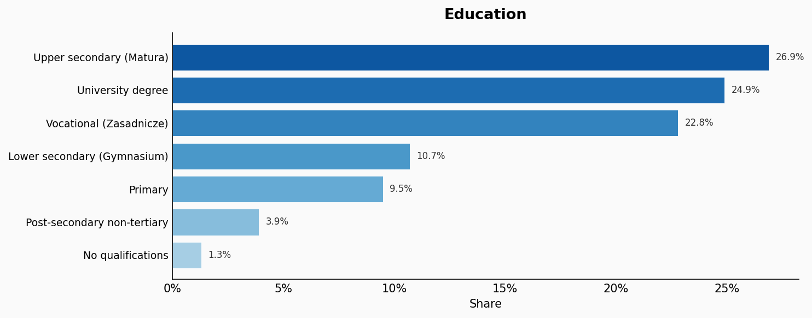

| Option | Share |
|---|---:|
| Upper secondary (Matura) | 26.9% |
| University degree | 24.9% |
| Vocational (Zasadnicze) | 22.8% |
| Lower secondary (Gymnasium) | 10.7% |
| Primary | 9.5% |
| Post-secondary non-tertiary | 3.9% |
| No qualifications | 1.3% |

## Occupation

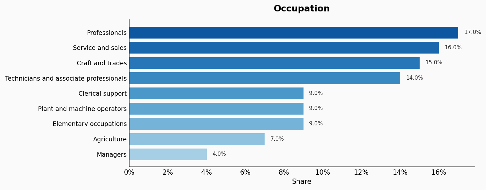

| Option | Share |
|---|---:|
| Professionals | 17.0% |
| Service and sales | 16.0% |
| Craft and trades | 15.0% |
| Technicians and associate professionals | 14.0% |
| Clerical support | 9.0% |
| Plant and machine operators | 9.0% |
| Elementary occupations | 9.0% |
| Agriculture | 7.0% |
| Managers | 4.0% |

## Housing Tenure

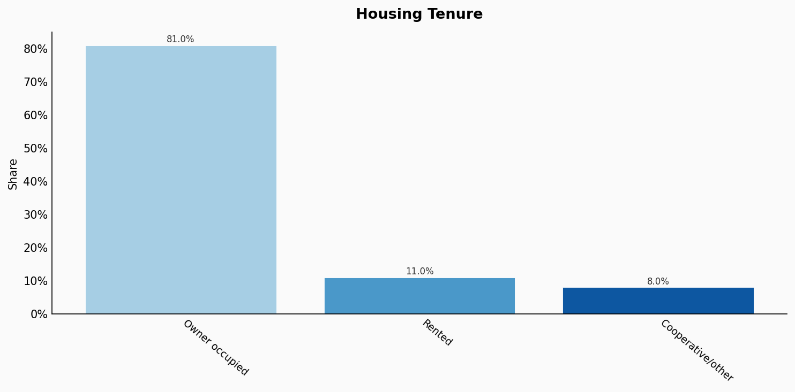

| Option | Share |
|---|---:|
| Owner occupied | 81.0% |
| Rented | 11.0% |
| Cooperative/other | 8.0% |

## Place Of Birth

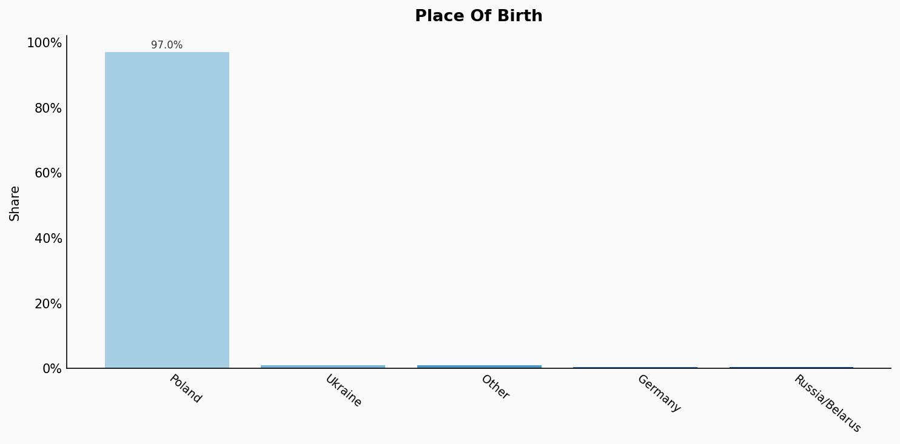

| Option | Share |
|---|---:|
| Poland | 97.0% |
| Ukraine | 1.0% |
| Other | 1.0% |
| Germany | 0.5% |
| Russia/Belarus | 0.5% |

## Sexuality

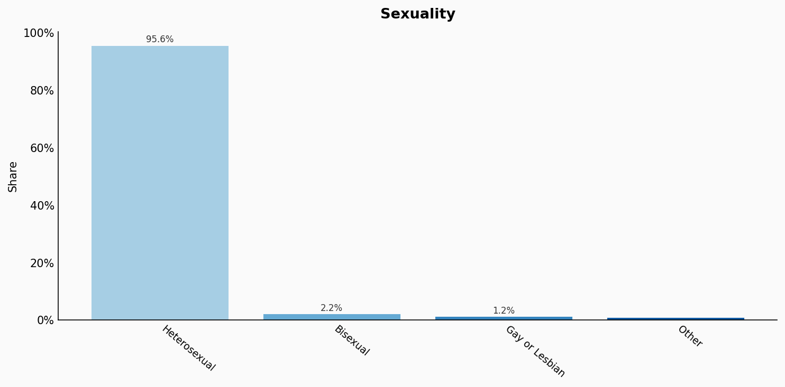

| Option | Share |
|---|---:|
| Heterosexual | 95.6% |
| Bisexual | 2.2% |
| Gay or Lesbian | 1.2% |
| Other | 1.0% |

## Sources

- [Narodowy Spis Powszechny Ludności i Mieszkań 2021, GUS (2021)](https://stat.gov.pl/spisy-powszechne/nsp-2021/)
  *Covers: `age`, `sex`, `marital status`, `location`, `place of birth`*
- [Badanie Aktywności Ekonomicznej Ludności (BAEL) 2022, GUS (2022)](https://stat.gov.pl/obszary-tematyczne/rynek-pracy/pracujacy-bezrobotni-bierni-zawodowo-wedlug-bael/)
  *Covers: `education`, `occupation`, `housing tenure`*
- [Wyznania religijne, GUS (2021)](https://stat.gov.pl/obszary-tematyczne/inne-opracowania/wyznania-religijne-w-polsce/)
  *Covers: `religion`*
- [Badanie społeczne CBOS, Centrum Badania Opinii Społecznej (2021)](https://www.cbos.pl/SPISKOM.POL/2021/K_068_21.PDF)
  *Covers: `sexuality`*