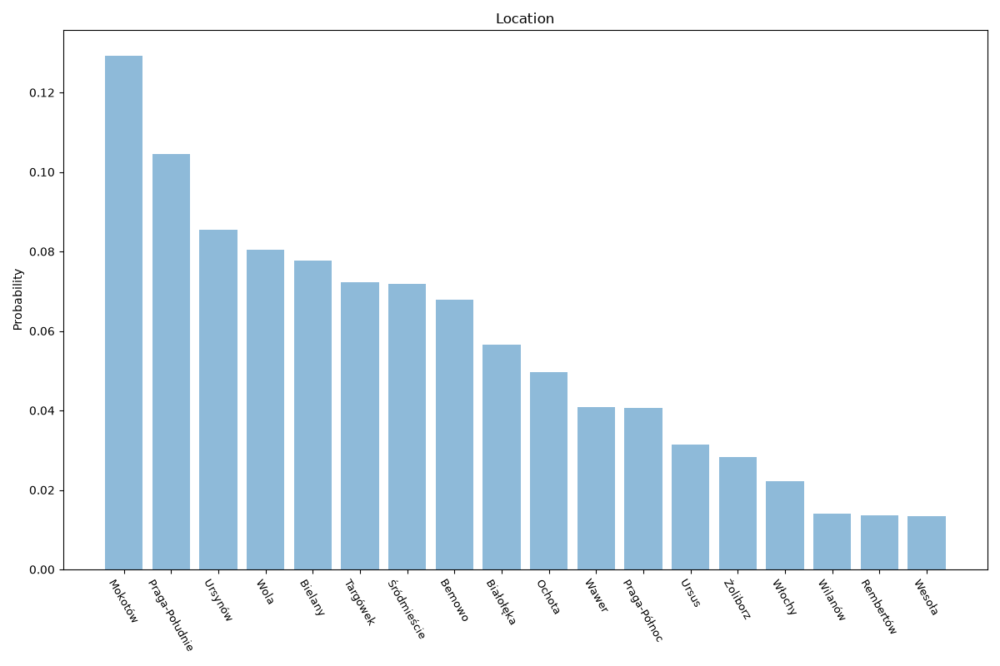

# Warsaw
**2 features:** location and residence.

## Location

## Residence

## Sources

- [Local Data Bank, Statistics Poland (GUS) (2021)](https://stat.gov.pl/) — location
- [World Urbanization Prospects 2018, United Nations (2018)](https://population.un.org/wup/) — residence