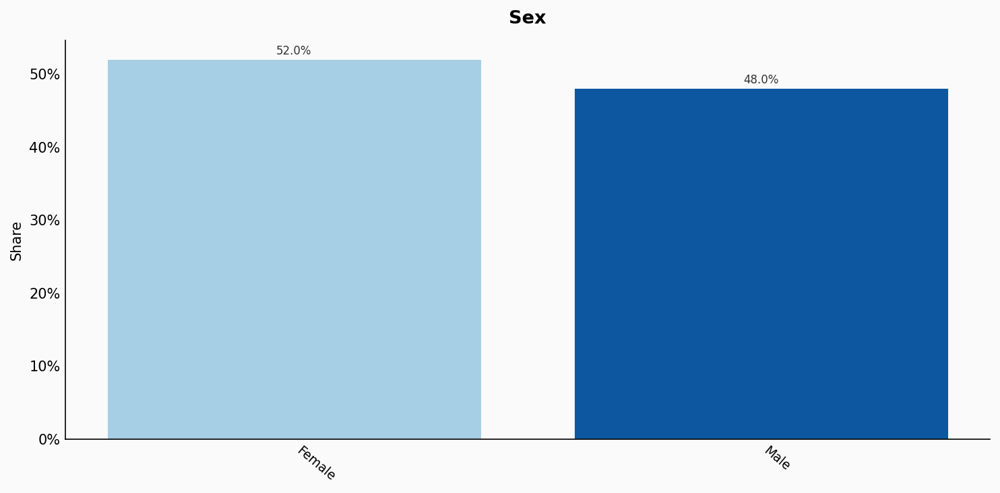
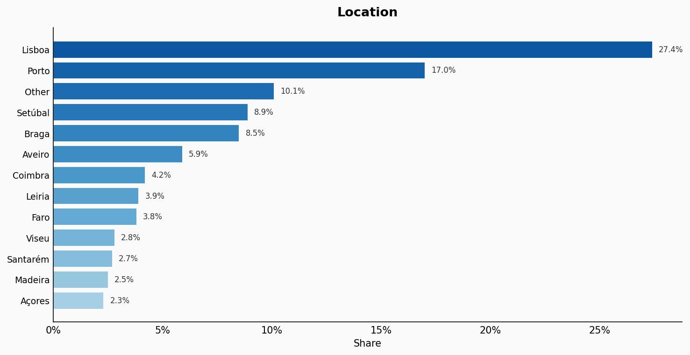
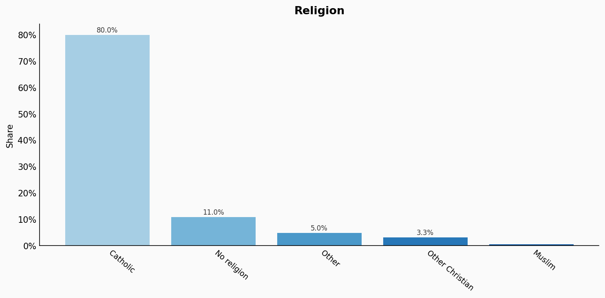
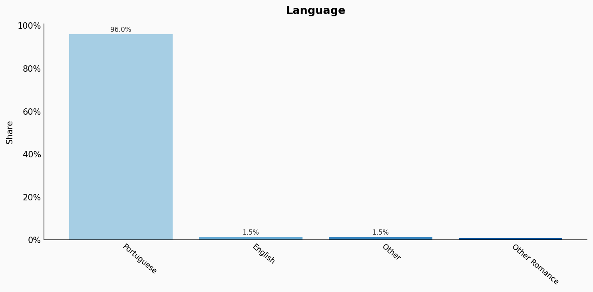
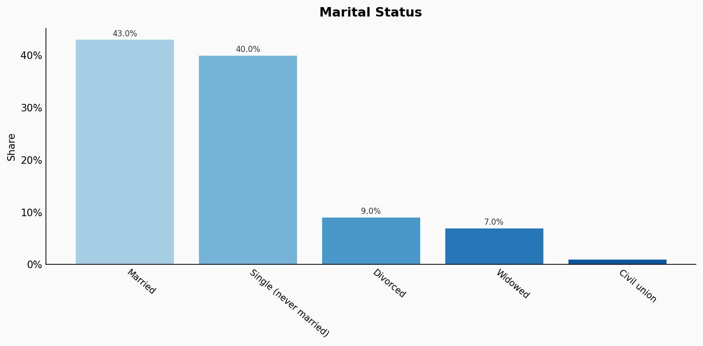
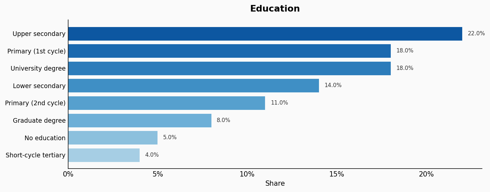
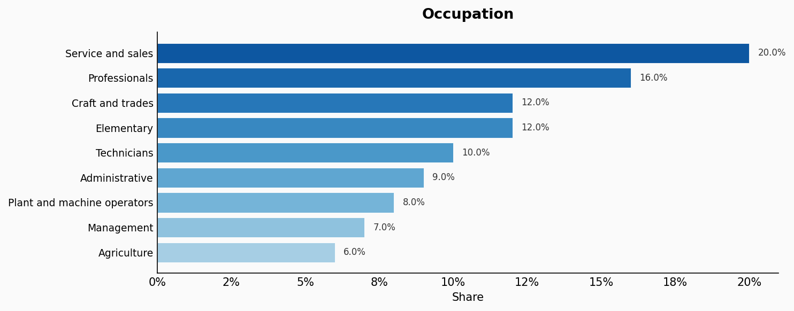
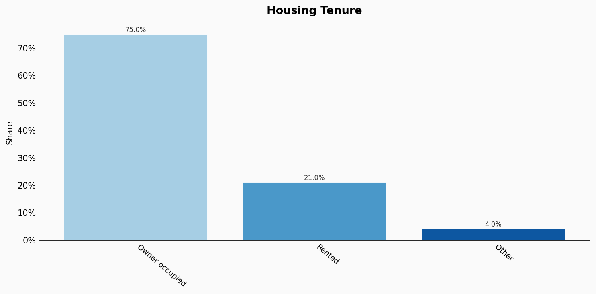
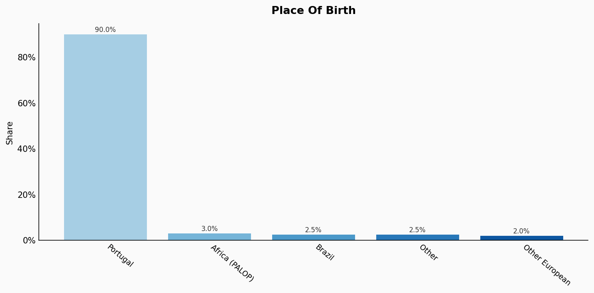
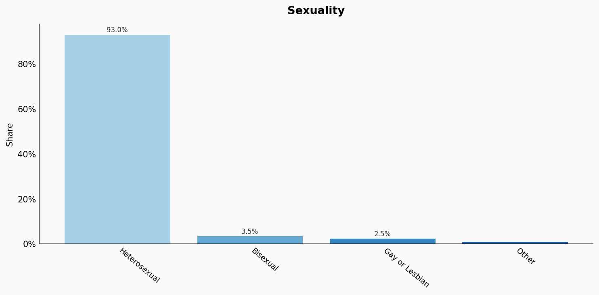

# Portugal

**11 features:** age, sex, location, religion, language, marital status, education, occupation, housing tenure, place of birth, and sexuality.

## Age

| Option | Share |
|---|---:|
| 0-4 | 4.6% |
| 5-9 | 5.0% |
| 10-14 | 5.0% |
| 15-19 | 4.9% |
| 20-24 | 5.2% |
| 25-29 | 5.8% |
| 30-34 | 6.3% |
| 35-39 | 6.9% |
| 40-44 | 7.2% |
| 45-49 | 7.3% |
| 50-54 | 7.2% |
| 55-59 | 6.9% |
| 60-64 | 6.4% |
| 65-69 | 6.0% |
| 70-74 | 5.4% |
| 75-79 | 4.0% |
| 80-84 | 2.9% |
| 85+ | 2.7% |

## Sex

| Option | Share |
|---|---:|
| Female | 52.0% |
| Male | 48.0% |

## Location

| Option | Share |
|---|---:|
| Lisboa | 27.4% |
| Porto | 17.0% |
| Other | 10.1% |
| Setúbal | 8.9% |
| Braga | 8.5% |
| Aveiro | 5.9% |
| Coimbra | 4.2% |
| Leiria | 3.9% |
| Faro | 3.8% |
| Viseu | 2.8% |
| Santarém | 2.7% |
| Madeira | 2.5% |
| Açores | 2.3% |

## Religion

| Option | Share |
|---|---:|
| Catholic | 80.0% |
| No religion | 11.0% |
| Other | 5.0% |
| Other Christian | 3.3% |
| Muslim | 0.7% |

## Language

| Option | Share |
|---|---:|
| Portuguese | 96.0% |
| English | 1.5% |
| Other | 1.5% |
| Other Romance | 1.0% |

## Marital Status

| Option | Share |
|---|---:|
| Married | 43.0% |
| Single (never married) | 40.0% |
| Divorced | 9.0% |
| Widowed | 7.0% |
| Civil union | 1.0% |

## Education

| Option | Share |
|---|---:|
| Upper secondary | 22.0% |
| Primary (1st cycle) | 18.0% |
| University degree | 18.0% |
| Lower secondary | 14.0% |
| Primary (2nd cycle) | 11.0% |
| Graduate degree | 8.0% |
| No education | 5.0% |
| Short-cycle tertiary | 4.0% |

## Occupation

| Option | Share |
|---|---:|
| Service and sales | 20.0% |
| Professionals | 16.0% |
| Craft and trades | 12.0% |
| Elementary | 12.0% |
| Technicians | 10.0% |
| Administrative | 9.0% |
| Plant and machine operators | 8.0% |
| Management | 7.0% |
| Agriculture | 6.0% |

## Housing Tenure

| Option | Share |
|---|---:|
| Owner occupied | 75.0% |
| Rented | 21.0% |
| Other | 4.0% |

## Place Of Birth

| Option | Share |
|---|---:|
| Portugal | 90.0% |
| Africa (PALOP) | 3.0% |
| Brazil | 2.5% |
| Other | 2.5% |
| Other European | 2.0% |

## Sexuality

| Option | Share |
|---|---:|
| Heterosexual | 93.0% |
| Bisexual | 3.5% |
| Gay or Lesbian | 2.5% |
| Other | 1.0% |

## Sources

- [Censos 2021, INE Portugal (2021)](https://censos.ine.pt/)
  *Covers: `age`, `sex`, `location`, `marital status`, `religion`, `place of birth`, `housing tenure`*
- [Inquérito ao Emprego 2022, INE Portugal (2022)](https://www.ine.pt/xportal/xmain?xpid=INE&xpgid=ine_destaques&DESTAQUESdest_boui=526271897&DESTAQUESmodo=2)
  *Covers: `education`, `occupation`*
- [Censos 2021 - Língua, INE Portugal (2021)](https://censos.ine.pt/)
  *Covers: `language`*
- [Eurobarometer Special Survey on Discrimination 2019, European Commission (2019)](https://europa.eu/eurobarometer/surveys/detail/2251)
  *Covers: `sexuality`*