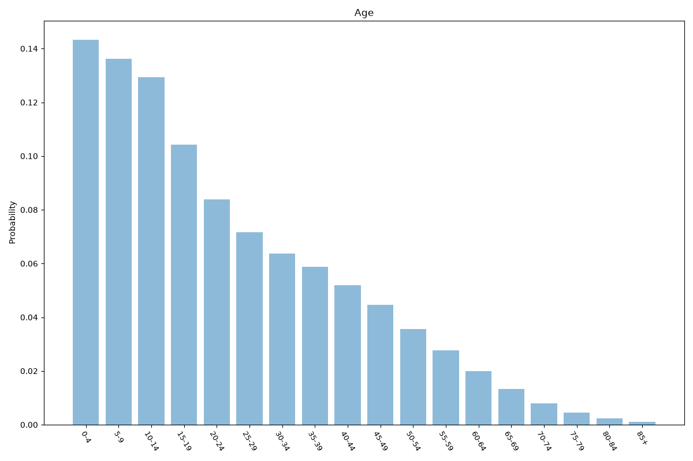
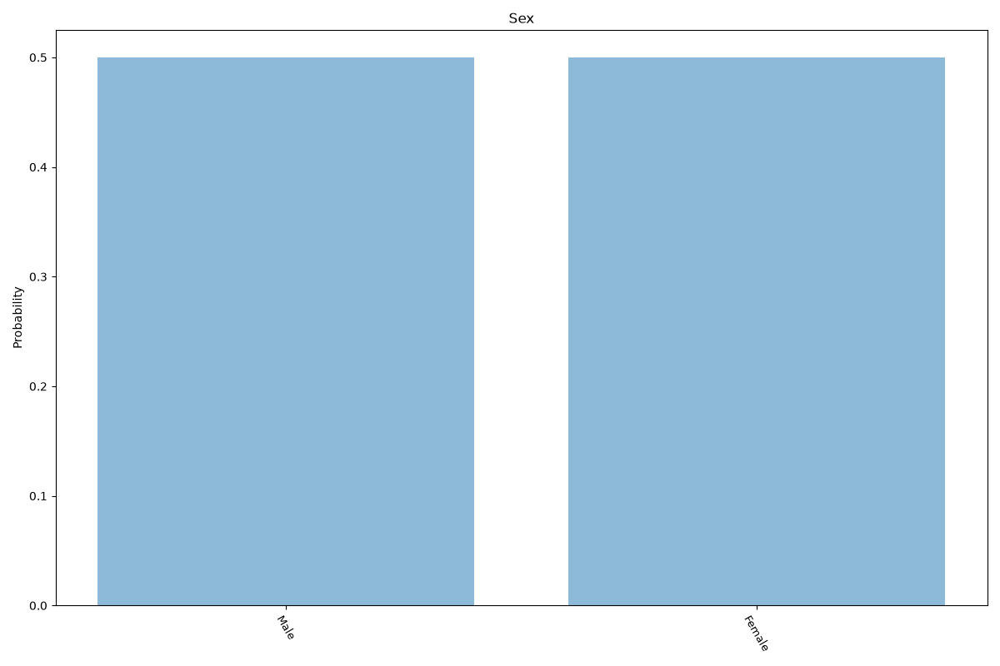
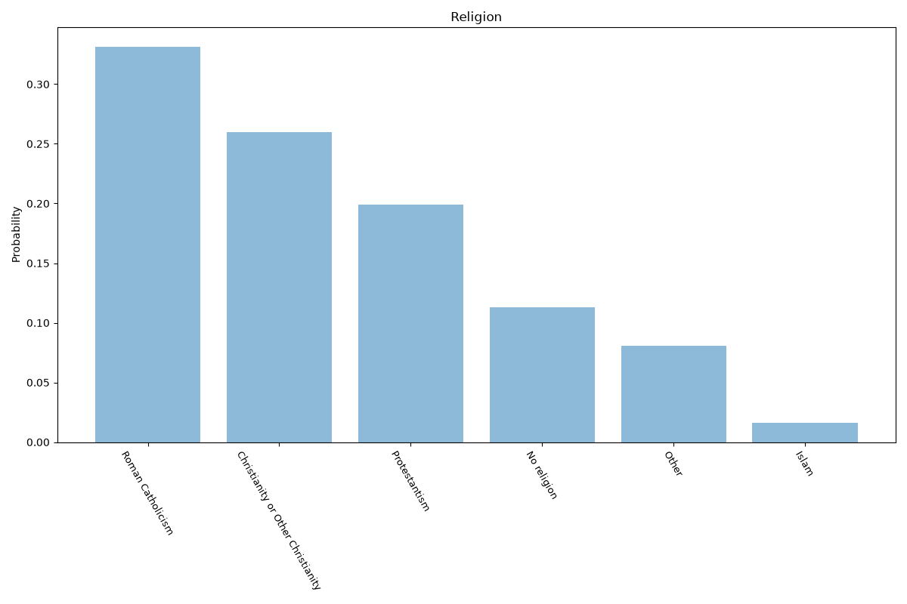
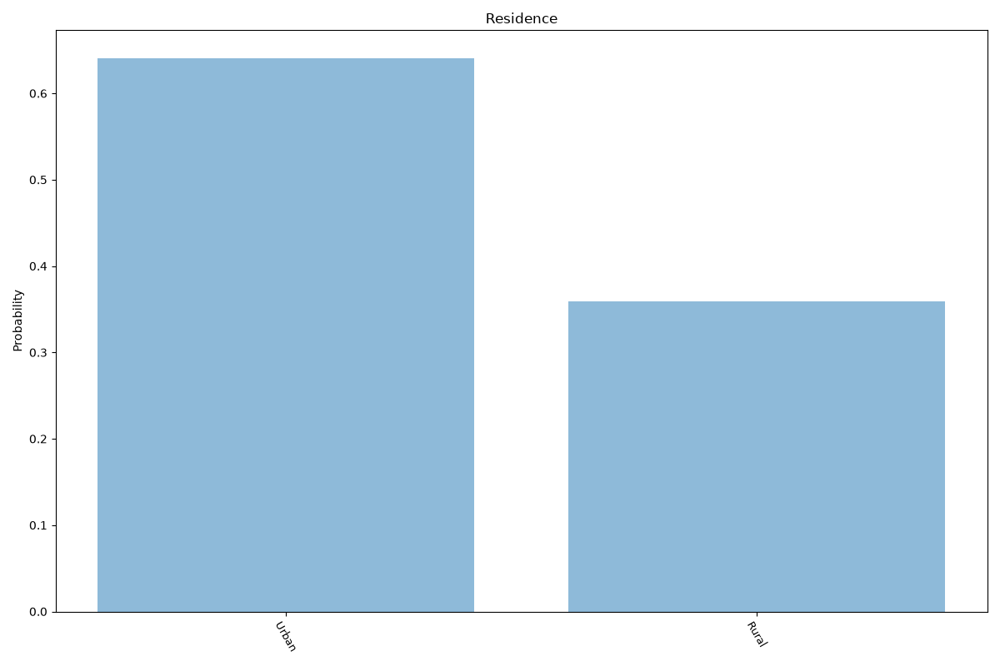
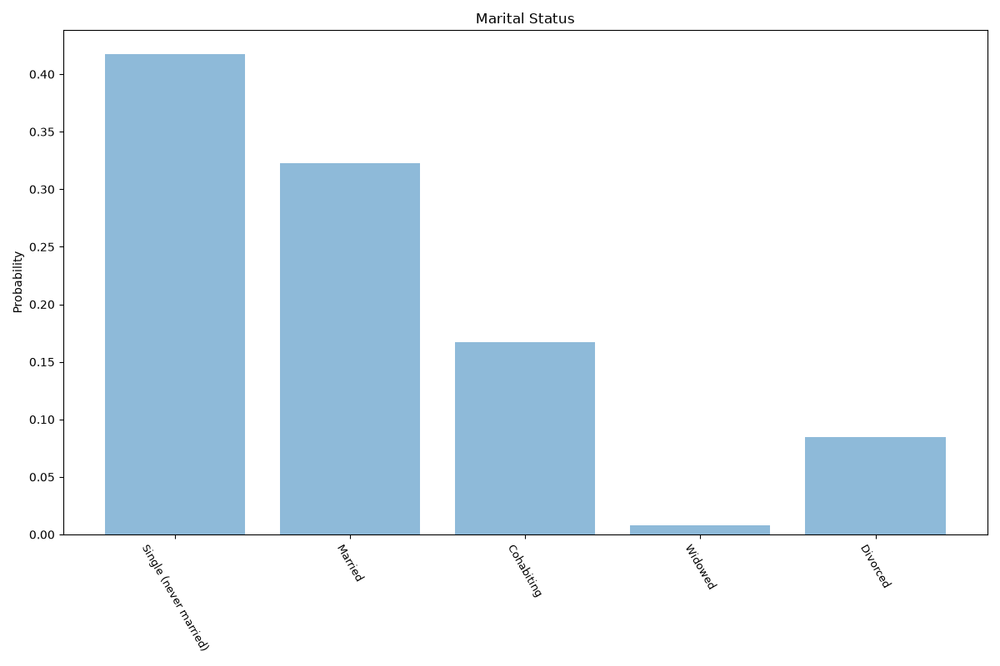
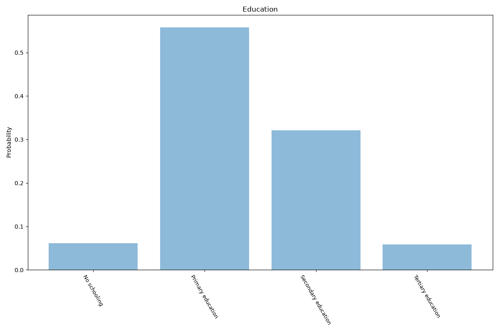
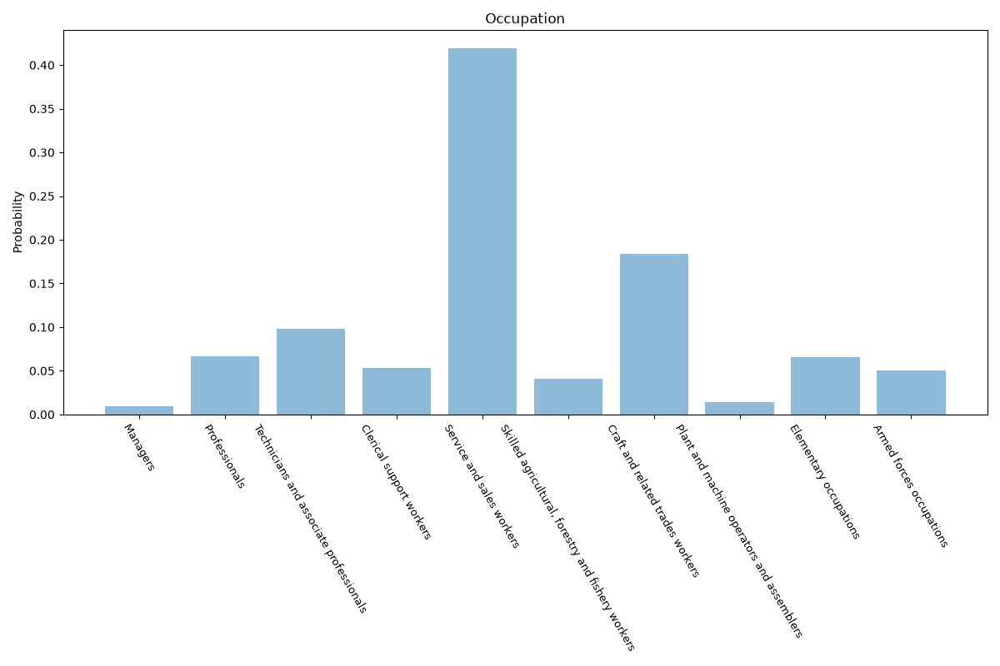
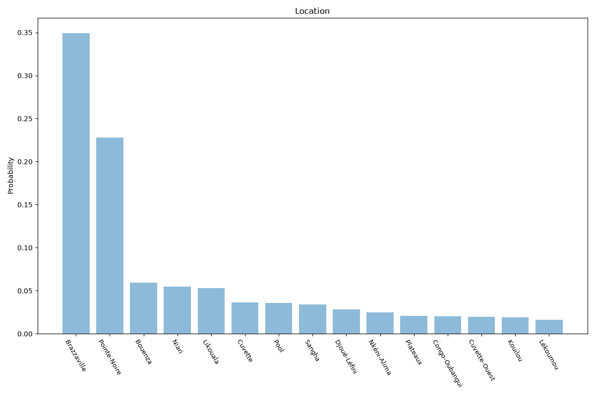

# Republic Of The Congo
**8 features:** age, sex, religion, residence, marital status, education, occupation and location.

## Age

## Sex

## Religion

## Residence

## Marital Status

## Education

## Occupation

## Location

## Sources

- [World Population Prospects 2024, United Nations (2024)](https://population.un.org/wpp/) — age, sex
- [The World Factbook: Republic of the Congo (religion), CIA (2007)](https://www.cia.gov/the-world-factbook/countries/congo-republic-of-the/) — religion
- [2023 Census, Institut National de la Statistique (Congo) (2023)](https://ins-congo.cg/) — location
- [Urban population (% of total population), World Bank (2025)](https://data.worldbank.org/indicator/SP.URB.TOTL.IN.ZS) — residence
- [World Marriage Data 2019, United Nations (2014)](https://www.un.org/development/desa/pd/data/world-marriage-data) — marital status
- [Wittgenstein Centre Human Capital Data Explorer (Version 3.0, SSP2 scenario), IIASA (2020)](https://dataexplorer.wittgensteincentre.org/wcde-v3/) — education
- [Employment by sex and occupation (ISCO-08), ILOSTAT, International Labour Organization (2009)](https://ilostat.ilo.org/data/) — occupation