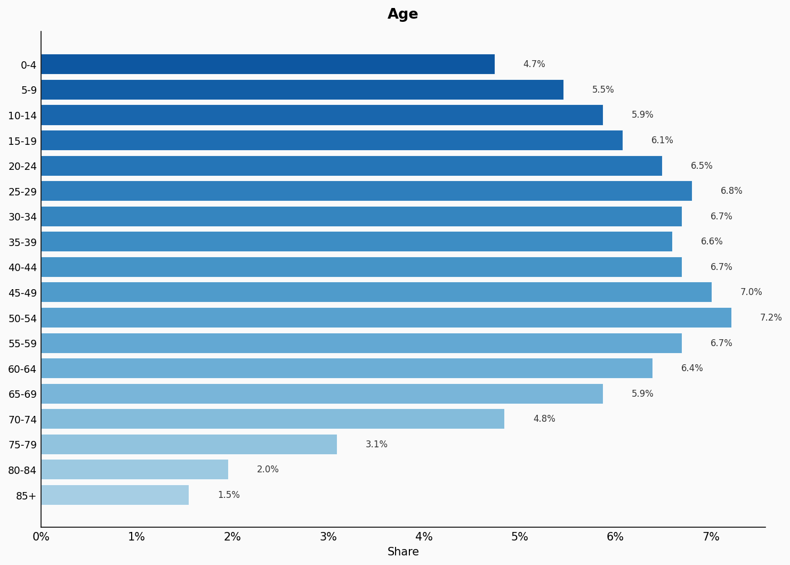
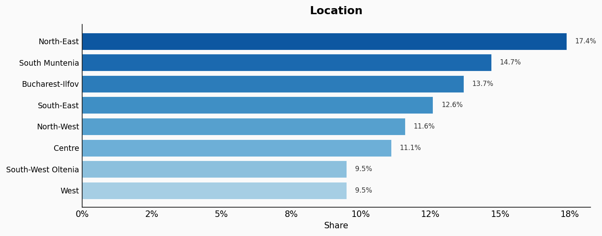
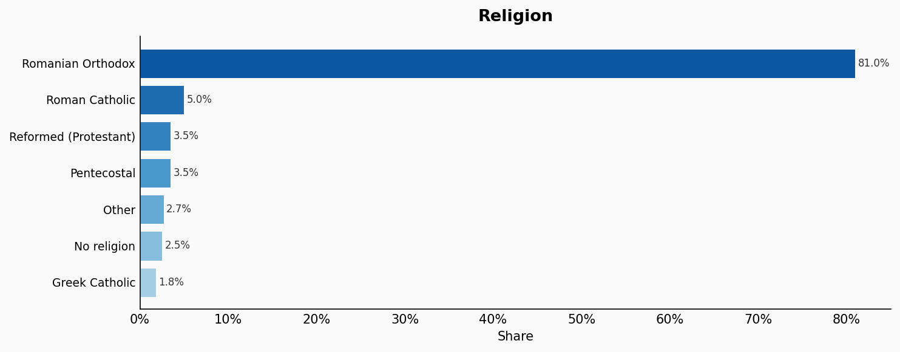
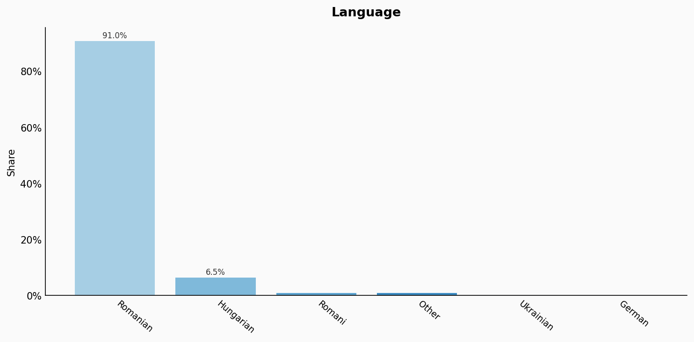
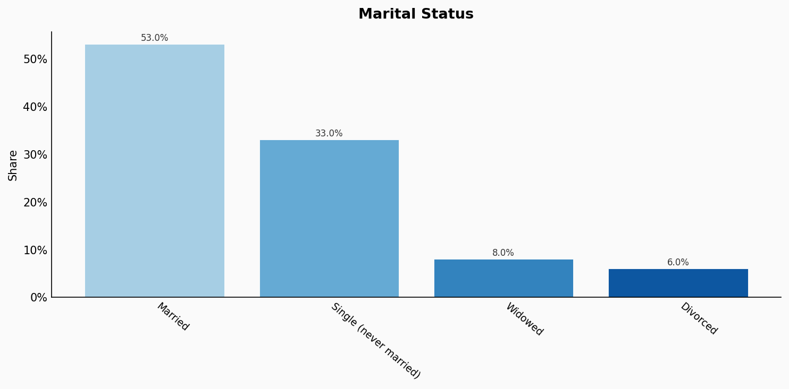
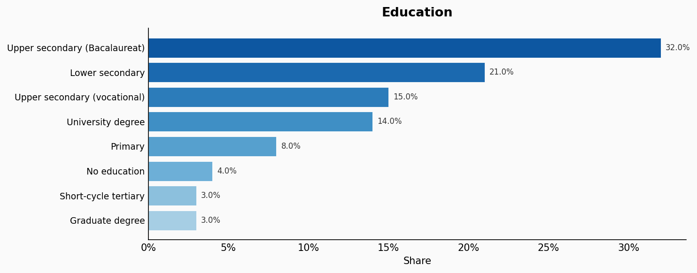
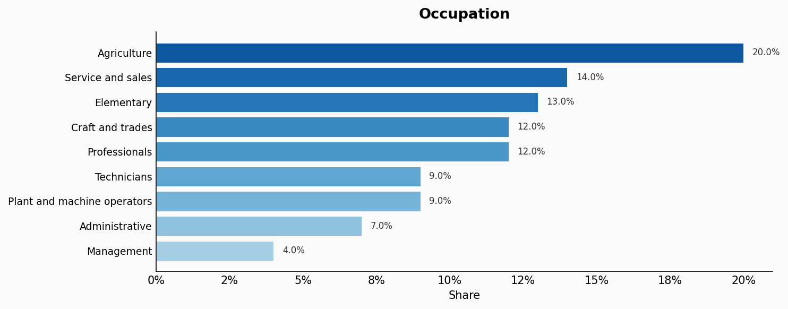
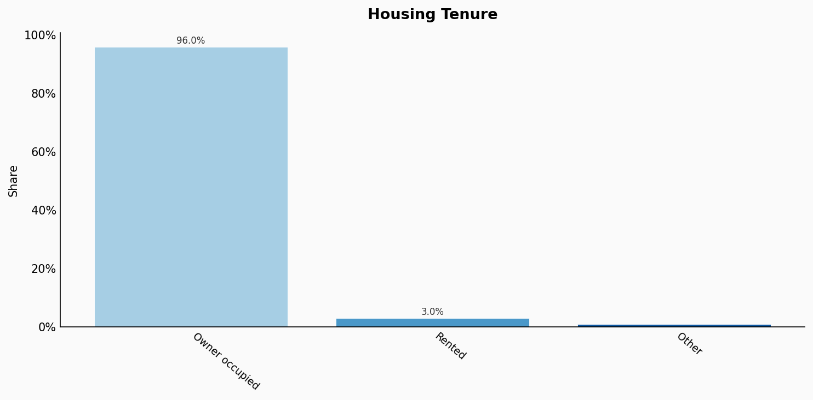
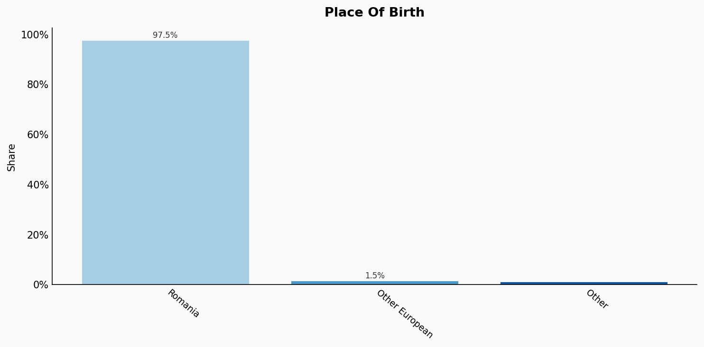
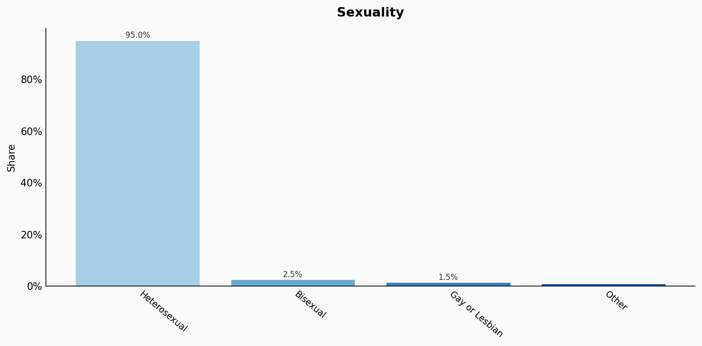

# Romania

**11 features:** age, sex, location, religion, language, marital status, education, occupation, housing tenure, place of birth, and sexuality.

## Age

| Option | Share |
|---|---:|
| 0-4 | 4.7% |
| 5-9 | 5.5% |
| 10-14 | 5.9% |
| 15-19 | 6.1% |
| 20-24 | 6.5% |
| 25-29 | 6.8% |
| 30-34 | 6.7% |
| 35-39 | 6.6% |
| 40-44 | 6.7% |
| 45-49 | 7.0% |
| 50-54 | 7.2% |
| 55-59 | 6.7% |
| 60-64 | 6.4% |
| 65-69 | 5.9% |
| 70-74 | 4.8% |
| 75-79 | 3.1% |
| 80-84 | 2.0% |
| 85+ | 1.5% |

## Sex

| Option | Share |
|---|---:|
| Female | 51.6% |
| Male | 48.4% |

## Location

| Option | Share |
|---|---:|
| North-East | 17.4% |
| South Muntenia | 14.7% |
| Bucharest-Ilfov | 13.7% |
| South-East | 12.6% |
| North-West | 11.6% |
| Centre | 11.1% |
| South-West Oltenia | 9.5% |
| West | 9.5% |

## Religion

| Option | Share |
|---|---:|
| Romanian Orthodox | 81.0% |
| Roman Catholic | 5.0% |
| Reformed (Protestant) | 3.5% |
| Pentecostal | 3.5% |
| Other | 2.7% |
| No religion | 2.5% |
| Greek Catholic | 1.8% |

## Language

| Option | Share |
|---|---:|
| Romanian | 91.0% |
| Hungarian | 6.5% |
| Romani | 1.0% |
| Other | 1.0% |
| Ukrainian | 0.3% |
| German | 0.2% |

## Marital Status

| Option | Share |
|---|---:|
| Married | 53.0% |
| Single (never married) | 33.0% |
| Widowed | 8.0% |
| Divorced | 6.0% |

## Education

| Option | Share |
|---|---:|
| Upper secondary (Bacalaureat) | 32.0% |
| Lower secondary | 21.0% |
| Upper secondary (vocational) | 15.0% |
| University degree | 14.0% |
| Primary | 8.0% |
| No education | 4.0% |
| Short-cycle tertiary | 3.0% |
| Graduate degree | 3.0% |

## Occupation

| Option | Share |
|---|---:|
| Agriculture | 20.0% |
| Service and sales | 14.0% |
| Elementary | 13.0% |
| Craft and trades | 12.0% |
| Professionals | 12.0% |
| Technicians | 9.0% |
| Plant and machine operators | 9.0% |
| Administrative | 7.0% |
| Management | 4.0% |

## Housing Tenure

| Option | Share |
|---|---:|
| Owner occupied | 96.0% |
| Rented | 3.0% |
| Other | 1.0% |

## Place Of Birth

| Option | Share |
|---|---:|
| Romania | 97.5% |
| Other European | 1.5% |
| Other | 1.0% |

## Sexuality

| Option | Share |
|---|---:|
| Heterosexual | 95.0% |
| Bisexual | 2.5% |
| Gay or Lesbian | 1.5% |
| Other | 1.0% |

## Sources

- [Recensământul Populației și Locuințelor 2022, Institutul Național de Statistică (INS) (2022)](https://insse.ro/cms/en/content/census-population-and-housing-2022)
  *Covers: `age`, `sex`, `location`, `marital status`, `housing tenure`, `place of birth`*
- [Ancheta privind Forța de Muncă în Gospodării (AMIGO) 2022, INS (2022)](https://insse.ro/cms/en/content/labour-force-survey-lfs-romania)
  *Covers: `education`, `occupation`*
- [Recensământul Populației - Religie 2022, INS (2022)](https://insse.ro/cms/en/content/census-population-and-housing-2022)
  *Covers: `religion`*
- [Recensământul Populației - Limba maternă 2022, INS (2022)](https://insse.ro/cms/en/content/census-population-and-housing-2022)
  *Covers: `language`*
- [Eurobarometer Special Survey on Discrimination 2019, European Commission (2019)](https://europa.eu/eurobarometer/surveys/detail/2251)
  *Covers: `sexuality`*