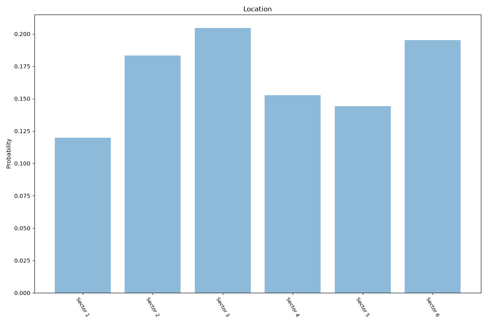

# Bucharest
**2 features:** location and residence.

## Location

## Residence

## Sources

- [Census 2011, National Institute of Statistics (INS) (2011)](https://www.insse.ro/) — location
- [World Urbanization Prospects 2018, United Nations (2018)](https://population.un.org/wup/) — residence